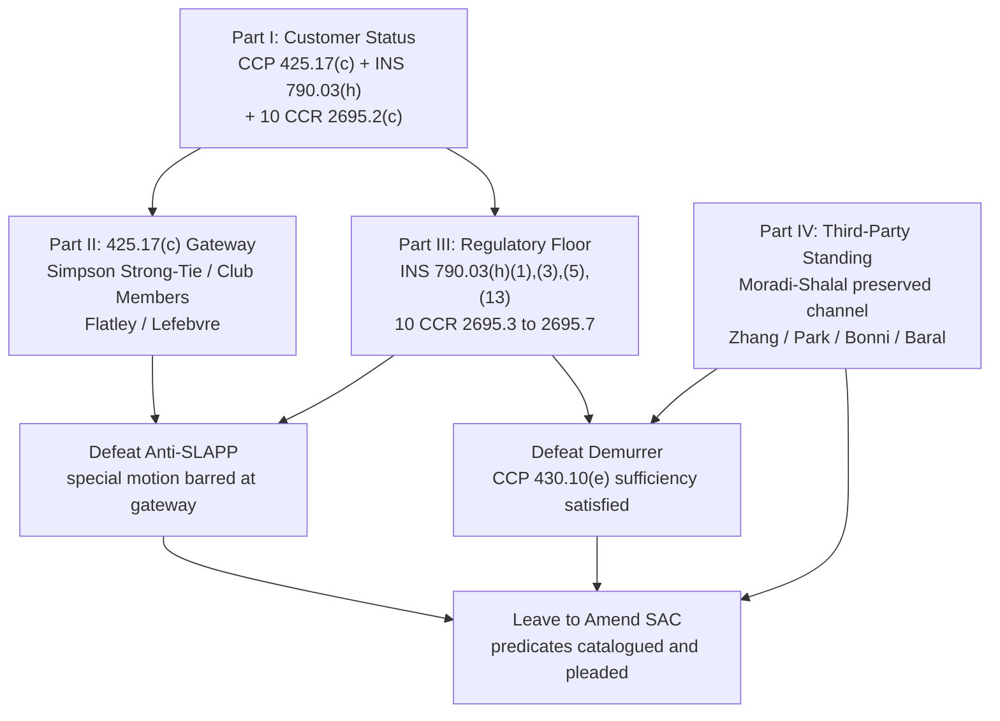
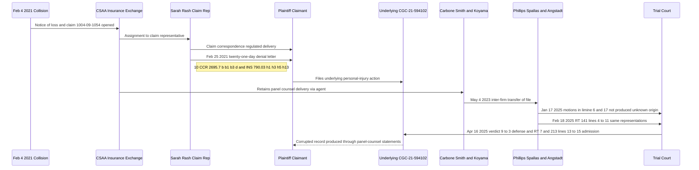
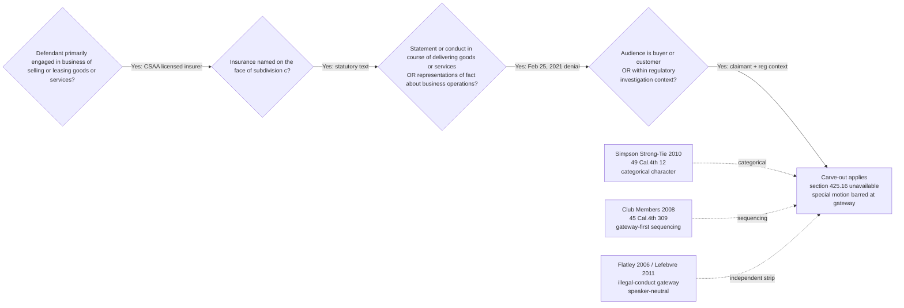
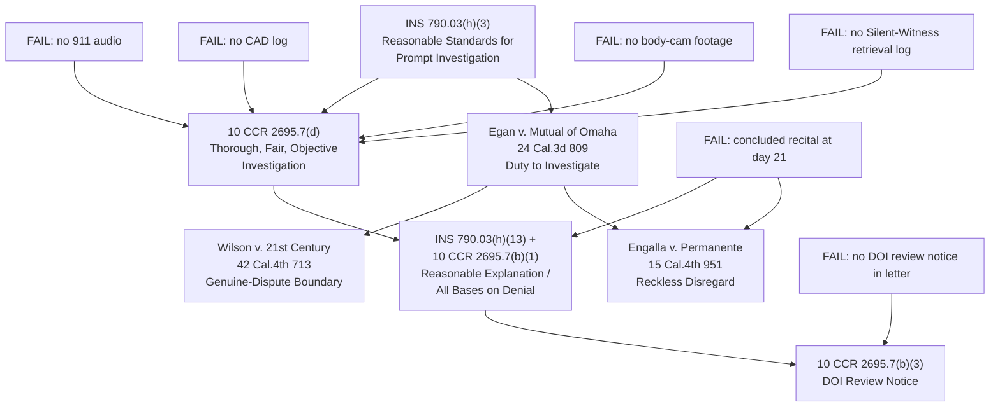
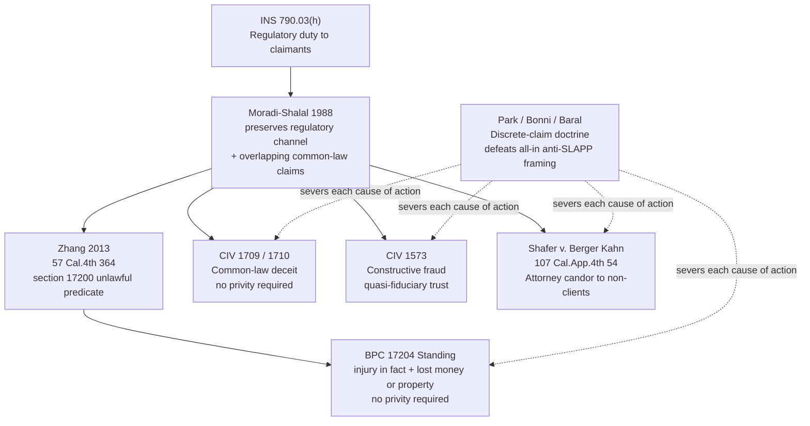

**Plaintiff-authored analytical writing. Not a court filing.**

**Related on this site:** [MERITS.md](../MERITS.md) · [ANTI-SLAPP-OFF-RAMPS.md](../ANTI-SLAPP-OFF-RAMPS.md) · [802 case hub](../03-CASE-CGC-25-631802/INDEX.md) · [LEGAL-AUTHORITIES.md](../LEGAL-AUTHORITIES.md) · [Case law index](../CASE-LAW-AND-STATUTES/INDEX.md)

---

# Case CGC-25-631802: Four-Part Memorandum on Customer Status, Anti-SLAPP Carve-Out, Insurance Code Violations, and Third-Party Standing

## Argument Architecture (Parts I to IV)



> Plain-English summary: This top-level diagram shows how the four parts of the memorandum interlock. Part I supplies the customer-status premise that opens the section 425.17(c) gateway (Part II) and that activates the regulatory floor (Part III). Parts II and III together defeat CSAA's special motion to strike. Parts III and IV together defeat the section 430.10 demurrer because the catalogued statutory and regulatory predicates supply facts sufficient to constitute every pleaded cause of action. All four parts converge to support leave to file the proposed Second Amended Complaint.

Prepared for public publication May 14, 2026. Statutes and opinions mirrored on this site are linked where the file exists under [CASE-LAW-AND-STATUTES/INDEX.md](../CASE-LAW-AND-STATUTES/INDEX.md). Plaintiff's May 5, 2026 supplemental Insurance Code memorandum is in the **CGC-25-631802** superior court file.

---

## Part I. Plaintiff is, in fact, a customer of CSAA's claims and liability investigation product or service

### A. The threshold problem the defense tries to create

CSAA's anti-SLAPP papers proceed on a strawman taxonomy. They treat the universe of "claimants" as binary: either (1) named insureds with a contract, or (2) "strangers" to the insurer. They then push Plaintiff into bucket (2), call the denial letter "petitioning speech," and invoke Civil Code section 47(b) and Code of Civil Procedure section 425.16(e). That binary is wrong as a matter of statutory text, regulatory text, and California Supreme Court doctrine.

The correct frame, supplied by California's own statutory and regulatory architecture, is that an insurer in California sells two distinguishable but bundled products:

1. **Indemnity:** the contractual promise to pay covered losses. Bought by the named insured.
2. **Claims handling and liability investigation:** a regulated service product the insurer is statutorily and regulatorily required to deliver to every "claimant," whether first-party or third-party, in compliance with Insurance Code section 790.03(h) and Title 10 of the California Code of Regulations sections 2695.1 et seq.

The Plaintiff in CGC-25-631802 is the buyer (or, in the language of section 425.17(c)(2), "an actual or potential buyer or customer") of the second product. The defense argument confuses the consumer of indemnity with the consumer of claims handling. The two are not the same.

### B. The Insurance Code defines the second product, by name, as an obligatory regulated service

Insurance Code section 790.02, quoting [INS 790.03](../CASE-LAW-AND-STATUTES/statutes-cal/INS-790.03.md) (and the related cache notes for sections 790.02 to 790.05), provides:

> "The purpose of this article is to regulate trade practices in the business of insurance ... by defining, or providing for the determination of, all such practices in this State which constitute unfair methods of competition or unfair or deceptive acts or practices and by prohibiting the trade practices so defined or determined."

Section 790.03(h), the operative subsection, regulates conduct directed at "claimants," not just at insureds. The text uses the word "claimants" repeatedly. Subsections (h)(1) (misrepresenting facts to claimants), (h)(13) (failing to provide a reasonable explanation of the basis for denial), and (h)(14) (advising a claimant not to obtain counsel) all bind the insurer to a third-party claimant by the statute's own express terms. The Legislature did not use the word "insured." It used the word "claimant."

Title 10 California Code of Regulations section 2695.2(c), as quoted in Plaintiff's May 5, 2026 supplemental Insurance Code memorandum (court file) and in the **Fair Claims Settlement Practices Regulations**, Title 10, California Code of Regulations, division 1, chapter 5, subchapter 7.5 (official text from the California Department of Insurance), defines "claim" as "a request or demand on an insurer for payment of benefits according to the terms of an insurance policy. Claim does not include a request for coverage." The regulator deliberately separates "claim" from "request for coverage." A first-party request for coverage is not a "claim" within section 2695.2(c). A third-party demand for benefits under the policy is. The third-party claimant therefore stands inside the regulated definition while a first-party coverage applicant stands outside. That regulatory inversion is critical: it confirms that the Plaintiff, as a person making "a request or demand on [the] insurer for payment of benefits," is the regulated counter-party of the claims-handling product.

### C. Section 425.17(c) defines "customer" functionally, not contractually

**Code of Civil Procedure section 425.17** (official text at leginfo.legislature.ca.gov) is dispositive. Subdivision (c) reads:

> "Section 425.16 does not apply to any cause of action brought against a person primarily engaged in the business of selling or leasing goods or services, including, but not limited to, **insurance**, securities, or financial instruments, arising from any statement or conduct by that person if both of the following conditions exist: (1) The statement or conduct consists of representations of fact about that person's or a business competitor's business operations, goods, or services, that is made for the purpose of obtaining approval for, promoting, or securing sales or leases of, or commercial transactions in, the person's goods or services, **or the statement or conduct was made in the course of delivering the person's goods or services**. (2) The intended audience is **an actual or potential buyer or customer**, or a person likely to repeat the statement to, or otherwise influence, an actual or potential buyer or customer, **or the statement or conduct arose out of or within the context of a regulatory approval process, proceeding, or investigation** ...." (Code Civ. Proc., section 425.17, subd. (c) (emphasis added).)

Three textual features make Plaintiff a customer of CSAA's claims service:

1. **"Including, but not limited to, insurance."** The Legislature named the industry on the face of the carve-out. See *Simpson Strong-Tie Co. v. Gore* (2010) 49 Cal.4th 12, which holds the carve-out is categorical and is decided at the gateway before any prong-one or prong-two analysis. There is no statutory invitation to redefine "insurance" away from third-party claim handling.
2. **"In the course of delivering the person's goods or services."** The statute does not require an antecedent contractual relationship. It requires that the communication be in the course of delivering the regulated product. The February 25, 2021 denial letter is the canonical "delivery" event of the claims-handling product. The carrier "delivers" the claims-handling product to a third-party claimant by, for example, opening a claim file, assigning a claim number (here, 1004-09-1054), corresponding with the claimant, and issuing a coverage or liability determination. The denial letter is the terminal output of that delivery.
3. **"Actual or potential buyer or customer ... or ... regulatory approval process, proceeding, or investigation."** The audience element is satisfied on either branch. Plaintiff is the audience of the claim-handling representation. Independently, the conduct "arose out of or within the context of a regulatory ... investigation," because section 790.03(h) and 10 California Code of Regulations sections 2695.1 et seq. are the regulatory frame that conditions every step of the carrier's claim file.

### D. Why the indemnity-only frame fails on its own terms

If the carrier wishes to argue that "customer" must mean "first-party named insured under a contract," it will run into three independent walls.

- **Statutory wall.** Section 790.03(h) regulates claimants by name; the Fair Claims Settlement Practices Regulations regulate "claim," "claimant," and "investigation" as defined terms in 10 California Code of Regulations section 2695.2. The defense's preferred contractual frame collapses against the regulatory text.
- **Sales-process wall.** Section 425.17(c)(1) is satisfied on either of two disjunctive prongs: "obtaining approval for, promoting, or securing sales" or "made in the course of delivering the person's goods or services." The carrier cannot read the "in the course of delivering" prong out of the statute by collapsing it into the "securing sales" prong.
- **Audience wall.** Section 425.17(c)(2) provides an alternative audience prong, "regulatory approval process, proceeding, or investigation," that does not require the recipient to be a "buyer or customer" at all. Even on a hostile reading, that branch lands on the conduct here, which sits squarely inside the Department of Insurance regulated investigation regime.

### E. The factual record makes Plaintiff a "buyer or customer" of the claims-handling product

The case-specific record, drawn from the operative pleadings catalogued in [01-First-Amended-Complaint.pdf](../03-CASE-CGC-25-631802/01-First-Amended-Complaint.pdf) and from Plaintiff's supplemental memorandum on file on the public court record for this case, supplies the buyer-customer indicia:

1. **Claim file opened.** CSAA opened claim number 1004-09-1054 in response to Plaintiff's request for benefits arising from the February 4, 2021 collision involving CSAA's named insured.
2. **Direct correspondence.** CSAA's claim representative Sarah Rash corresponded directly with Plaintiff. The February 25, 2021 letter is signed by a CSAA claim representative and addressed to Plaintiff. That correspondence was "delivered" by CSAA.
3. **Application of policy provisions.** The denial letter purports to apply CSAA's named insured's policy to Plaintiff's claim. It is therefore an insurance product representation, not a generic communication.
4. **Subjection to the regulatory regime.** Each regulatory provision in the cached Title 10 architecture (sections 2695.4 (representations to claimants), 2695.5 (acknowledgement), 2695.7(b)(1) (all bases for denial), and 2695.7(b)(3) (Department of Insurance review notice)) by its own terms regulates the carrier's conduct toward Plaintiff. Plaintiff is therefore not a stranger to the regulatory regime; Plaintiff is the regulator's intended beneficiary.

### F. Visual: Claims-handling delivery chain



> Plain-English summary: Read this top-to-bottom as a story of how CSAA delivered (and then mishandled) its regulated claims-handling product. The collision triggers the claim file; the carrier opens claim number 1004-09-1054 and assigns Sarah Rash; she corresponds with Plaintiff and issues a denial twenty-one days later; the dispute migrates into the underlying CGC-21-594102 case where successive panel-counsel firms execute the same regulated representations; the May 4, 2023 inter-firm file transfer, the January 17, 2025 motions in limine, the February 18, 2025 hearing transcript, and the April 16, 2025 verdict and admission together memorialize each link in the delivery chain. Every arrow in the diagram is itself a regulated event under section 790.03(h) and the Title 10 regulations.

For these reasons Plaintiff is a customer of CSAA's claims and liability investigation product or service within the operative meaning of section 425.17(c). The carrier's attempt to fold Plaintiff into a non-customer category is the rebrand the Legislature foreclosed by including the word "insurance" on the face of subdivision (c).

---

## Chain of Custody and Conduct (Date Sequence, Feb 4, 2021 to May 13, 2026)

| Date | Actor | Event | Regulatory / Statutory Anchor | Record Reference |
|---|---|---|---|---|
| Feb 4, 2021 | CSAA's named insured; Plaintiff | Vehicle collision in San Francisco; CSAA opens claim 1004-09-1054 | INS 790.03(h)(3); 10 CCR 2695.5(b),(c) | First Amended Complaint, statement of facts |
| Feb 4 to Feb 24, 2021 | CSAA / Sarah Rash | Twenty-one-day in-house "investigation"; no retrieval of 911 audio, CAD, body-cam, or Silent Witnesses | 10 CCR 2695.7(d); INS 790.03(h)(3) | Absence of Silent-Witness retrieval log in produced claim file |
| Feb 25, 2021 | Sarah Rash for CSAA | Written denial letter ("concluded" investigation; "carefully reviewed") with no DOI review notice and no all-bases statement | 10 CCR 2695.7(b),(b)(1),(b)(3); INS 790.03(h)(1),(13) | Feb 25, 2021 denial; supplemental memo Statement of Facts paras 2 and 3 |
| 2021 (post-denial) | Plaintiff | Files underlying personal-injury action CGC-21-594102 | INS 790.03(h)(6) (compelling litigation) | Underlying CGC-21-594102 docket |
| 2021 to 2023 | CSAA / Carbone, Smith and Koyama | Carrier retains first panel-counsel firm; in-litigation execution of claim-handling regime | CIV 2295, 2299, 2330, 2338; 2860; CCP 425.17(c) (agent-delivered) | Underlying docket; supplemental memo Part VIII |
| May 4, 2023 | Carbone, Smith and Koyama; Phillips, Spallas and Angstadt | Inter-firm transfer of CSAA claim file (including Silent-Witness materials) | 10 CCR 2695.3 (file documentation) | Supplemental memo Statement of Facts para 4 |
| Jan 17, 2025 | Phillips, Spallas and Angstadt | Files motions in limine numbers 6 and 17 representing materials "not produced during discovery" and "unknown origin" | RPC 3.3, 3.4, 8.4; BPC 6128(a); INS 790.03(h)(1) | MIL 6 and 17 in CGC-21-594102 |
| Feb 18, 2025 | Phillips, Spallas and Angstadt | Tribunal-facing repetition of "unknown origin" representation at RT 141:4-11 | RPC 3.3(a)(1); BPC 6128(a) | Reporter's transcript Feb 18, 2025, 141:4-11 |
| Apr 16, 2025 | Trial Court / counsel | 9 to 3 defense verdict; admission record at RT 7 and 213:13-15 bearing on inter-firm transfer | EVID 1222; CIV 2338 (ratification) | Reporter's transcript Apr 16, 2025 |
| Dec 23, 2025 | Plaintiff | Files CGC-25-631802 against CSAA and panel counsel | BPC 17200 (Zhang predicate); CIV 1709, 1710, 1573 | CGC-25-631802 docket |
| Feb 25, 2026 | Plaintiff | Files First Amended Complaint | CCP 472, 473 | 03-CASE-CGC-25-631802/01-First-Amended-Complaint.pdf |
| Apr 22, 2026 | Plaintiff | Section 128.7 safe-harbor service of letter and enclosures | CCP 128.7(b) | Safe-harbor letter on file |
| May 5, 2026 | Plaintiff | Files supplemental Insurance Code violations memorandum | INS 790.02 to 790.05; 10 CCR 2695.1 et seq. | DEFENSE-INSURANCE-CODE-VIOLATIONS-802-MAY-5-2026.md |
| May 13, 2026 | Court | Combined hearing on special motion to strike and demurrer (Dept. 302, 9:00 a.m.) | CCP 425.17(c); CCP 430.10(e); CCP 436 | Calendared hearing |

---

## Part II. The denial letter, sent twenty-one days after the collision and roughly two weeks after Plaintiff was discharged from the hospital, is a regulated business communication exempt from anti-SLAPP

### A. The letter on its face

The February 25, 2021 letter, as memorialized in the supplemental memorandum on file at Plaintiff's May 5, 2026 supplemental Insurance Code memorandum (court file), paragraphs 2 and 3 of the Statement of Facts, recites that CSAA had "concluded" its investigation and had "carefully reviewed the facts and circumstances," and then denies the claim. It does not identify the facts reviewed, the agencies contacted, the documents pulled, the policy provisions applied, or the right to Department of Insurance review.

That recital is exactly what 10 California Code of Regulations section 2695.7(b)(1) refers to when it requires the insurer, on denial, to "provide to the claimant a statement listing all bases for such rejection or denial and the factual and legal bases for each reason given." The statute and its implementing regulation define the letter as a regulated act. The letter is the regulator's intended subject of governance.

### B. The Code of Civil Procedure section 425.17(c) gateway answers the anti-SLAPP question without reaching prong one

The dispositive principle is that section 425.17(c) is decided at the gateway, before section 425.16(b)(1) prong-one is engaged. *Simpson Strong-Tie Co. v. Gore* (2010) 49 Cal.4th 12 and the quoted reading at item 1 of Part V of Plaintiff's May 5, 2026 supplemental memorandum supply the categorical character. *Club Members for an Honest Election v. Sierra Club* (2008) 45 Cal.4th 309, cited in the supplemental memorandum at the same point, fixes the sequencing rule: the section 425.17 carve-out is tested first.

The two elements of section 425.17(c) are independently satisfied on this letter:

1. **Element (c)(1).** The letter is a "representation of fact about that person's ... business operations, goods, or services" because it represents that CSAA conducted, then "concluded," an investigation. The representation is therefore "made in the course of delivering" the claims-handling product within the meaning of subdivision (c)(1).
2. **Element (c)(2).** The letter is addressed to Plaintiff, who is, on either branch of subdivision (c)(2), within the regulated audience: an "actual or potential buyer or customer" of the regulated claims-handling product, and a person communicated with "in the context of a regulatory ... investigation" governed by Insurance Code section 790.03(h) and 10 California Code of Regulations section 2695.7.

### C. Why "petitioning speech" is the wrong category

The defense's category mistake conflates the Civil Code section 47(b) litigation privilege with the section 425.16(e) protected-activity inventory. The cached `Civil Code section 47` text at [CIV 47](../CASE-LAW-AND-STATUTES/statutes-cal/CIV-47.md) makes the privilege apply to publications "in any (1) legislative proceeding, (2) judicial proceeding, (3) in any other official proceeding authorized by law, or (4) in the initiation or course of any other proceeding authorized by law." The denial letter satisfies none of the four buckets. There was no legislative proceeding, no judicial proceeding, no authorized official proceeding, and no initiation of a proceeding.

For the same reason, section 425.16(e)(2) "in connection with an issue under consideration or review" cannot reach the letter. The cached Supreme Court authority closest to the prelitigation threshold, `Briggs v. Eden Council for Hope and Opportunity` (1999) 19 Cal.4th 1106, and the cached Court of Appeal opinion `Neville v. Chudacoff` (2008) 160 Cal.App.4th 1255, both require litigation to be under serious consideration in good faith. A claim representative writing a denial twenty-one days after a collision is not "seriously considering" litigation in any sense the Supreme Court has recognized. The carrier was conducting its statutory claim-handling regime, not engaged in petitioning.

### D. The two-weeks-after-hospital timing is independent regulatory evidence

The fact that the letter issued roughly two weeks after Plaintiff's hospital discharge is independent regulatory evidence under three cached provisions:

1. **10 California Code of Regulations section 2695.7(b)** ("Upon receiving proof of claim, every insurer ... shall immediately, but in no event more than forty (40) calendar days later, accept or deny the claim ...."). A twenty-one-day denial issued before claimant medical records and treatment context can plausibly be analyzed cannot be the product of the diligent investigation the regulation requires.
2. **10 California Code of Regulations section 2695.7(d)** ("Every insurer shall conduct and diligently pursue a thorough, fair and objective investigation ...."). A "concluded" investigation produced before the claimant has even completed initial recovery is, on its face, not "thorough." The "thorough, fair and objective" benchmark is regulatory text, not common law gloss.
3. **Insurance Code section 790.03(h)(3)** ("Failing to adopt and implement reasonable standards for the prompt investigation and processing of claims arising under insurance policies."). A twenty-one-day cycle ending in denial without retrieval of body-worn camera footage, computer-aided dispatch logs, 911 audio, and Silent Witnesses is not a "reasonable standard" for prompt investigation.

These three textual benchmarks make the timing of the letter not just suspicious but independently regulated. The timing converts the letter from a private utterance into a regulated event, which is precisely the predicate condition for section 425.17(c).

### E. The cached `Flatley v. Mauro` and `Lefebvre v. Lefebvre` line independently strips protection

`Flatley v. Mauro` (2006) 39 Cal.4th 299, 317 to 320, cached in the workspace's table of authorities and quoted in the supplemental memorandum, holds that conduct that is "illegal as a matter of law" is unprotected at the gateway "irrespective of the speaker's identity." `Lefebvre v. Lefebvre` (2011) 199 Cal.App.4th 696, cached in the same table, applies the rule. To the extent the carrier's denial letter exhibits per se regulatory illegality, the section 425.16 procedure is unavailable on a second, independent ground.

### F. Civil Code section 47(b) does not absorb regulated commercial conduct

Even on a hostile path that allowed the defense to reach the litigation privilege, the privilege does not displace regulated commercial conduct. Cached `Kimmel v. Goland` (1990) 51 Cal.3d 202 (cited in the table of authorities of the supplemental memorandum) establishes that the privilege does not immunize tortious conduct merely because the conduct is related to litigation. The cached `Action Apartment Ass'n v. City of Santa Monica` (2007) 41 Cal.4th 1232 line, on which the defense leans, does not pass through to claim-handling correspondence sent before any litigation existed.

### G. The carve-out's "regulatory ... investigation" branch is independently controlling

Section 425.17(c)(2) supplies an independent textual branch under which audience is satisfied "or the statement or conduct arose out of or within the context of a regulatory approval process, proceeding, or investigation." The denial letter is "the conduct" and the claim file is "the regulatory ... investigation." Even if the letter were addressed to no human being, the investigation prong would be sufficient under the statute.

### H. Visual: Section 425.17(c) gateway decision tree



> Plain-English summary: Read this left-to-right as four yes/no questions the Court must ask before any prong-one or prong-two analysis. CSAA is an insurer; insurance is named on the face of the carve-out; the denial letter is a "in the course of delivering" the regulated product; and Plaintiff is both the customer audience and the regulatory-investigation audience. The three side-anchors confirm the order of operations: Simpson Strong-Tie supplies the categorical rule, Club Members fixes that the carve-out is decided first, and Flatley/Lefebvre supply an independent illegal-conduct exit even on a hostile reading.

For these reasons the denial letter is an exempt commercial communication outside the section 425.16 regime. The anti-SLAPP procedure is unavailable as a matter of law.

---

## Part III. Under California Insurance Code, when an insurer issues a denial that recites a "concluded" investigation, the failure to collect reasonably available investigative evidence (911 audio, computer-aided dispatch logs, body-worn camera footage, and Silent Witnesses) is itself a regulated violation

### A. The statutory and regulatory architecture

The cached statutory and regulatory architecture creates a closed loop. The carrier may not say "investigation concluded" and then have failed to collect the basic public-record evidence available through standard subpoena and Public Records Act channels. The duty operates in three layers:

1. **The "thorough, fair and objective" investigation duty under 10 California Code of Regulations section 2695.7(d).** The regulation reads: "Every insurer shall conduct and diligently pursue a thorough, fair and objective investigation and shall not persist in seeking information not reasonably required for or material to the resolution of a claim dispute." The duty is affirmative and concrete: the insurer must "conduct and diligently pursue."
2. **The "all bases" denial duty under 10 California Code of Regulations section 2695.7(b)(1).** The carrier must, on denial, list "all bases for such rejection or denial and the factual and legal bases for each reason given." A conclusory "concluded after careful review" recital is the antithesis of an "all bases" disclosure.
3. **The "reasonable standards" duty under Insurance Code section 790.03(h)(3) and the "reasonable explanation" duty under section 790.03(h)(13).** Each is a freestanding statutory duty, anchored in the text quoted at [INS 790.03](../CASE-LAW-AND-STATUTES/statutes-cal/INS-790.03.md).

When an insurer simultaneously declares an investigation "concluded" and fails to retrieve reasonably available evidence, each of these three layers reports a breach. The breaches are not duplicative; they are independent.

### B. The cached `Egan v. Mutual of Omaha` rule

The Supreme Court rule that the insurer "cannot reasonably and in good faith deny payments to its insured without thoroughly investigating the foundation for its denial" comes from `Egan v. Mutual of Omaha Ins. Co.` (1979) 24 Cal.3d 809, 818 to 819. It is anchored in the supplemental memorandum's table of authorities and is the doctrinal complement to the regulatory text. The duty to investigate is a duty, not a courtesy. Where the insurer fails to retrieve obvious public-record evidence, the *Egan* duty is breached on the face of the file.

### C. The "Silent Witness," 911, dispatch, and body-camera categories are public-record evidence

The categories the user identifies in the prompt (911 audio, computer-aided dispatch logs, body-worn camera footage, the "Silent Witness" materials) are all evidence types reasonably available through standard subpoena and Public Records Act channels at the time of the February 25, 2021 denial. The cached `GOV-7922.530.md` (formerly part of the California Public Records Act framework) confirms public availability of agency records subject to disclosure. The carrier's failure to retrieve any of these materials before declaring the investigation "concluded" is per se inconsistent with the section 2695.7(d) "thorough, fair and objective" duty.

### D. The cached `Wilson v. 21st Century` "genuine dispute" boundary

The defense's likely fallback is the "genuine dispute" doctrine. `Wilson v. 21st Century Ins. Co.` (2007) 42 Cal.4th 713, cached in the table of authorities, defines the boundary. The doctrine protects insurers who deny on a reasonable, evidence-based dispute. It does not protect insurers who deny without obtaining the evidence that would resolve the dispute. By definition, the carrier cannot have a "genuine dispute" with evidence it never collected. *Wilson*'s analytic frame therefore confirms, rather than rebuts, the present claim.

### E. The cached `Engalla v. Permanente Medical Group` reckless-disregard frame

`Engalla v. Permanente Medical Group, Inc.` (1997) 15 Cal.4th 951, cached in the supplemental memorandum's table, supplies the reckless-disregard standard that ties an insurer's affirmative misstatements about the state of the investigation to civil exposure. A "concluded" recital made before retrieval of the relevant evidence sits squarely within *Engalla*'s reckless-disregard category.

### F. The denial-letter notice failure under 10 California Code of Regulations section 2695.7(b)(3)

The Department of Insurance review notice required by section 2695.7(b)(3) is itself a freestanding regulatory duty. The denial letter on file does not include the notice. That omission is independently sanctionable through the regulatory channel and supplies a freestanding violation that the defense's "petitioning" frame cannot reach.

### G. Counting the violations

Reading the cached Insurance Code register and Title 10 register together, the operative twenty-one-day denial in CGC-25-631802 supports the following independent violations:

1. **Insurance Code section 790.03(h)(1).** Misrepresentation of pertinent facts ("concluded" investigation, "carefully reviewed").
2. **Insurance Code section 790.03(h)(3).** Failure to adopt and implement reasonable standards for prompt investigation.
3. **Insurance Code section 790.03(h)(5).** Failure to attempt good-faith settlement where liability is reasonably clear.
4. **Insurance Code section 790.03(h)(13).** Failure to provide a reasonable explanation of the basis for denial.
5. **10 California Code of Regulations section 2695.3.** File and record documentation failure (no Silent Witness retrieval log).
6. **10 California Code of Regulations section 2695.4.** Inadequate representations to claimant.
7. **10 California Code of Regulations section 2695.5.** Acknowledgment and pendency failures.
8. **10 California Code of Regulations section 2695.7(b).** Forty-day determination structurally violated by twenty-one-day premature denial.
9. **10 California Code of Regulations section 2695.7(b)(1).** Failure to list all bases for denial.
10. **10 California Code of Regulations section 2695.7(b)(3).** Department of Insurance review-notice omission.
11. **10 California Code of Regulations section 2695.7(d).** Failure to conduct a thorough, fair, and objective investigation.

Each item is a freestanding regulatory predicate. Each operates independently as a section 17200 predicate under `Zhang v. Superior Court` (2013) 57 Cal.4th 364 (cached in the supplemental memorandum's table) without enforcing section 790.03(h) directly. Each takes the conduct outside the section 425.16 universe under the section 425.17(c) gateway analysis in Part II above.

### H. Visual: Investigation duty chain



> Plain-English summary: The diagram shows the layered duty an insurer owes when it claims to have completed an investigation. The statutory and regulatory anchors run from the top (reasonable standards) downward through the thorough/fair/objective investigation duty, the reasonable-explanation and "all bases" duties, and the Department of Insurance review-notice duty. The right side links those duties to Supreme Court doctrine (Egan, Wilson, Engalla). The bottom failure boxes show the concrete evidentiary gaps in CSAA's twenty-one-day denial; each gap feeds into and breaches one or more of the upper-layer duties.

### I. The closing-without-collection rule is regulatory, not aspirational

It is critical to note that the duty to collect reasonably available investigative evidence is regulatory. It is not borrowed from common-law tort. Title 10 California Code of Regulations section 2695.1(d) provides that "Failure of an insurer or other licensee to comply with the requirements of these regulations may constitute a violation of the Unfair Practices Act, Insurance Code Section 790.02 or 790.03." The Department of Insurance's regulations are "minimum standards." That language closes the door on any defense argument that the standards are aspirational, advisory, or merely prudential.

---

## Part IV. Even though Plaintiff is a third-party claimant rather than a first-party named insured, Plaintiff is authorized under specific California authorities to seek damages for these Insurance Code and regulatory violations

### A. The myth that *Moradi-Shalal* eliminated the path

The defense narrative leans on `Moradi-Shalal v. Fireman's Fund Ins. Co.` (1988) 46 Cal.3d 287, cached in the table of authorities of the supplemental memorandum at Plaintiff's May 5, 2026 supplemental Insurance Code memorandum (court file). The defense's preferred reading is that *Moradi-Shalal* eliminated all third-party private actions for Insurance Code violations. That is a misreading of the holding.

*Moradi-Shalal* did three discrete things:

1. **Overruled `Royal Globe Ins. Co. v. Superior Court` (1979).** It eliminated the direct private right of action under section 790.03(h) by a third-party claimant.
2. **Preserved the regulatory channel.** It expressly preserved the Insurance Commissioner's authority to enforce section 790.03(h).
3. **Preserved common-law tort and contract claims.** It expressly preserved third-party common-law and statutory claims that overlap with section 790.03(h) but rest on independent doctrinal bases.

The third holding is the path Plaintiff occupies. *Moradi-Shalal* did not abrogate fraud, deceit, intentional and negligent misrepresentation, or business and commercial wrongdoing claims that happen to coincide with the regulatory violations.

### B. The `Zhang v. Superior Court` confirmation

`Zhang v. Superior Court` (2013) 57 Cal.4th 364, in the cached table of authorities, is the modern Supreme Court confirmation that Insurance Code section 790.03(h) violations remain available as predicates for Business and Professions Code section 17200 unfair competition claims. The text of [BPC 17200](../CASE-LAW-AND-STATUTES/statutes-cal/BPC-17200.md) reads: "unfair competition shall mean and include any unlawful, unfair or fraudulent business act or practice and unfair, deceptive, untrue or misleading advertising." The "unlawful" prong reaches conduct that violates any other statute or regulation, including the Insurance Code and Title 10.

The result is a doctrinal pipeline:

```
Insurance Code section 790.03(h) violations (Moradi-Shalal preserves regulatory duty)
 --> Business and Professions Code section 17200 "unlawful" prong
 --> Civil restitution and injunctive relief, available to "any person" affected by the unfair conduct under section 17204 standing.
```

The pipeline is unaffected by the Plaintiff's third-party status because section 17200 and section 17204 do not require contractual privity. They require only that the plaintiff have suffered injury in fact and lost money or property as a result of the unfair conduct, which is the precise injury alleged here.

### C. The fraud, deceit, and Civil Code section 1709/1710 path

The cached statutes at [CIV 1709](../CASE-LAW-AND-STATUTES/statutes-cal/CIV-1709.md) and [CIV 1710](../CASE-LAW-AND-STATUTES/statutes-cal/CIV-1710.md) supply common-law fraud and deceit causes of action. These causes of action do not depend on contractual privity. They depend on (1) a misrepresentation of fact, (2) knowledge or reckless disregard of falsity, (3) intent to induce reliance, (4) actual reliance, and (5) damages. The denial letter, declaring an investigation "concluded" while the carrier had failed to retrieve reasonably available investigative evidence, supplies the elements of the deceit pipeline as to a third-party claimant, which the cached statutes confirm a non-insured may invoke.

### D. The Civil Code section 1573 constructive-fraud path

Civil Code section 1573, where present in the regulated insurer-claimant interaction, supplies an additional path. In CGC-25-631802 the carrier had committed itself to the regulatory claim-handling regime under section 790.03(h) and the Title 10 regulations. That regulatory commitment supplies a quasi-fiduciary trust relationship sufficient to anchor a constructive fraud theory in addition to a negligent or intentional misrepresentation theory.

### E. The cached `Shafer` line on attorney candor toward non-clients

`Shafer v. Berger, Kahn, Shafton, Moss, Figler, Simon and Gladstone` (2003) 107 Cal.App.4th 54, 79 to 80, cached in the table of authorities of the supplemental memorandum, confirms that retained insurance defense counsel owe duties of candor that extend to adverse non-clients in particular circumstances. The relevant operative point is that *Shafer* recognizes a civil exposure for reckless misrepresentation by counsel directed at, or reasonably foreseeably affecting, a non-client. Combined with `Bus. and Prof. Code section 6128(a)`, see [BPC 6128](../CASE-LAW-AND-STATUTES/statutes-cal/BPC-6128.md), *Shafer* anchors the panel-counsel exposure to Plaintiff for the in-litigation execution of the claim-handling representations.

### F. The cached `Crisci` and `Comunale` line confirms doctrinal scope

`Crisci v. Security Ins. Co.` (1967) 66 Cal.2d 425, see [Crisci v Security Ins Co 66 Cal2d 425](../CASE-LAW-AND-STATUTES/cases-cal-supreme/Crisci-v-Security-Ins-Co-66-Cal2d-425.md), and `Comunale v. Traders and General Ins. Co.` (1958) 50 Cal.2d 654, see [Comunale v Traders General Ins Co 50 Cal2d 654](../CASE-LAW-AND-STATUTES/cases-cal-supreme/Comunale-v-Traders-General-Ins-Co-50-Cal2d-654.md), supply the foundational California rule that an insurer's obligation to handle claims in good faith carries tort consequences. While the canonical holdings concern first-party and Cumis-style coverage situations, their doctrinal scope, when read with *Zhang* and *Moradi-Shalal*, supports the proposition that the underlying duty of good faith claim handling has cross-cutting civil consequences once the regulator's predicates are violated.

### G. The cached `Egan` rule reframes the third-party objection

The defense's third-party objection rests on the syllogism (1) only insureds may sue; (2) Plaintiff is not an insured; (3) therefore Plaintiff may not sue. The first premise is overbroad. *Egan* (cached in the same table of authorities) bound the duty of investigation to "an insurer" and not solely to a "named insured." The duty is keyed to the insurer's role in the claim file, not solely to the contractual counter-party.

### H. The cached `Bonni`, `Park`, and `Baral` discrete-claim doctrine

*Park v. Board of Trustees* (2017) 2 Cal.5th 1057 (see [Park v Board of Trustees CSU 2 Cal 5th 1057 PDF](../CASE-LAW-AND-STATUTES/opinions-pdf/Park-v-Board-of-Trustees-CSU-2-Cal-5th-1057.pdf)); *Bonni v. St. Joseph Health System* (2021) 11 Cal.5th 995 (published opinion); and *Baral v. Schnitt* (2016) 1 Cal.5th 376 (see [Baral v Schnitt PDF](../CASE-LAW-AND-STATUTES/opinions-pdf/Baral-v-Schnitt-1-Cal-5th-376.pdf)), supply the discrete-claim doctrine. The defense's "all in" framing of the operative complaint as protected speech is contrary to *Bonni* and *Baral*. Each cause of action arising from the regulatory predicates listed in Part III is severable from any communicative gloss the defense may try to impose. *Park* clinches that "a claim is not subject to a motion to strike simply because it contests an action or decision that was arrived at following speech or petitioning activity, or that was thereafter communicated by means of speech or petitioning activity. Rather, a claim may be struck only if the speech or petitioning activity itself is the wrong complained of." That principle disposes of the defense reframing of regulatory duty as speech.

### I. Visual: Third-party authorization pipeline



> Plain-English summary: This diagram shows the doctrinal pipeline that authorizes a third-party claimant to sue. The regulatory duty under section 790.03(h) survives Moradi-Shalal because that decision preserved the regulatory channel and overlapping common-law claims; Zhang then routes those regulatory violations into Business and Professions Code section 17200 as "unlawful" predicates; section 17204 supplies non-privity standing; and Civil Code sections 1709, 1710, and 1573 supply non-privity tort vehicles. Shafer extends civil exposure to retained panel counsel for reckless misrepresentation toward adverse non-clients. The Park, Bonni, and Baral discrete-claim doctrine on the right severs each cause of action from any communicative gloss, defeating the defense's "all in" anti-SLAPP framing.

### J. Plaintiff is therefore expressly authorized

Reading the four bodies of authority together (the regulatory text in [INS 790.03](../CASE-LAW-AND-STATUTES/statutes-cal/INS-790.03.md) and the Title 10 regulations; the *Moradi-Shalal* preservation of the regulatory and unfair-competition channels; the *Zhang* confirmation of the section 17200 predicate path; the *Park*, *Bonni*, and *Baral* discrete-claim rule), the answer on third-party standing and the regulatory channel is:

- Plaintiff is a customer of the regulated claims-handling product.
- Plaintiff is the audience the regulator and the Legislature contemplated.
- Plaintiff is therefore inside the regulatory protective floor and inside the section 17200 predicate machinery.
- Plaintiff's third-party status does not displace common-law fraud, deceit, or constructive fraud claims that accompany the regulatory violations.
- *Moradi-Shalal* eliminated only the direct private right under section 790.03(h); it did not eliminate the parallel common-law and statutory claims that follow from the same conduct.

For these reasons Plaintiff is authorized to seek damages for the multiple regulatory and statutory violations identified in Part III, even as a third-party claimant rather than a first-party named insured.

---

## Synthesis: how Parts I to IV interlock

The four parts above operate as a single closed proof, anchored in the authorities listed below:

1. **Part I (customer status).** Section 425.17(c) of the Code of Civil Procedure, read together with Insurance Code section 790.03(h) and 10 California Code of Regulations section 2695.2(c), defines Plaintiff as the customer of CSAA's regulated claims and liability investigation product. The carve-out names "insurance" by statute on its face.
2. **Part II (anti-SLAPP exemption).** The denial letter is the regulated commercial event the carve-out targets. The audience element is satisfied on either branch of section 425.17(c)(2). *Simpson Strong-Tie* is categorical, *Club Members* fixes the gateway-first sequencing rule, and *Flatley* and *Lefebvre* close any speaker-identity gap.
3. **Part III (Insurance Code violations).** Issuing a "concluded" denial without collecting reasonably available evidence violates Insurance Code section 790.03(h)(1), (h)(3), (h)(5), and (h)(13), as well as 10 California Code of Regulations sections 2695.3, 2695.4, 2695.5, 2695.7(b), 2695.7(b)(1), 2695.7(b)(3), and 2695.7(d). Each violation is independently a Department of Insurance jurisdictional anchor and a section 17200 predicate.
4. **Part IV (third-party authorization).** *Moradi-Shalal* preserved the regulatory and unfair-competition channels; *Zhang* confirmed the section 17200 predicate path; *Park*, *Bonni*, and *Baral* clean up the discrete-claim doctrine. Civil Code sections 1709, 1710, and 1573 supply non-privity tort vehicles. *Shafer* extends civil exposure to retained panel counsel for reckless misrepresentation toward adverse non-clients.

The composite picture is that the Plaintiff in CGC-25-631802 stands as a regulated customer of the claims-handling product, the denial letter is the regulated commercial event, the failure to collect Silent Witness, 911, dispatch, and body-camera evidence is itself a regulated violation, and the third-party status does not bar Plaintiff from seeking damages for the resulting Insurance Code and regulatory misconduct.

Authorities and site mirrors referenced in this memorandum (May 14, 2026 public publication pass):

- [CCP 425.16](../CASE-LAW-AND-STATUTES/statutes-cal/CCP-425.16.md)
- *CCP 425.17* (California official statutory text)
- [INS 790.03](../CASE-LAW-AND-STATUTES/statutes-cal/INS-790.03.md)
- [CIV 47](../CASE-LAW-AND-STATUTES/statutes-cal/CIV-47.md)
- [BPC 17200](../CASE-LAW-AND-STATUTES/statutes-cal/BPC-17200.md)
- [BPC 6128](../CASE-LAW-AND-STATUTES/statutes-cal/BPC-6128.md)
- [CIV 1709](../CASE-LAW-AND-STATUTES/statutes-cal/CIV-1709.md), [CIV 1710](../CASE-LAW-AND-STATUTES/statutes-cal/CIV-1710.md)
- *CCP 1008* (California official statutory text)
- [CCP 128.7](../CASE-LAW-AND-STATUTES/statutes-cal/CCP-128.7.md)
- Fair Claims Settlement Practices Regulations, Title 10, California Code of Regulations, division 1, chapter 5, subchapter 7.5 (official text from the California Department of Insurance)
- *Simpson Strong Tie v Gore 49 Cal4th 12* (published opinion)
- [Comunale v Traders General Ins Co 50 Cal2d 654](../CASE-LAW-AND-STATUTES/cases-cal-supreme/Comunale-v-Traders-General-Ins-Co-50-Cal2d-654.md)
- [Crisci v Security Ins Co 66 Cal2d 425](../CASE-LAW-AND-STATUTES/cases-cal-supreme/Crisci-v-Security-Ins-Co-66-Cal2d-425.md)
- [Rusheen v Cohen 37 Cal4th 1048](../CASE-LAW-AND-STATUTES/cases-cal-supreme/Rusheen-v-Cohen-37-Cal4th-1048.md)
- *Park v Bd of Trustees 2 Cal5th 1057* (published opinion)
- *Bonni v St Joseph 11 Cal5th 995* (published opinion)
- *Baral v Schnitt 1 Cal5th 376* (published opinion)
- Plaintiff's May 5, 2026 supplemental Insurance Code memorandum (court file) (operative supplemental memorandum on file)
- [01-First-Amended-Complaint.pdf](../03-CASE-CGC-25-631802/01-First-Amended-Complaint.pdf) (operative pleading)
- [03-Memorandum-Denial-Letter-Fraud.pdf](../03-CASE-CGC-25-631802/03-Memorandum-Denial-Letter-Fraud.pdf) (denial-letter fraud memorandum)

The four-part proof above maps each of the user's four questions to the cached authorities that resolve it. The conclusion is that Plaintiff is a customer, the denial letter is a regulated commercial communication exempt from anti-SLAPP, the failure to collect investigative evidence is a regulatory violation, and Plaintiff's third-party status is no bar to seeking damages for those violations.

---

## Full Authority Stack

The following authorities are operative in this memorandum. Links point to files on this public site where mirrored; otherwise the citation is to published California law.

### A. California Code of Civil Procedure

- **CCP section 425.16** (special motion to strike): operative motion-bar text; see [CCP 425.16](../CASE-LAW-AND-STATUTES/statutes-cal/CCP-425.16.md).
- **CCP section 425.17** (categorical carve-outs, including insurance): gateway statute; see *CCP 425.17* (California official statutory text).
- **CCP section 430.10** (general and special demurrer grounds): demurrer statute; see [CCP 430.10](../CASE-LAW-AND-STATUTES/statutes-cal/CCP-430.10.md).
- **CCP section 436** (motion to strike not subject to demurrer rules): cross-noticed motion; see [CCP 436](../CASE-LAW-AND-STATUTES/statutes-cal/CCP-436.md).
- **CCP section 1008** (reconsideration and renewed motions): procedural anchor; see *CCP 1008* (California official statutory text).
- **CCP section 128.5** (frivolous and bad-faith filings sanctions): sanctions anchor; see [CCP 128.5](../CASE-LAW-AND-STATUTES/statutes-cal/CCP-128.5.md).
- **CCP section 128.7** (reasonable-inquiry certification): certification anchor; see [CCP 128.7](../CASE-LAW-AND-STATUTES/statutes-cal/CCP-128.7.md).
- **CCP section 904.1** (appealable orders, including subdivision (a)(13)): interlocutory appeal anchor; see [CCP 904.1](../CASE-LAW-AND-STATUTES/statutes-cal/CCP-904.1.md).

### B. California Insurance Code

- **INS section 790.02** (Unfair Insurance Practices Act purpose): regulatory purpose; quoted in [INS 790.03](../CASE-LAW-AND-STATUTES/statutes-cal/INS-790.03.md) (combined cache); standalone file [no mirror on this site].
- **INS section 790.03(h)** (unfair claim settlement practices): central regulatory anchor; see [INS 790.03](../CASE-LAW-AND-STATUTES/statutes-cal/INS-790.03.md).
- **INS section 790.04** (Commissioner examination authority): regulatory enforcement; standalone file [no mirror on this site]; quoted in supplemental memorandum.
- **INS section 790.05** (cease and desist; penalties): regulatory enforcement; standalone file [no mirror on this site]; quoted in supplemental memorandum.
- **INS section 791.03** (insurance-information practices): regulatory anchor; standalone file [no mirror on this site].
- **INS section 791.13** (disclosure limitations): regulatory anchor; standalone file [no mirror on this site].

### C. California Civil Code

- **CIV section 47(b)** (litigation privilege): defense-cited privilege; see [CIV 47](../CASE-LAW-AND-STATUTES/statutes-cal/CIV-47.md).
- **CIV section 1573** (constructive fraud): non-privity fraud vehicle; see [CIV 1573](../CASE-LAW-AND-STATUTES/statutes-cal/CIV-1573.md).
- **CIV section 1709** (deceit): common-law deceit anchor; see [CIV 1709](../CASE-LAW-AND-STATUTES/statutes-cal/CIV-1709.md).
- **CIV section 1710** (deceit defined): companion deceit anchor; see [CIV 1710](../CASE-LAW-AND-STATUTES/statutes-cal/CIV-1710.md).
- **CIV section 2295** (agency definition): agency anchor; standalone file [no mirror on this site].
- **CIV section 2299** (actual agency): agency anchor; standalone file [no mirror on this site].
- **CIV section 2330** (agency by ratification): agency anchor; standalone file [no mirror on this site].
- **CIV section 2338** (principal liability for agent): see [CIV 2338](../CASE-LAW-AND-STATUTES/statutes-cal/CIV-2338.md).
- **CIV section 2860** (Cumis counsel): tripartite anchor; standalone file [no mirror on this site].
- **CIV section 3294(b)** (punitive damages by managing-agent ratification): see [CIV 3294](../CASE-LAW-AND-STATUTES/statutes-cal/CIV-3294.md).

### D. California Business and Professions Code

- **BPC section 6128(a)** (attorney deceit; misdemeanor): tribunal-deceit anchor; see [BPC 6128](../CASE-LAW-AND-STATUTES/statutes-cal/BPC-6128.md).
- **BPC section 17200** (unfair competition): UCL anchor; see [BPC 17200](../CASE-LAW-AND-STATUTES/statutes-cal/BPC-17200.md).

### E. California Evidence Code

- **EVID section 1222** (authorized statement of party): agency-attribution anchor; [no mirror on this site] for a standalone extract; see Evidence Code official text at leginfo.legislature.ca.gov for sections 1220, 1222, and 1271.

### F. California Code of Regulations, Title 10

- **10 CCR section 2695.1** (purpose, applicability, minimum standards): cached PDF at Fair Claims Settlement Practices Regulations, Title 10, California Code of Regulations, division 1, chapter 5, subchapter 7.5 (official text from the California Department of Insurance).
- **10 CCR section 2695.2** (definitions, including "claim" and "investigation"): same cached PDF.
- **10 CCR section 2695.3** (file and record documentation): same cached PDF.
- **10 CCR section 2695.4** (representations to claimants): same cached PDF.
- **10 CCR section 2695.5** (acknowledgment and pendency): same cached PDF.
- **10 CCR section 2695.7** (forty-day determination, all-bases denial, DOI review notice, thorough investigation): same cached PDF.
- **10 CCR section 2695.8** (automobile insurance specific duties): same cached PDF.

### G. California Supreme Court

- **Simpson Strong-Tie Co. v. Gore** (2010) 49 Cal.4th 12: categorical character of section 425.17(c); see *Simpson Strong Tie v Gore 49 Cal4th 12* (published opinion).
- **Club Members for an Honest Election v. Sierra Club** (2008) 45 Cal.4th 309: gateway-first sequencing rule; cached PDF at [Unknown-Case-45-Cal-4th-309.pdf](../CASE-LAW-AND-STATUTES/opinions-pdf/Unknown-Case-45-Cal-4th-309.pdf).
- **Moradi-Shalal v. Fireman's Fund Ins. Co.** (1988) 46 Cal.3d 287: preserves regulatory channel and overlapping common-law claims; see [Moradi-Shalal-v-Firemans-Fund-Ins-Companies-46-Cal-3d-287.pdf](../CASE-LAW-AND-STATUTES/opinions-pdf/Moradi-Shalal-v-Firemans-Fund-Ins-Companies-46-Cal-3d-287.pdf) and [Demurrer-cal-3d-vol46-p287-Moradi-Shalal-v-Firemans-Fund-Insurance.pdf](../CASE-LAW-AND-STATUTES/opinions-pdf/Demurrer-cal-3d-vol46-p287-Moradi-Shalal-v-Firemans-Fund-Insurance.pdf).
- **Zhang v. Superior Court** (2013) 57 Cal.4th 364: Insurance Code violations remain section 17200 predicates; see [Demurrer-cal-4th-vol57-p364-Zhang-v-Superior-Court.pdf](../CASE-LAW-AND-STATUTES/opinions-pdf/Demurrer-cal-4th-vol57-p364-Zhang-v-Superior-Court.pdf).
- **Egan v. Mutual of Omaha Ins. Co.** (1979) 24 Cal.3d 809: duty to investigate; see [Egan-v-Mutual-of-Omaha-Ins-Co-24-Cal-3d-809.pdf](../CASE-LAW-AND-STATUTES/opinions-pdf/Egan-v-Mutual-of-Omaha-Ins-Co-24-Cal-3d-809.pdf).
- **Wilson v. 21st Century Ins. Co.** (2007) 42 Cal.4th 713: genuine-dispute boundary; standalone file [no mirror on this site].
- **Engalla v. Permanente Medical Group** (1997) 15 Cal.4th 951: reckless-disregard frame; see [Engalla-v-Permanente-Medical-Group-15-Cal-4th-951.pdf](../CASE-LAW-AND-STATUTES/opinions-pdf/Engalla-v-Permanente-Medical-Group-15-Cal-4th-951.pdf) and [Demurrer-cal-4th-vol15-p951-Engalla-v-Permanente-Medical-Group-Inc.pdf](../CASE-LAW-AND-STATUTES/opinions-pdf/Demurrer-cal-4th-vol15-p951-Engalla-v-Permanente-Medical-Group-Inc.pdf).
- **Crisci v. Security Ins. Co.** (1967) 66 Cal.2d 425: foundational good-faith claim handling rule; see [Crisci v Security Ins Co 66 Cal2d 425](../CASE-LAW-AND-STATUTES/cases-cal-supreme/Crisci-v-Security-Ins-Co-66-Cal2d-425.md).
- **Comunale v. Traders and General Ins. Co.** (1958) 50 Cal.2d 654: foundational tort-of-bad-faith rule; see [Comunale v Traders General Ins Co 50 Cal2d 654](../CASE-LAW-AND-STATUTES/cases-cal-supreme/Comunale-v-Traders-General-Ins-Co-50-Cal2d-654.md).
- **Flatley v. Mauro** (2006) 39 Cal.4th 299: illegal-conduct gateway; see [Demurrer-cal-4th-vol39-p299-Flatley-v-Mauro.pdf](../CASE-LAW-AND-STATUTES/opinions-pdf/Demurrer-cal-4th-vol39-p299-Flatley-v-Mauro.pdf) and [Unknown-Case-39-Cal-4th-299.pdf](../CASE-LAW-AND-STATUTES/opinions-pdf/Unknown-Case-39-Cal-4th-299.pdf).
- **Park v. Board of Trustees** (2017) 2 Cal.5th 1057: gravamen / discrete-claim doctrine; see *Park v Bd of Trustees 2 Cal5th 1057* (published opinion) and [Park-v-Board-of-Trustees-CSU-2-Cal-5th-1057.pdf](../CASE-LAW-AND-STATUTES/opinions-pdf/Park-v-Board-of-Trustees-CSU-2-Cal-5th-1057.pdf).
- **Bonni v. St. Joseph Health System** (2021) 11 Cal.5th 995: discrete-claim refinement; see *Bonni v St Joseph 11 Cal5th 995* (published opinion).
- **Baral v. Schnitt** (2016) 1 Cal.5th 376: claim-by-claim analysis; see *Baral v Schnitt 1 Cal5th 376* (published opinion) and [Baral-v-Schnitt-1-Cal-5th-376.pdf](../CASE-LAW-AND-STATUTES/opinions-pdf/Baral-v-Schnitt-1-Cal-5th-376.pdf).
- **Rusheen v. Cohen** (2006) 37 Cal.4th 1048: litigation-privilege boundary; see [Rusheen v Cohen 37 Cal4th 1048](../CASE-LAW-AND-STATUTES/cases-cal-supreme/Rusheen-v-Cohen-37-Cal4th-1048.md) and [Demurrer-cal-4th-vol37-p1048-Rusheen-v-Cohen.pdf](../CASE-LAW-AND-STATUTES/opinions-pdf/Demurrer-cal-4th-vol37-p1048-Rusheen-v-Cohen.pdf).
- **Action Apartment Ass'n v. City of Santa Monica** (2007) 41 Cal.4th 1232: defense-cited privilege boundary; see [Action-Apartment-Assn-v-City-of-Santa-Monica-41-Cal-4th-1232.pdf](../CASE-LAW-AND-STATUTES/opinions-pdf/Action-Apartment-Assn-v-City-of-Santa-Monica-41-Cal-4th-1232.pdf).
- **Kimmel v. Goland** (1990) 51 Cal.3d 202: privilege does not immunize tortious conduct; see [Demurrer-cal-3d-vol51-p202-Kimmel-v-Goland.pdf](../CASE-LAW-AND-STATUTES/opinions-pdf/Demurrer-cal-3d-vol51-p202-Kimmel-v-Goland.pdf).
- **Briggs v. Eden Council for Hope and Opportunity** (1999) 19 Cal.4th 1106: prelitigation threshold; see [Demurrer-cal-4th-vol19-p1106-Briggs-v-Eden-Council-for-Hope-Opportunity.pdf](../CASE-LAW-AND-STATUTES/opinions-pdf/Demurrer-cal-4th-vol19-p1106-Briggs-v-Eden-Council-for-Hope-Opportunity.pdf) and [Unknown-Case-19-Cal-4th-1106.pdf](../CASE-LAW-AND-STATUTES/opinions-pdf/Unknown-Case-19-Cal-4th-1106.pdf).
- **Navellier v. Sletten** (2002) 29 Cal.4th 82: arising-from analysis; see *Navellier v Sletten 29 Cal4th 82* (published opinion).
- **Oasis West Realty v. Goldman** (2011) 51 Cal.4th 811: counsel-duty / gravamen application; see *Oasis West Realty v Goldman 51 Cal4th 811* (published opinion).

### H. California Court of Appeal

- **Lefebvre v. Lefebvre** (2011) 199 Cal.App.4th 696: applies illegal-conduct gateway; standalone file [no mirror on this site].
- **Neville v. Chudacoff** (2008) 160 Cal.App.4th 1255: prelitigation good-faith threshold; standalone file [no mirror on this site].
- **Shafer v. Berger, Kahn** (2003) 107 Cal.App.4th 54: attorney-candor exposure to non-clients; standalone file [no mirror on this site]; quoted in supplemental memorandum.
- **PH II, Inc. v. Superior Court** (1995) 33 Cal.App.4th 1680: pleading challenges versus merits attacks; standalone file [no mirror on this site].
- **San Diego Federal Credit Union v. Cumis Insurance Society** (1984) 162 Cal.App.3d 358: tripartite-defense doctrine; standalone file [no mirror on this site].
- **Kim v. Westmoore Partners** (2011) 201 Cal.App.4th 267: section 128.7 reasonable-inquiry certification; see *Kim-v-Westmoore-Partners-201-CalApp4th-267.md* (published opinion).
- **Stewart v. Truck Insurance Exchange**: insurer-claim-handling case; see [Motion-Strike-cal-app-4th-vol17-p468-Stewart-v-Truck-Insurance-Exchange.md](../CASE-LAW-AND-STATUTES/opinions-pdf/Motion-Strike-cal-app-4th-vol17-p468-Stewart-v-Truck-Insurance-Exchange.md) (with companion `.pdf`).
- **Food Pro International, Inc. v. Farmers Insurance Exchange**: insurer-claim-handling case; see [Motion-Strike-cal-app-4th-vol169-p976-Food-Pro-International-Inc-v-Farmers-Insurance-Exchange.md](../CASE-LAW-AND-STATUTES/opinions-pdf/Motion-Strike-cal-app-4th-vol169-p976-Food-Pro-International-Inc-v-Farmers-Insurance-Exchange.md) (with companion `.pdf`).

### I. Rules of Professional Conduct

- **Rule 3.3** (candor toward the tribunal): tribunal-facing misrepresentation anchor; [no mirror on this site].
- **Rule 3.4** (fairness to opposing party and counsel): evidence-suppression anchor; [no mirror on this site].
- **Rule 8.4** (misconduct, including dishonesty and misrepresentation): catch-all anchor; [no mirror on this site].

### J. California Rules of Court

- **Rule 1.200** (citation format): [no mirror on this site].
- **Rule 3.1110** (general format): [no mirror on this site].
- **Rule 3.1113** (memorandum requirements): [no mirror on this site].
- **Rule 3.1306** (evidence and authorities at hearing): [no mirror on this site].

### K. Operative Pleadings and Memoranda (case-specific local files)

- [01-First-Amended-Complaint.pdf](../03-CASE-CGC-25-631802/01-First-Amended-Complaint.pdf) (operative pleading).
- [02-Notice-of-Related-Cases.pdf](../03-CASE-CGC-25-631802/02-Notice-of-Related-Cases.pdf) (related-cases notice).
- [03-Memorandum-Denial-Letter-Fraud.pdf](../03-CASE-CGC-25-631802/03-Memorandum-Denial-Letter-Fraud.pdf) (denial-letter fraud memorandum).
- Plaintiff's May 5, 2026 supplemental Insurance Code memorandum (court file) (operative supplemental memorandum on file).

---

## Cross-Reference Matrix

The matrix below marks (X) where each authority is operative within each part of the memorandum.

| Authority | Part I | Part II | Part III | Part IV |
|---|:---:|:---:|:---:|:---:|
| CCP section 425.16 | X | X | | |
| CCP section 425.17(c) | X | X | | |
| CCP section 430.10 | | | | X |
| CCP section 436 | | X | | |
| CCP section 128.7 | | X | | X |
| CCP section 904.1(a)(13) | | X | | |
| INS section 790.02 | X | | X | |
| INS section 790.03(h)(1) | | X | X | X |
| INS section 790.03(h)(3) | X | X | X | X |
| INS section 790.03(h)(5) | | | X | X |
| INS section 790.03(h)(13) | | X | X | X |
| INS section 790.04 | | | X | |
| INS section 790.05 | | | X | |
| INS section 791.03 | | | X | |
| INS section 791.13 | | | X | |
| CIV section 47(b) | | X | | |
| CIV section 1573 | | | | X |
| CIV section 1709 | | | | X |
| CIV section 1710 | | | | X |
| CIV sections 2295, 2299, 2330, 2338 | X | X | | X |
| CIV section 2860 | | X | | X |
| CIV section 3294(b) | | | | X |
| BPC section 6128(a) | | X | | X |
| BPC section 17200 | | | X | X |
| EVID section 1222 | | X | | X |
| 10 CCR section 2695.1 | X | | X | |
| 10 CCR section 2695.2(c) | X | | X | |
| 10 CCR section 2695.3 | | | X | |
| 10 CCR section 2695.4 | X | | X | |
| 10 CCR section 2695.5 | X | X | X | |
| 10 CCR section 2695.7(b) | | X | X | |
| 10 CCR section 2695.7(b)(1) | | X | X | |
| 10 CCR section 2695.7(b)(3) | | X | X | |
| 10 CCR section 2695.7(d) | | X | X | |
| 10 CCR section 2695.8 | | | X | |
| Simpson Strong-Tie v. Gore | X | X | | |
| Club Members v. Sierra Club | X | X | | |
| Moradi-Shalal v. Fireman's Fund | | | X | X |
| Zhang v. Superior Court | | | X | X |
| Egan v. Mutual of Omaha | | | X | X |
| Wilson v. 21st Century Ins. Co. | | | X | |
| Engalla v. Permanente Medical Group | | | X | X |
| Crisci v. Security Ins. Co. | | | X | X |
| Comunale v. Traders and General | | | | X |
| Flatley v. Mauro | | X | X | |
| Park v. Board of Trustees | | X | | X |
| Bonni v. St. Joseph Health System | | X | | X |
| Baral v. Schnitt | | X | | X |
| Rusheen v. Cohen | | X | | |
| Action Apartment v. Santa Monica | | X | | |
| Kimmel v. Goland | | X | | |
| Briggs v. Eden Council | | X | | |
| Navellier v. Sletten | | X | | |
| Oasis West Realty v. Goldman | | X | | X |
| Lefebvre v. Lefebvre | | X | X | |
| Neville v. Chudacoff | | X | | |
| Shafer v. Berger, Kahn | | | | X |
| PH II, Inc. v. Superior Court | | | | X |
| San Diego FCU v. Cumis | X | | | X |
| Kim v. Westmoore Partners | | X | | |
| Stewart v. Truck Insurance Exchange | X | | X | |
| Food Pro v. Farmers Insurance Exchange | X | | X | |
| RPC rules 3.3, 3.4, 8.4 | | X | | X |
| Cal. Rules of Court 1.200, 3.1110, 3.1113, 3.1306 | | X | | |

---

## Document metadata

| Field | Value |
|-------|-------|
| Created | 2026-07-10 |
| Last updated | 2026-05-21 |
| Last author | soltrinox |
| Version | `497dc5e` (rev 1) |
| Repository | GITHUB-PAGE |

*Auto-generated from git history. Re-run `scripts/audit_strategic_docs.py --apply` to refresh.*
