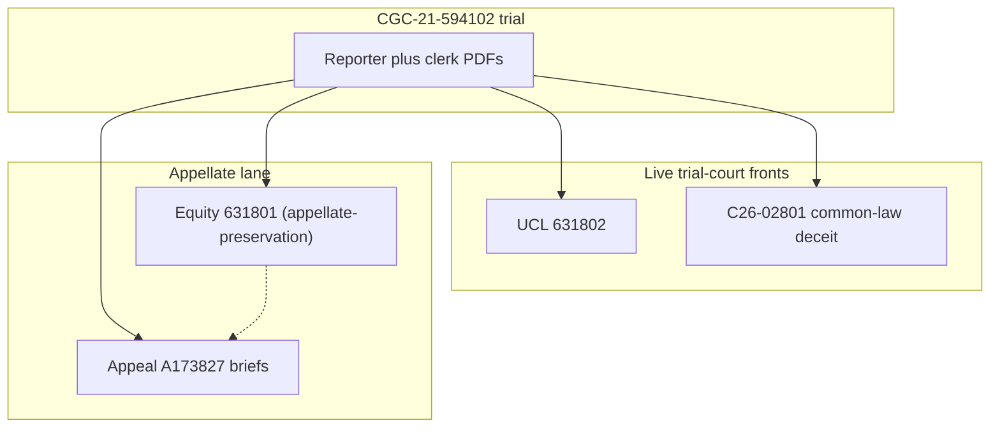

# Case dossier (30-minute deep read)

**One-file PDF:** [CASE-DOSSIER.pdf](CASE-DOSSIER.pdf) (export of this page; for counsel pickup).

> **Posture (September 22, 2026):** Contra Costa **C26-02801** is the filed common-law deceit action ([04-CASE-C26-02801/INDEX.md](04-CASE-C26-02801/INDEX.md)). 802 (CGC-25-631802) remains the San Francisco carrier caption (CCP 391 continued to October 6, 2026; CMC October 21, 2026; see [03-CASE-CGC-25-631802/INDEX.md](03-CASE-CGC-25-631802/INDEX.md)). 801 (CGC-25-631801) is in appellate-preservation posture (see [01-APPEAL/EQUITY-PRESERVATION-LANE/](01-APPEAL/EQUITY-PRESERVATION-LANE/README.md)). A173827 is in active appellate briefing.

**Not legal advice.** This page is a **table of contents** to material already on this site. Open the links; do not treat this page as a substitute for the primary PDFs.

---

## 1. Factual spine (five anchors)

Reproduced in full prose in Section 3 of [`CROSS-CASE-NARRATIVE-LEGAL-THEORY-AND-LEVERAGE.md`](CROSS-CASE-NARRATIVE-LEGAL-THEORY-AND-LEVERAGE.md): 911 audio; BWC + CAD; Vehicle Code turning-duty statutes; **April 16, 2025** Day-7 "provided by Dolan" colloquy; and CSAA's funding and direction of the defense. Numbered pins: [`evidence.md`](evidence.md) (E-01 through E-15).

---

## 2. The two signature contradictions

- **“Concluded / careful review” (2021 letter)** vs **“not produced / news to me” (2025 pretrial)**: developed in Section 5 of the same cross-case narrative, and in [`CONTRADICTION-LETTER.md`](CONTRADICTION-LETTER.md).  
- **Dolan / chain-of-custody:** Day-7 admission block-quoted in [`CROSS-CASE-LOGIC-TREE-AND-CSAA-WORST-CASE.md`](CROSS-CASE-LOGIC-TREE-AND-CSAA-WORST-CASE.md) and analyzed in [`08-LEGAL-ANALYSIS/FATAL-PROOF-NAVARATNASINGHAM-DOLAN-ADMISSION-EXTRINSIC-FRAUD.md`](08-LEGAL-ANALYSIS/FATAL-PROOF-NAVARATNASINGHAM-DOLAN-ADMISSION-EXTRINSIC-FRAUD.md).

---

## 3. Cross-forum reading method

From the homepage: keep **appeal**, **631801 equity**, **631802 UCL**, **594102 trial**, and **C26-02801** materials **separate**; verify quoted lines in **reporter PDFs**; verify insurer documents in **631802** and **C26** exhibits. See the homepage banner at [`README.md`](README.md#banner-argument-c26-02801-and-the-core-wrong).

---

## 4. Element → source (pleaded / argued)

The consolidated **element map** (negligence, appeal clusters, 631801, 631802, C26-02801, audio) is maintained at [`evidence-tree/INDEX.md`](evidence-tree/INDEX.md).  

For verbatim cross-walks and court-reliance import, use [`08-LEGAL-ANALYSIS/COURT-RELIANCE-FRAUD-ON-COURT.md`](08-LEGAL-ANALYSIS/COURT-RELIANCE-FRAUD-ON-COURT.md) and the integrated discrepancy file [`08-LEGAL-ANALYSIS/DISCREPANCY-INTEGRATED-ANALYSIS.md`](08-LEGAL-ANALYSIS/DISCREPANCY-INTEGRATED-ANALYSIS.md).

---

## 5. Five-forum map

---

## 6. What to verify first (primary PDFs)

**Contra Costa filed deceit action:** [04-CASE-C26-02801/INDEX.md](04-CASE-C26-02801/INDEX.md) and [VERIFIED-COMPLAINT-C26-02801.pdf](04-CASE-C26-02801/VERIFIED-COMPLAINT-C26-02801.pdf).

**San Francisco 802 calendar:** [03-CASE-CGC-25-631802/INDEX.md](03-CASE-CGC-25-631802/INDEX.md); next dates on [HEARINGS-CALENDAR.md](HEARINGS-CALENDAR.md).

**Appellate-preservation lane (post-May-12 801 materials):** [01-APPEAL/EQUITY-PRESERVATION-LANE/README.md](01-APPEAL/EQUITY-PRESERVATION-LANE/README.md).

| Item | Link |
|------|--------|
| Trial Day 7 (Apr. 16, 2025) | [`05-TRANSCRIPTS/REPORTER-TRANSCRIPTS/Trial-Day-07-April-16-2025.pdf`](05-TRANSCRIPTS/REPORTER-TRANSCRIPTS/Trial-Day-07-April-16-2025.pdf) |
| Trial Day 8 (Apr. 17, 2025) | [`05-TRANSCRIPTS/REPORTER-TRANSCRIPTS/Trial-Day-08-April-17-2025.pdf`](05-TRANSCRIPTS/REPORTER-TRANSCRIPTS/Trial-Day-08-April-17-2025.pdf) |
| Feb. 18, 2025 hearing register | [`05-TRANSCRIPTS/HEARINGS/All-Hearing-Transcripts-Rosario-AAA.pdf`](05-TRANSCRIPTS/HEARINGS/All-Hearing-Transcripts-Rosario-AAA.pdf) (verify cite) |
| MIL / instruction context | Use [`05-TRANSCRIPTS/CLERKS-TRANSCRIPT/CGC-21-594102-A173827-Clerks-Transcript-Full.pdf`](05-TRANSCRIPTS/CLERKS-TRANSCRIPT/CGC-21-594102-A173827-Clerks-Transcript-Full.pdf) and [`01-APPEAL/01-Appellants-Opening-Brief.pdf`](01-APPEAL/01-Appellants-Opening-Brief.pdf) |

Audio, body-cam, and pin register: [`evidence.md`](evidence.md).

---

---

## Document metadata

| Field | Value |
|-------|-------|
| Created | 2026-07-10 |
| Last updated | 2026-09-22 |
| Last author | soltrinox |
| Version | `d456321` (rev 5) |
| Repository | GITHUB-PAGE |

*Auto-generated from git history. Re-run `scripts/audit_strategic_docs.py --apply` to refresh.*
[← Homepage](README.md) · [For attorneys (cover)](FOR-ATTORNEYS.md) · [Risk / economics](RISK-AND-ECONOMICS.md)
