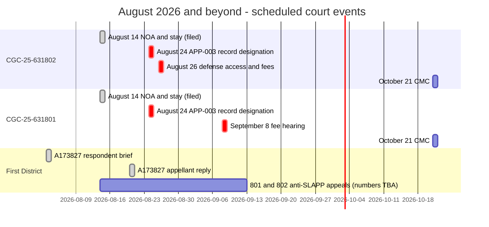
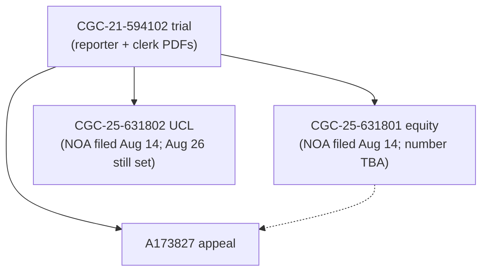
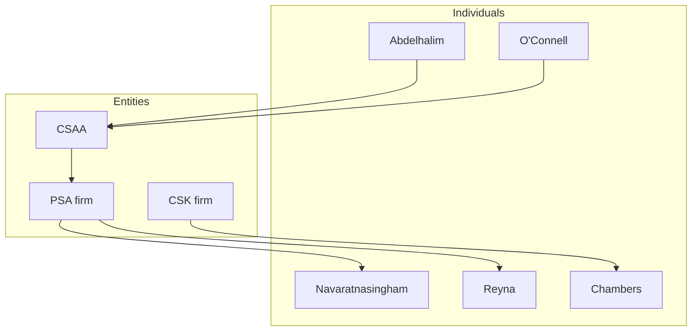

# Archived homepage (through August 21, 2026)

> **This is a retired homepage, kept for its link structure and its dated refresh history.** The current homepage is [README.md](README.md). Nothing was deleted from this page; posture statements below are frozen as of August 21, 2026 and are not updated.

---

# Rosario v. Abdelhalim et al.: forensic case record

> Open public record. All documents are California court filings.

**Plaintiff:** Franciscus Dylan Rosario (in pro per)
**Forums:** San Francisco Superior Court · California Court of Appeal, First Appellate District, Division Three
**Cases:** CGC-21-594102 (underlying trial) · A173827 (appeal) · CGC-25-631801 (equity / extrinsic fraud, now appellate-preservation posture) · CGC-25-631802 (UCL / denial-letter fraud, live trial-court front)
**Verdict:** 9 to 3 defense, April 23, 2025 (the bare minimum civil majority).
**Last refresh:** August 21, 2026 (see [What's new](#whats-new)).

> **Posture (August 21, 2026):** Notices of appeal are **on the civil register of actions** in **both** CGC-25-631802 (Tx `80347004`; DocIDs `10377025` / `10377027` / `10377028`) and CGC-25-631801 (Tx `80347363`; DocIDs `10377050` / `10377052` / `10377053`). Those appeals go to the **California Court of Appeal, First Appellate District**. Appellate numbers are **TBA**; do not infer them. Same-day stay notices (CCP 916 / *Varian*) were authorized in Dept. 302 (Tx `80347745`) and Dept. 301 (Tx `80347943`) and are **not yet on the register**. The defense is seeking **$32,928.27** in 802 fees (Aug 26, Dept. 302) and **$37,110.46** in 801 fees (Sept 8, Dept. 301, ROA-confirmed), plus a defense access bar in 802 on Aug 26, used as an escape after the empty-file / anti-SLAPP contradiction. Plaintiff opposed both fee motions and filed an 801 motion to tax costs. In the older trial appeal **A173827**, plaintiff filed the **Appellant's Reply Brief** and four companion papers on **August 20, 2026**. **CMC continued:** September 9 is now **October 21, 2026, 10:30 a.m., Dept. 610** (801 DocID `10376072` / 802 DocID `10376074`). See [Where each side stands](#where-each-side-stands-august-21-2026) · [802 Aug 14 hub](03-CASE-CGC-25-631802/aug14-2026-appeal-stay-fees-cmc/README.md) · [801 Aug 14 hub](02-CASE-CGC-25-631801/aug14-2026-appeal-stay-fees-tax-cmc/README.md) · [ANALYSIS/AUG-2026-POSTURE.md](ANALYSIS/AUG-2026-POSTURE.md).

---

# **LIVE FRONT — dual anti-SLAPP appeals + remaining trial-court calendar**

## **➤ [802 Aug 14 hub (NOA, stay, fee opposition, CM-110)](03-CASE-CGC-25-631802/aug14-2026-appeal-stay-fees-cmc/README.md)** · **[801 Aug 14 hub (NOA, stay, fee opposition, tax, CM-110)](02-CASE-CGC-25-631801/aug14-2026-appeal-stay-fees-tax-cmc/README.md)**

- **Appeals filed August 14, 2026, now on the register:** both cases to the **First Appellate District**. 802 Tx `80347004` (July 1 order, DocID `10297081`; ROA seq 327-329). 801 Tx `80347363` (Aug 6 order, DocID `10361462`; ROA seq 207-209). Appellate numbers **TBA**.
- **Stay notices same day:** 802 Dept. 302 Tx `80347745`; 801 Dept. 301 Tx `80347943`. Filed legal position under CCP 916 / *Varian*; **not** on the August 20 register, and not a court order taking hearings off calendar.
- **What the defense wants:** 802 fees **$32,928.27** (Aug 26, Dept. 302) plus a defense access bar the same morning, used as an escape after the empty-file / anti-SLAPP contradiction; 801 fees and costs **$37,110.46** (Sept 8, Dept. 301, ROA-confirmed Tx `80309587`), stated as 169.30 hours at $210/hr plus two anticipated hearing hours, with an MC-010 costs memo of $1,137.46.
- **What plaintiff filed in response:** 802 fee opposition Tx `80348027`; 801 fee opposition Tx `80348365`; 801 motion to tax costs Tx `80349087` (hearing TBD / specially set); CM-110s Tx `80349265` (802) and `80349330` (801). Those four remain **off** the August 20 register.
- **Still on calendar:** August 26, 2026, 9:00 a.m., Dept. 302 (802 defense access/fee hearing); September 8, 2026, 9:00 a.m., Dept. 301 (801 fees); **October 21, 2026, 10:30 a.m., Dept. 610** (CMC both cases; continued from Sept 9). Confirm on the portal.
- **Record designation:** CRC 8.121 notices designating the record (form APP-003) are due in each superior-court file by **August 24, 2026**, ten days after the notices of appeal. APP-004 waits on the Court of Appeal clerk's notice.
- **802 case hub:** [03-CASE-CGC-25-631802/INDEX.md](03-CASE-CGC-25-631802/INDEX.md) · [defense papers as filed](03-CASE-CGC-25-631802/vexatious-opposition-aug26-2026/README.md) · [802 PUBLIC-SYNOPSIS](03-CASE-CGC-25-631802/aug14-2026-appeal-stay-fees-cmc/PUBLIC-SYNOPSIS.md)
- **801 case hub:** [02-CASE-CGC-25-631801/INDEX.md](02-CASE-CGC-25-631801/INDEX.md) · [801 PUBLIC-SYNOPSIS](02-CASE-CGC-25-631801/aug14-2026-appeal-stay-fees-tax-cmc/PUBLIC-SYNOPSIS.md)

Most recent 802 filings:
- [**August 14 appeal / stay / fee opposition / CM-110** (Tx `80347004` / `80347745` / `80348027` / `80349265`)](03-CASE-CGC-25-631802/aug14-2026-appeal-stay-fees-cmc/README.md)
- [**Aug 26 defense access/fee papers as filed** (Tx `80094866` / `80105728`)](03-CASE-CGC-25-631802/vexatious-opposition-aug26-2026/README.md)
- [Court e-filed Apr. 28 to 29 wave (six SFTC transactions, 35 served titles)](03-CASE-CGC-25-631802/served-sftc-apr28-29-2026/README.md)
- [Clerk filing build Apr. 28 (DOCUSERV mirror, 99 PDFs)](03-CASE-CGC-25-631802/clerk-filing-2026-04-28/README.md)
- [Cross-hearing § 425.17(c) stack (Apr. 30)](03-CASE-CGC-25-631802/cross-hearing-42517-apr30-2026/README.md)

---

## Where each side stands (August 21, 2026)

Neutral description of filed positions across four forums. Nothing below predicts an outcome; every dollar figure and transaction number is taken from a paper on file or from a portal register pull mirrored on this site.

### What the defense has done and is asking for

| Front | Defense position as filed | Amount / relief | Next date |
|-------|---------------------------|-----------------|-----------|
| **802** (CSAA denial letter / UCL) | Won the July 1, 2026 special motion to strike (DocID `10297081`); demurrer mooted; leave to file a TAC denied | CCP 425.16(c) fees **$32,928.27** (Tx `80070231`) | Aug 26, 2026, Dept. 302 |
| **802** | Moved for an access bar after the July 1 strike (escape from empty-file / anti-SLAPP contradiction) | Access bar (Tx `80094857`) | Same Aug 26 morning |
| **802** | MC-010 costs memorandum | **$1,137.46** (Tx `80123223`) | Cost calendar (matured Aug 10) |
| **801** (equity / extrinsic fraud) | Won the Aug 6, 2026 order striking the amended complaint (DocID `10361462`); opposed reconsideration, which was denied Aug 11 on minutes | Fees and costs **$37,110.46** (Tx `80309587`) | Sept 8, 2026, Dept. 301 |
| **A173827** (trial appeal) | Filed the Respondent's Brief on Aug 3, 2026 | Affirmance of the 9 to 3 defense verdict | Reply filed; argument not yet set |
| Both trial-court cases | Filed case management statements (801 Tx `80343025`; 802 Tx `80343603`) | Case management | Oct 21, 2026, Dept. 610 |

801 moving parties named on the fee notice: CSAA Insurance Exchange; Michael R. Chambers; Carbone, Smith & Koyama. Clerk PDFs are mirrored in each hub's `defense/` folder. Defense-side filings generally: [DEFENSE-FILINGS/](DEFENSE-FILINGS/).

### What plaintiff has done and is asking for

| Front | Plaintiff position as filed | Instrument | Status |
|-------|-----------------------------|------------|--------|
| **802** | Appeal of the July 1 strike order | Notice of appeal Tx `80347004` | On ROA seq 327-329; First District number TBA |
| **801** | Appeal of the Aug 6 strike order | Notice of appeal Tx `80347363` | On ROA seq 207-209; First District number TBA |
| **Both** | Automatic stay of trial-court proceedings embraced by the appeals | Stay notices Tx `80347745` (Dept. 302) / `80347943` (Dept. 301) under CCP 916 and *Varian* | Filed legal position; off the Aug 20 register; hearings remain on the portal |
| **802** | Opposition to the $32,928.27 fee demand | Tx `80348027` | Filed Aug 14; off the Aug 20 register |
| **802** | Opposition to the defense access motion | Tx `80094866` / `80105728` | On ROA; [hub](03-CASE-CGC-25-631802/vexatious-opposition-aug26-2026/README.md) |
| **801** | Opposition to the $37,110.46 fee demand | Tx `80348365` | Filed Aug 14; off the Aug 20 register |
| **801** | Motion to tax or strike costs (CRC 3.1700(b)) | Tx `80349087` | Hearing to be specially set |
| **A173827** | Appellant's Reply Brief plus motion to disregard extra-record matter in the Respondent's Brief, supplemental RJN, consolidated exhibits, and two proposed orders | Served Aug 20, 2026 | [aug20 reply hub](01-APPEAL/aug20-2026-reply/README.md) |
| **Both** | CM-110 case management statements | Tx `80349265` (802) / `80349330` (801) | Filed Aug 14 for the CMC |
| Public record | Correspondence archive with split legal labels; personal-dialogue letter to CSAA's counsel of record | Not filings | [correspondence/INDEX.md](correspondence/INDEX.md) · [LETTER-TO-OCONNELL-AUG21-2026.md](LETTER-TO-OCONNELL-AUG21-2026.md) |

### What has actually changed in the last week

1. **The two anti-SLAPP appeals are real and imaged.** Both notices of appeal now carry register sequence numbers and clerk DocIDs, so the appellate lane no longer depends on File & Serve receipts alone. What is still unknown is the First District case number for each.
2. **The stay question is unresolved on paper.** Plaintiff's CCP 916 position is filed; the Aug 26 and Sept 8 fee hearings are still on the portal. Nothing on the register shows the court taking either matter off calendar.
3. **The CMC moved.** September 9 became **October 21, 2026**, in both cases, so the only near-term contested settings are the two fee hearings and the defense access motion.
4. **The trial appeal is fully briefed on the merits.** With the Aug 3 Respondent's Brief answered by the Aug 20 reply, A173827 is in the window between briefing and argument.
5. **The next plaintiff deadline is a record designation, not a brief.** Form APP-003 is due August 24, 2026, separately in each trial-court file.

---

# **IMMUNITY MAPPING → BAD-FAITH SIGNAL**

## **➤ [Read the full narrative → IMMUNITY-MAPPING-TO-BAD-FAITH-SIGNAL.md](IMMUNITY-MAPPING-TO-BAD-FAITH-SIGNAL.md)**

**How reaching for litigation privilege / anti-SLAPP “anticipation of litigation” becomes a purpose confession under California Fair Claims standards.** Two inline flowcharts map the core contradiction (adversarial posture vs. thorough / fair / objective investigation) and the adverse-inference cascade (purpose admission, *Action Apartment* overclaim, regulatory laundering → judicial estoppel / *Wilson* bar / concealment).

**Spine:** day-21 denial as “anticipation of litigation”; 10 CCR § 2695.7(d) objectivity; *Action Apartment* privilege predicate; *Wilson* contemporaneous-file rule; *Egan* one-sided investigation; *Aguilar* judicial estoppel; Ins. Code § 790.03 / Fair Claims as **standard of care only** (*Moradi-Shalal* / *Zhang*).

**Companion to:** [ANTI-SLAPP-CONSEQUENCE-RADIUS.md](ANTI-SLAPP-CONSEQUENCE-RADIUS.md) · [STRATEGIC-MEMO-DELAY-TACTIC-IMMUNITY-GAMBIT-801-802.md](STRATEGIC-MEMO-DELAY-TACTIC-IMMUNITY-GAMBIT-801-802.md) · [ANTI-SLAPP-OFF-RAMPS.md](ANTI-SLAPP-OFF-RAMPS.md) · [MERITS.md](MERITS.md).

### **➤ [Open IMMUNITY-MAPPING-TO-BAD-FAITH-SIGNAL.md and read the full narrative](IMMUNITY-MAPPING-TO-BAD-FAITH-SIGNAL.md)**

---

# **APPELLATE / PRESERVATION LANE**

## **➤ [Open the appellate lane → 01-APPEAL/INDEX.md](01-APPEAL/INDEX.md)**

## Dual anti-SLAPP appeals (filed August 14, 2026)

Notices of appeal are now File & Serve authorized in **both** superior-court cases. They go to the **California Court of Appeal, First Appellate District**. They are **not** federal district-court appeals. Appellate numbers are **TBA**.

| Case | Source order | NOA Tx | Stay Tx | Public hub |
|------|--------------|--------|---------|------------|
| **CGC-25-631802** | July 1, 2026 (DocID `10297081`) | `80347004` | `80347745` (Dept. 302) | [aug14-2026-appeal-stay-fees-cmc](03-CASE-CGC-25-631802/aug14-2026-appeal-stay-fees-cmc/README.md) |
| **CGC-25-631801** | August 6, 2026 (DocID `10361462`) | `80347363` | `80347943` (Dept. 301) | [aug14-2026-appeal-stay-fees-tax-cmc](02-CASE-CGC-25-631801/aug14-2026-appeal-stay-fees-tax-cmc/README.md) |

The older **A173827** appeal of the CGC-21-594102 trial verdict remains a separate proceeding.

## Post-May-12 appellate stack (CGC-25-631801)

**[Open the five-packet stack (scaffold PDFs) → 01-APPEAL/POST-MAY-12-FILING-STACK/README.md](01-APPEAL/POST-MAY-12-FILING-STACK/README.md)**

- **Day +5:** Objections to proposed order (CRC 3.1312(a)) — [01-OBJECTIONS-PROPOSED-ORDER](01-APPEAL/POST-MAY-12-FILING-STACK/01-OBJECTIONS-PROPOSED-ORDER/README.md)
- **Day +10:** Reconsideration (CCP § 1008) — [02-RECONSIDERATION (pointer)](01-APPEAL/POST-MAY-12-FILING-STACK/02-RECONSIDERATION/README.md) · May 13 rebuild PDFs: [post-order-recon-may-13](01-APPEAL/EQUITY-PRESERVATION-LANE/post-order-recon-may-13/README.md)
- **Day +15:** New trial (CCP §§ 657, 659) — [03-NEW-TRIAL](01-APPEAL/POST-MAY-12-FILING-STACK/03-NEW-TRIAL/README.md)
- **Day +15:** Vacate (CCP §§ 663, 663a) — [04-VACATE-663](01-APPEAL/POST-MAY-12-FILING-STACK/04-VACATE-663/README.md)
- **Day +60:** Notice of appeal (CCP § 904.1(a)(13); jurisdictional) — [05-NOTICE-OF-APPEAL](01-APPEAL/POST-MAY-12-FILING-STACK/05-NOTICE-OF-APPEAL/README.md)

**May 12 source order (PDF + parse):** [02-CASE-CGC-25-631801/court-orders/2026-05-12-anti-slapp-grant-order/](02-CASE-CGC-25-631801/court-orders/2026-05-12-anti-slapp-grant-order/README.md)

| Forum | Posture | Hub |
|-------|---------|-----|
| **A173827** (First District, Div. 3) | Reply filed August 20, 2026 | [01-APPEAL/INDEX.md](01-APPEAL/INDEX.md) · [aug20 hub](01-APPEAL/aug20-2026-reply/README.md) |
| **CGC-25-631801** (equity / extrinsic-fraud vacatur) | Post-May-12 preservation; Motion for Reconsideration; appellate-preservation RJN | [01-APPEAL/EQUITY-PRESERVATION-LANE/README.md](01-APPEAL/EQUITY-PRESERVATION-LANE/README.md) |

801 case file remains mirrored at [02-CASE-CGC-25-631801/](02-CASE-CGC-25-631801/INDEX.md) for record purposes only.

---
# CASE 801 STANDING (now on appellate review) :

Although Plaintiff does not assert a private cause of action arising directly under the California Rules of Professional Conduct or Business and Professions Code section 6068(d) — which do not, of themselves, supply an independent civil cause enforceable by an opposing party (Stanley v. Richmond (1995) 35 Cal.App.4th 1070, 1095–1097; Mirabito v. Liccardo (1992) 4 Cal.App.4th 41, 45–46) — this action sounds in the equitable cause for vacatur on extrinsic fraud, in common-law Intentional Misrepresentation, Concealment, and Constructive Fraud under Civil Code sections 1709, 1710(1), 1710(3), and 1573, and in the statutory civil action for Attorney Deceit under Business and Professions Code section 6128(a).

By appearing of record in CGC-21-594102 and issuing affirmative tribunal-directed representations — in Motions in Limine Nos. 6 and 17, at the February 18, 2025 hearing, and at trial — that they had "no idea where" the silent-witness materials "came from," Defendants engaged in a voluntary officer-of-the-court undertaking analogous to Biakanja v. Irving (1958) 49 Cal.2d 647, assuming a duty of candor to the tribunal and a parallel duty of accuracy to the unrepresented opposing party reasonably relying on those statements. Shafer v. Berger, Kahn (2003) 107 Cal.App.4th 54, 79–80.

Consequently, the authorities cited herein are not invoked as a direct source of a private right of action; rather, they establish the objective standard of care and the "officer-of-the-court floor" governing counsel's candor and the integrity of the adversary process.

Under the framework of Kulchar v. Kulchar (1969) 1 Cal.3d 467, 471–472, and In re Marriage of Modnick (1983) 33 Cal.3d 897, 905, supplemented by Shafer, supra, these standards serve as the benchmark against which the truthfulness and reasonableness of Defendants' tribunal-directed representations must be measured.

Liability arises from Defendants' affirmative representations to the trial court that they neither possessed nor had knowledge of the silent-witness materials when, in fact, no reasonable grounds existed for believing such assertions to be true; CSAA Insurance Exchange's liability arises additionally from its institutional ratification of those representations through its authorized panel counsel. Civ. Code § 2330; Evid. Code § 1222; Gulf Ins. Co. v. Berger, Kahn (2000) 79 Cal.App.4th 114, 124.


> **801 notice of appeal filed August 14, 2026** (Tx `80347363`). Post-May-12 materials: [01-APPEAL/EQUITY-PRESERVATION-LANE/](01-APPEAL/EQUITY-PRESERVATION-LANE/README.md). Filed Aug 14 set: [aug14-2026-appeal-stay-fees-tax-cmc](02-CASE-CGC-25-631801/aug14-2026-appeal-stay-fees-tax-cmc/README.md). Trial-court file: [02-CASE-CGC-25-631801/INDEX.md](02-CASE-CGC-25-631801/INDEX.md).

---

# CASE 802 STANDING

Although Plaintiff, as a third-party claimant, does not assert a private cause of action under Insurance Code § 790.03 or for breach of the implied covenant of good faith and fair dealing, consistent with the limitations in Moradi-Shalal v. Fireman's Fund Ins. Cos. (1988) 46 Cal.3d 287, 
this action sounds in common-law Negligent Misrepresentation under Civil Code § 1710(2).
By issuing a formal written denial predicated on the positive assertion of a 'concluded investigation,' CSAA engaged in a voluntary undertaking under Biakanja v. Irving (1958) 49 Cal.2d 647, thereby assuming a duty of care to ensure the accuracy of factual representations made to the Plaintiff. 
Consequently, the authorities cited herein are not invoked as a direct source of a private right of action; rather, they establish the objective standard of care and the 'regulatory floor' governing the adequacy of an insurer’s investigative process. 
Under the framework of Bartel v. Chicago Title Ins. Co. (2025),  these standards serve as the benchmark against which the truthfulness and reasonableness of CSAA’s representations must be measured. 
CSAA’s liability arises from its affirmative representation that a competent investigation had been performed when, in fact, the insurer possessed no reasonable grounds for believing such an assertion to be true.


# **MERITS HERE!**

## **➤ [Read the full Merits Statement → MERITS.md](MERITS.md)**

**A single-record, paragraph-cited statement of the merits in CGC-25-631801 (independent action in equity to set aside judgment) and CGC-25-631802 (denial-letter fraud / UCL).** Every cause of action in both Third Amended Complaints is tethered, element-by-element, to the operative TAC paragraphs that plead it (801 TAC ¶¶ 52–87; 802 TAC ¶¶ 5–69). After this letter, the defense's "no merits" posture is no longer available as a procedural matter.

**The pivot point is one sentence:** the **February 25, 2021 CSAA denial letter** signed by Sarah Rash represented that the investigation **was** performed; the **January 17, 2025 MIL Nos. 6 and 17 declarations** signed by appointed defense counsel under [CCP § 2015.5](CASE-LAW-AND-STATUTES/statutes-cal/CCP-2015.5.md) represented that the investigative product **was not** in counsel's possession. Both cannot be true on the face of the record. The reconciliation *requires bearing false witness in one direction or the other*.

**What the document does on a single record:**

- **Forecloses the "merits not articulated" posture.** Every count is mapped to TAC paragraphs and counsel is given a written demand to identify any specific element/cause/paragraph claimed deficient — silence is converted into procedural forfeiture.
- **Catalogs the procedural admissions** flowing from the demurrer / Anti-SLAPP vehicles defendants chose under [*Blank v. Kirwan* (1985) 39 Cal.3d 311, 318](CASE-LAW-AND-STATUTES/opinions-pdf/Blank-v-Kirwan-39-Cal-3d-311.pdf) and [*Soukup v. Hafif* (2006) 39 Cal.4th 260, 291](https://law.justia.com/cases/california/supreme-court/4th/39/260.html) ([local authority index](LEGAL-AUTHORITIES.md)).
- **Stages personal exposure** under Business and Professions Code § 6128(a) (attorney deceit), officer-of-the-court fiduciary breach, aiding and abetting (as to CSAA), and Civil Code § 2338 ratification.
- **Pairs the cornerstone artifacts** (Rash 2021 denial letter; Priya MIL Nos. 6 / 17 declarations) with **Jeremy Jessup's** sworn officer-of-the-court testimony from the Dolan firm that the materials *were* delivered to CSAA's defense counsel.
- **Multi-channel record:** transmitted simultaneously to the Court, all defendants, the California Department of Insurance (CDI), and CSAA's current counsel of record (Tyler J. O'Connell) — boxing in four parallel records that must remain consistent.

**Why click:** the document doubles as both a meet-and-confer letter under [CCP § 430.41](CASE-LAW-AND-STATUTES/statutes-cal/CCP-430.41.md) / [CCP § 435.5](CASE-LAW-AND-STATUTES/statutes-cal/CCP-435.5.md) *and* a section-by-section implications analysis (Sections 1–7) that walks through what changes the moment this hits the multi-channel record — including [*Stansfield v. Starkey*](https://law.justia.com/cases/california/court-of-appeal/3d/220/59.html) (1990) 220 Cal.App.3d 59, [*D'Amico v. Board of Medical Examiners*](https://law.justia.com/cases/california/supreme-court/3d/11/1.html) (1974) 11 Cal.3d 1, [*Committee on Children's Television, Inc. v. General Foods Corp.*](https://law.justia.com/cases/california/supreme-court/3d/35/197.html) (1983) 35 Cal.3d 197, and [CCP § 128.7](CASE-LAW-AND-STATUTES/statutes-cal/CCP-128.7.md) ramifications, plus the withdrawal-or-correct dilemma now confronting successor counsel. See [legal authorities](LEGAL-AUTHORITIES.md).

**Cornerstone exhibits and operative TACs** (see [MERITS-EXHIBITS/](MERITS-EXHIBITS/README.md)):

| # | Exhibit | PDF |
|---|---------|-----|
| 1 | February 25, 2021 CSAA denial letter (Sarah Rash) | [CSAA_Denial_Letter-Feb-25-2021.pdf](MERITS-EXHIBITS/CSAA_Denial_Letter-Feb-25-2021.pdf) |
| 2 | January 17, 2025 MIL No. 6 declaration (CT Vol. 1, pp. 149–151) | [MIL-No-6 PDF](MERITS-EXHIBITS/CGC-21-594102-CT1-MIL-No-6_Clerk-pp-149-151.pdf) |
| 3 | January 17, 2025 MIL No. 17 declaration (CT Vol. 1, pp. 238–241) | [MIL-No-17 PDF](MERITS-EXHIBITS/CGC-21-594102-CT1-MIL-No-17_Clerk-pp-238-241.pdf) |
| 4 | CGC-25-631801 — Third Amended Complaint (certified) | [TAC-801-06-TAC.pdf](MERITS-EXHIBITS/TAC-801-06-TAC.pdf) |
| 5 | CGC-25-631802 — Third Amended Complaint (certified) | [TAC-802-06-TAC.pdf](MERITS-EXHIBITS/TAC-802-06-TAC.pdf) |

### **➤ [Open MERITS.md and read the full statement](MERITS.md)**

---

# **ANTI-SLAPP CONSEQUENCE RADIUS**

## **➤ [Read the full narrative → ANTI-SLAPP-CONSEQUENCE-RADIUS.md](ANTI-SLAPP-CONSEQUENCE-RADIUS.md)**

**A 7,000-word focused narrative tracing the consequence radius of the defense's April 9, 2026 anti-SLAPP filings in CGC-25-631801 and CGC-25-631802.** Anchored on the threshold preclusion under [CCP § 425.17(c)](CASE-LAW-AND-STATUTES/statutes-cal/) (insurance / commercial-speech carve-out, *Simpson Strong-Tie Co., Inc. v. Gore* (2010) 49 Cal.4th 12). Walks seven self-inflicted procedural injuries from the April 9 filing through the **June 24, 2026** consolidated 802 hearing (continued from the May 29 setting) and the May 29 [§ 128.7](CASE-LAW-AND-STATUTES/statutes-cal/CCP-128.7.md) safe-harbor expiry date. Closes with a four-hypothesis classification of defense conduct (ignorance / arrogance / honest error / strategic delay or ratification) inferred strictly from documentary signals.

**Spine:** § 425.17(c) as threshold bar; thirteen-row maneuver-to-consequence ledger; discovery stay backfire under [§ 425.16(g)](CASE-LAW-AND-STATUTES/statutes-cal/CCP-425.16.md); conscription of the claim record; omitted controlling authorities and candor toward the tribunal; the reply maneuver and page-cap counter-trap; deem-admit and compel as independent channels; reply declaration and § 1005 trap.

**Companion to:** [ANTI-SLAPP-OFF-RAMPS.md](ANTI-SLAPP-OFF-RAMPS.md) (doctrinal off-ramps walkthrough) · [STRATEGIC-MEMO-DELAY-TACTIC-IMMUNITY-GAMBIT-801-802.md](STRATEGIC-MEMO-DELAY-TACTIC-IMMUNITY-GAMBIT-801-802.md) (strategic-memo voice) · [IMMUNITY-MAPPING-TO-BAD-FAITH-SIGNAL.md](IMMUNITY-MAPPING-TO-BAD-FAITH-SIGNAL.md) (anticipation-of-litigation → purpose confession) · [MERITS.md](MERITS.md) (TAC-aligned merits statement).

### **➤ [Open ANTI-SLAPP-CONSEQUENCE-RADIUS.md and read the full narrative](ANTI-SLAPP-CONSEQUENCE-RADIUS.md)**

---

## Anti-SLAPP jurisprudence — § 425.16 off-ramps (801 / 802)

California’s special motion to strike under CCP § 425.16 is a two-step burden shift. **Exemptions** (CCP § 425.17), **gravamen** analysis (*City of Cotati v. Cashman*, *Park v. Board of Trustees*), and **illegality as a matter of law** (*Flatley v. Mauro*) can defeat the motion before prong two—and prong two itself requires only **minimal merit** (*Navellier v. Sletten*).

**On this record:** Filings treat **commercial / insurer factual representations** (§ 425.17(c)), **public-interest** routes in the alternative (§ 425.17(b)), **prong-one** mis-targeting of the injury-producing acts, **_Flatley_** predicates anchored in **Bus. & Prof. Code § 6128(a)** and insurer regulatory floors (**10 CCR § 2695.7**, Ins. Code § 790.03(h)), and **prong-two** evidence—plus **extrinsic fraud** posture (*Kulchar*, *Kougasian*) where pleaded—as independent grounds the May hearings’ special motions do not fit the SAC.

**→ [Anti-SLAPP misuse and consequence radius (801 / 802) → ANTI-SLAPP-CONSEQUENCE-RADIUS.md](ANTI-SLAPP-CONSEQUENCE-RADIUS.md):** 7,000-word focused narrative; § 425.17(c) as threshold bar; seven consequence chains (discovery stay backfire, conscription of the claim record, omitted authorities, reply maneuver, page-cap counter-trap, deem-admit / compel channels, § 1005 reply-declaration trap); four-hypothesis classification of defense conduct (plaintiff-authored narrative; not a court filing).

**→ [Read the full doctrinal walkthrough → ANTI-SLAPP-OFF-RAMPS.md](ANTI-SLAPP-OFF-RAMPS.md)**

**→ [Strategic memo: delay-tactic immunity gambit (801 / 802) → STRATEGIC-MEMO-DELAY-TACTIC-IMMUNITY-GAMBIT-801-802.md](STRATEGIC-MEMO-DELAY-TACTIC-IMMUNITY-GAMBIT-801-802.md):** CCP § 425.17(c) gateway, § 425.17(e) and appellate leverage, two-layer immunity rhetoric (Layer A / B), per-case catalogs, and Tracks 1–3 case-management readout (plaintiff-authored narrative; not a court filing).

**→ [Immunity mapping to bad-faith signal → IMMUNITY-MAPPING-TO-BAD-FAITH-SIGNAL.md](IMMUNITY-MAPPING-TO-BAD-FAITH-SIGNAL.md):** How “anticipation of litigation” becomes a purpose confession under 10 CCR § 2695.7(d), *Action Apartment*, *Wilson*, and *Aguilar*; two flowcharts (claims-handling contradiction + adverse-inference cascade) (plaintiff-authored narrative; not a court filing).

---

## April 28–29, 2026 — preparation for Apr. 30 hearing (CGC-25-631802)

Plaintiff **e-filed and e-served** coordinated packets for **CGC-25-631802** so the record matches **Department 302** on **April 30, 2026** (leave to amend / SAC-related oral reply) and the **originally noticed May 29, 2026** demurrer / Anti-SLAPP calendar (continued to **June 24, 2026**). The filings bracket SAC posture against defendants' procedural vehicles—nothing here predicts outcomes.

- **Yesterday (Apr. 27)** — Combined motion-for-leave / SAC packets to defense with Judicial Council POS-050s; **802** reply ISO leave court-ready for Apr. 30; [*Moradi-Shalal*](_shared/moradi-shalal-carveout-apr27/README.md) carve-out meet-and-confer; safe harbor and adverse-authority supplements ([801 hub](02-CASE-CGC-25-631801/apr-2026-sac-leave/served-defense-apr27/README.md) · [802 hub](03-CASE-CGC-25-631802/apr-2026-sac-leave/served-defense-apr27/README.md)).
- **Today (Apr. 28–29)** — Six **File and Serve** transactions, **35** served titles, six mirrored topic lanes (bench/SAC support, TAC response + cure matrix, Anti-SLAPP NOL, Prong-One NOL, discovery tracks 1–3, defense-service masters); plus clerk-facing **[DOCUSERV build](03-CASE-CGC-25-631802/clerk-filing-2026-04-28/README.md)** and **[SFTC docket register](03-CASE-CGC-25-631802/served-sftc-apr28-29-2026/SFTC-DOCKET-REGISTER.md)** keyed receipt-by-receipt.
- **Tomorrow (Apr. 30 hearing)** — Bench packet, courtesy copies for Dept. 302, and **cure matrix** materials remain staged beside the served hubs for oral argument and leave posture ([served hub](03-CASE-CGC-25-631802/served-sftc-apr28-29-2026/README.md) · [synopsis](03-CASE-CGC-25-631802/served-sftc-apr28-29-2026/PUBLIC-SYNOPSIS-AND-STRATEGY.md)).
- **Court-filed cross-hearing stack (Apr. 30)** — Memorandum, notice of lodging, RJN, omnibus blackletter supplement, customer-doctrine supplement, safe-harbor notice/declaration, and POS-050 **as filed with the court** for **631801** and **631802**, with Markdown and LaTeX sources mirrored on this site; **bench briefs from that package are omitted** from the public mirror ([801 hub](02-CASE-CGC-25-631801/cross-hearing-42517-apr30-2026/README.md) · [802 hub](03-CASE-CGC-25-631802/cross-hearing-42517-apr30-2026/README.md)).

| Hub | Link |
|-----|------|
| **631802** — all April 28–29 PDFs, SFTC transaction table, folder guide | [**Served Apr. 28–29 (802)**](03-CASE-CGC-25-631802/served-sftc-apr28-29-2026/README.md) |
| **631802** — receipt-by-receipt title → PDF map (six transactions) | [**SFTC docket register**](03-CASE-CGC-25-631802/served-sftc-apr28-29-2026/SFTC-DOCKET-REGISTER.md) |
| **631802** — narrative only (how the lanes fit together) | [Public synopsis — strategy](03-CASE-CGC-25-631802/served-sftc-apr28-29-2026/PUBLIC-SYNOPSIS-AND-STRATEGY.md) |
| **631802** — full clerk-filing build (DOCUSERV mirror, 99 PDFs incl. courtesy + prong-one) | [Clerk filing — Apr. 28 (802)](03-CASE-CGC-25-631802/clerk-filing-2026-04-28/README.md) |
| **631801 / 631802** — Apr. 30 court-filed § 425.17(c) cross-hearing (PDFs + Markdown + TeX; no bench briefs) | [801 cross-hearing](02-CASE-CGC-25-631801/cross-hearing-42517-apr30-2026/README.md) · [802 cross-hearing](03-CASE-CGC-25-631802/cross-hearing-42517-apr30-2026/README.md) |

---

## April 27, 2026 — served to defense (both cases)

Plaintiff served the defense team the **same-day combined motion-for-leave / SAC court-facing packets** for **CGC-25-631801** and **CGC-25-631802** (with Judicial Council POS-050 proofs), the **Apr. 27 safe-harbor supplements** and **adverse-authority notices** per case, the **802 reply ISO leave** for the Apr. 30 setting, and a **case-collective** meet-and-confer letter plus memorandum on the ***Moradi-Shalal*** common-law carve-out (served on both captions).

| Hub | Link |
|-----|------|
| **631801** — combined packet, POS-050, safe harbor, adverse authority, gravamen deck | [Served Apr. 27 (801)](02-CASE-CGC-25-631801/apr-2026-sac-leave/served-defense-apr27/README.md) |
| **631802** — same plus **reply SAC (Apr. 30, court-ready)** | [Served Apr. 27 (802)](03-CASE-CGC-25-631802/apr-2026-sac-leave/served-defense-apr27/README.md) |
| ***Moradi-Shalal*** carve-out — meet-and-confer + general analysis (Markdown and PDF) | [*Moradi-Shalal* hub — Apr. 27](_shared/moradi-shalal-carveout-apr27/README.md) |

---

> *"BOOM! I just hit him. HIT HIM. There was barely anything."*
> Defendant Subhi Abdelhalim, 911 call, February 4, 2021. Authenticated under oath at trial: *"Yes. That is my voice."* See [Trial Day 8 reporter PDF](05-TRANSCRIPTS/REPORTER-TRANSCRIPTS/Trial-Day-08-April-17-2025.pdf) and [evidence.md](evidence.md).

> *"Sure. They were provided by Dolan. He has had them for whatever, sure."*
> Defense counsel Priya D. Navaratnasingham, [Trial Day 7, April 16, 2025](05-TRANSCRIPTS/REPORTER-TRANSCRIPTS/Trial-Day-07-April-16-2025.pdf). This sentence is irreconcilable with prior sworn statements that the same materials were "not produced during discovery" and of "unknown provenance."

---

### Defense fatal flaws (631802 posture) — quick map

| Flaw (short label) | Why it matters on the existing record | Primary links on this site |
|--------------------|----------------------------------------|----------------------------|
| **Concluded-investigation fraud (802)** | Feb. 25, 2021 denial letter represents a completed investigation; claim file does not reflect acquisition of 911 / BWC / CAD materials pleaded as foundational. | [MERITS.md](MERITS.md) · [631802 index](03-CASE-CGC-25-631802/INDEX.md) · cornerstone PDFs in [MERITS-EXHIBITS/](MERITS-EXHIBITS/README.md) |
| **“Provided by Dolan” admission (801)** | Trial Day 7 transcript line pairs with sworn MIL-era narratives of absence / provenance. | [Trial Day 7 PDF](05-TRANSCRIPTS/REPORTER-TRANSCRIPTS/Trial-Day-07-April-16-2025.pdf) · [Extrinsic fraud threading](EXTRINSIC-FRAUD-THREADING-THE-NEEDLE-801-AND-802.md) |
| **MIL Nos. 6 / 17 vs. denial letter** | Same-record juxtaposition of denial letter and MIL declarations under oath. | [MERITS-EXHIBITS/](MERITS-EXHIBITS/README.md) |
| **Litigation privilege misfit** | Denial letter predates litigation; theory targets ordinary-course communications. | [631802 — Why this avoids standard defenses](03-CASE-CGC-25-631802/INDEX.md#why-this-avoids-standard-defenses) |
| **Anti-SLAPP gravamen / prong one** | Lodged prong-one packet and checklist vs. pleaded pre-litigation gravamen. | [40-PRONG-ONE-RECORD/](03-CASE-CGC-25-631802/clerk-filing-2026-04-28/40-PRONG-ONE-RECORD/) · May 13 checklist exhibit in same clerk build |

**Expanded discussion:** [DEFENSE-FATAL-FLAWS.md](DEFENSE-FATAL-FLAWS.md) (TAC paragraph cites; routes through [LEGAL-AUTHORITIES.md](LEGAL-AUTHORITIES.md)).

---

## Pick a lane

| Audience | Single entry point | What it gives you |
|----------|--------------------|-------------------|
| **California counsel** | **[FOR-ATTORNEYS.md](FOR-ATTORNEYS.md)** | One-page intake brief |
| **Journalists / writers** | **[JOURNALIST-NARRATIVE-THREE-CASES.md](JOURNALIST-NARRATIVE-THREE-CASES.md)** | Newsroom narrative |
| **Researchers / public** | **[CASE-DOSSIER.md](CASE-DOSSIER.md)** | 30-minute curated tour |
| **Plaintiff-authored analysis** | **[ANALYSIS/README.md](ANALYSIS/README.md)** | Long-form memos (not court filings) |
| **Case law and statutes** | **[LEGAL-AUTHORITIES.md](LEGAL-AUTHORITIES.md)** | Mirror index: [CASE-LAW-AND-STATUTES/INDEX.md](CASE-LAW-AND-STATUTES/INDEX.md), [opinions PDF](CASE-LAW-AND-STATUTES/opinions-pdf/), [statutes](CASE-LAW-AND-STATUTES/statutes-cal/) |

**Where do I start (quick links)?**

- Who is asking for what, right now → [Where each side stands](#where-each-side-stands-august-21-2026)
- Dual anti-SLAPP appeals filed Aug 14, now on the register (First District; numbers TBA) → [802 Aug 14 hub](03-CASE-CGC-25-631802/aug14-2026-appeal-stay-fees-cmc/README.md) · [801 Aug 14 hub](02-CASE-CGC-25-631801/aug14-2026-appeal-stay-fees-tax-cmc/README.md)
- Live trial-court motion practice (Aug 26 defense access/fee hearing; Sept 8 801 fees; Oct 21 CMC) → [03-CASE-CGC-25-631802/INDEX.md](03-CASE-CGC-25-631802/INDEX.md) · [vexatious-opposition-aug26-2026](03-CASE-CGC-25-631802/vexatious-opposition-aug26-2026/README.md)
- Trial appeal A173827, now fully briefed → [aug20 reply hub](01-APPEAL/aug20-2026-reply/README.md) · [01-APPEAL/INDEX.md](01-APPEAL/INDEX.md) · [POST-MAY-12-FILING-STACK](01-APPEAL/POST-MAY-12-FILING-STACK/README.md)
- Cross-case theory / leverage / risk → [MERITS.md](MERITS.md) · [RISK-SURFACE.md](RISK-SURFACE.md)

**Deeper attorney reading:** [CASE-DOSSIER.md](CASE-DOSSIER.md) (Markdown) · **[CASE-DOSSIER.pdf](CASE-DOSSIER.pdf)** (download) · [HEARINGS-CALENDAR.md](HEARINGS-CALENDAR.md) · [RISK-AND-ECONOMICS.md](RISK-AND-ECONOMICS.md).

**Big-picture analytical writing already on this site:** [ANALYSIS/README.md](ANALYSIS/README.md) · [CROSS-CASE-NARRATIVE-LEGAL-THEORY-AND-LEVERAGE.md](CROSS-CASE-NARRATIVE-LEGAL-THEORY-AND-LEVERAGE.md) · [CROSS-CASE-LOGIC-TREE-AND-CSAA-WORST-CASE.md](CROSS-CASE-LOGIC-TREE-AND-CSAA-WORST-CASE.md) · [CONTRADICTION-LETTER.md](CONTRADICTION-LETTER.md) · [LETTER-TO-OCONNELL-AUG21-2026.md](LETTER-TO-OCONNELL-AUG21-2026.md) (personal dialogue; not a filing) · [correspondence/INDEX.md](correspondence/INDEX.md) (Rosario-to-defense archive; split labels) · [SPINE.md](SPINE.md) · [BOOK-OUTLINE.md](BOOK-OUTLINE.md) (every Markdown file on the site).

---

## What's new (August 21, 2026)

- **Correspondence full-archive (not a filing; not service; not a 128.7 restart).** Phase 1 of the August 21, 2026 Porter Scott mailbox export is published under [correspondence/full-archive/](correspondence/full-archive/README.md): challenged-set threads, inbound defense mail (labeled as defense speech), and court-staff mail (labeled as court-staff, not Rosario speech). Sent bodies stay as sent except where a visible Rule 3 marker replaces a span; the marker does not describe withheld words. Court-seen threads from the defense access/fee hearing exhibits match the lodged exhibits. Face reservation: [correspondence/banners/reservation-of-rights.md](correspondence/banners/reservation-of-rights.md). Completeness is not a substitute for papers already on file. The 32-event class table remains at [correspondence/INDEX.md](correspondence/INDEX.md).
- **Homepage posture rewritten to the current position of both sides.** New section: [Where each side stands](#where-each-side-stands-august-21-2026), with a defense ask-by-ask table (802 fees, defense access bar, MC-010 costs, 801 fees, A173827 respondent's brief) beside the plaintiff response table (two notices of appeal, two stay notices, two fee oppositions, 801 tax motion, A173827 reply wave, CM-110s).
- **Calendar corrected site-wide.** The September 9 case management conference is **continued to October 21, 2026, 10:30 a.m., Dept. 610** in both cases (801 DocID `10376072`; 802 DocID `10376074`). The Aug 26 and Sept 8 hearings are unchanged.
- **Notices of appeal confirmed on the register.** Both August 14 notices now carry register sequence numbers and clerk DocIDs (802 seq 327-329; 801 seq 207-209). The stay notices, fee oppositions, 801 tax motion, and plaintiff CM-110s were **not** on the August 20 register pull.
- **Next plaintiff deadline is the record designation.** Form APP-003 under CRC 8.121 is due **August 24, 2026**, filed separately in each superior-court file. APP-004 waits on the Court of Appeal clerk's notice; appellate numbers remain **TBA**.
- **A173827 reply papers indexed on the homepage.** The appeal document table now lists items 8 through 14, including the Respondent's Opening Brief and the August 20 reply wave.
- **Correspondence archive (split labels; not a filing).** Rosario-to-defense emails and letters, classified as they were when sent. Personal-dialogue items carry the First Amendment / article I, section 2 waiver. Meet-and-confer, CCP 128.7, Evidence Code 1152, and service transmittals keep that legal character. Publishing does not convert those papers into personal dialogue, does not restart any 128.7 clock, and is not new service. Hub: [correspondence/INDEX.md](correspondence/INDEX.md) (32 events).
- **Personal dialogue letter to Tyler J. O'Connell (not a filing).** First Amendment / article I, section 2 commentary addressed to CSAA's counsel of record, with a face waiver that it is personal dialogue, not a pleading, not a settlement offer, and not a substitute for papers on file. Canonical: [LETTER-TO-OCONNELL-AUG21-2026.md](LETTER-TO-OCONNELL-AUG21-2026.md) · email-ready twin: [LETTER-TO-OCONNELL-AUG21-2026-EMAIL.md](LETTER-TO-OCONNELL-AUG21-2026-EMAIL.md). Formal positions remain those in the filed 801/802 and A173827 papers.

## What's new (August 20, 2026)

- **A173827 reply wave published.** Appellant's Reply Brief (80 pages) plus motion to disregard extra-record matter in the respondent's brief, supplemental RJN, consolidated exhibits, and two proposed orders. Proof of service executed August 20, 2026. Respondent's Opening Brief (August 3, 2026) is mirrored with the set. Hub: [01-APPEAL/aug20-2026-reply](01-APPEAL/aug20-2026-reply/README.md) · [09-Appellants-Reply-Brief.pdf](01-APPEAL/09-Appellants-Reply-Brief.pdf). This is the trial-verdict appeal in the First Appellate District, Division Three; not the August 14 801/802 anti-SLAPP notices.
- **802 ROA refresh (GetROA 9:16 am; paste 9:05 am):** 329 rows (was 324). Newest date **2026-08-14**. Notice of appeal **on ROA** Tx `80347004` (DocIDs `10377025` / `10377027` / `10377028`). CMC of Sep 9 **continued to Oct 21, 2026, 10:30 a.m., Dept. 610** (DocID `10376074`). Stay / fee opp / plaintiff CM-110 still off-register. Previously missing seq 323-324 PDFs now LOCAL. [STATE-2026-08-20](03-CASE-CGC-25-631802/docket-state/STATE-2026-08-20.md) · [ROA-AUDIT-2026-08-20](03-CASE-CGC-25-631802/docket-state/ROA-AUDIT-2026-08-20.md).
- **801 ROA refresh (GetROA 9:16 am; paste 9:13 am):** 212 rows (was 203). Notice of appeal **on ROA** Tx `80347363` (DocIDs `10377050` / `10377052` / `10377053`). MC-010 **is** a separate DocID `10369596` (seq 201). Fee papers remapped to seq 202-204 (DocIDs unchanged). Same Oct 21 CMC continuance (DocID `10376072`). Stay / fee opp / tax still off-register. [STATE-2026-08-20](02-CASE-CGC-25-631801/docket-state/STATE-2026-08-20.md) · [CALENDAR-2026-08-20](02-CASE-CGC-25-631801/docket-state/CALENDAR-2026-08-20.md).
- **Live calendar:** Aug 26, 9:00 a.m., Dept. 302 / Quinn (802 fees + defense access motion); Sept 8, 9:00 a.m., Dept. 301 (801 fees); **Oct 21, 10:30 a.m., Dept. 610 CMC**.

## What's new (August 14, 2026)

- **Notices of appeal filed in both cases.** 802 Tx `80347004` (2:33 p.m. PDT) from the July 1 order (DocID `10297081`). 801 Tx `80347363` (2:40 p.m. PDT) from the Aug 6 strike order (DocID `10361462`). Forum: **California Court of Appeal, First Appellate District**. Appellate numbers **TBA**. [802 hub](03-CASE-CGC-25-631802/aug14-2026-appeal-stay-fees-cmc/README.md) · [801 hub](02-CASE-CGC-25-631801/aug14-2026-appeal-stay-fees-tax-cmc/README.md) · [802 synopsis](03-CASE-CGC-25-631802/aug14-2026-appeal-stay-fees-cmc/PUBLIC-SYNOPSIS.md) · [801 synopsis](02-CASE-CGC-25-631801/aug14-2026-appeal-stay-fees-tax-cmc/PUBLIC-SYNOPSIS.md).
- **Stay notices same day.** 802 Dept. 302 Tx `80347745`; 801 Dept. 301 Tx `80347943`. CCP 916 / *Varian* as filed; hearings remain on the portal until the court says otherwise.
- **Defense fee campaign, now mirrored.** 802 demand **$32,928.27** (July 17 Tx `80070231`; hearing Aug 26). 801 demand **$37,110.46** (Aug 11 Tx `80309587`; DocIDs `10369670` / `10369671` / `10369673`; hearing Sept 8, Dept. 301). Clerk PDFs are in each hub's `defense/` folder.
- **Plaintiff fee oppositions and 801 tax.** 802 fee opp Tx `80348027`. 801 fee opp Tx `80348365`. 801 motion to tax costs Tx `80349087` (hearing TBD / specially set).
- **CM-110s filed early.** 802 Tx `80349265`; 801 Tx `80349330`. Sept 9, 2026, 10:30 a.m., Dept. 610 remains the CMC.
- **Not published here:** Contra Costa complaint, CDI complaint, hearing-kit drafts, predraft AOBs. Those are not this SF docket wave.

## What's new (August 12, 2026)

- **802 ROA refresh:** Portal paste Generated 2026-08-12 1:03 pm. Newest register date still **2026-07-28**. Two rows after the July 27 register: defense MC-010 $1,137.46 (Tx `80123223`, mature Aug 10) and plaintiff RFJN (Tx `80146159`). No August ROA rows, no NOA, no July 1 NOE label, no judgment, no defense reply. [STATE-2026-08-12](03-CASE-CGC-25-631802/docket-state/STATE-2026-08-12.md) · [ROA-AUDIT-2026-08-12](03-CASE-CGC-25-631802/docket-state/ROA-AUDIT-2026-08-12.md).
- **801 ROA refresh:** Portal paste Generated 2026-08-12 1:06 pm (200 of 200). Reconsideration **DENIED** Aug 11 on ROA (minutes; no appearance; no DocID). No NOE. Fee motion served Aug 11 is **not** on ROA or Calendar. Only live 801 setting: Sep 9 CMC. [STATE-2026-08-12](02-CASE-CGC-25-631801/docket-state/STATE-2026-08-12.md) · [CALENDAR-2026-08-12](02-CASE-CGC-25-631801/docket-state/CALENDAR-2026-08-12.md).
- **Live calendar confirmed (802):** Aug 26, 9:00 a.m., Dept. 302 / Quinn (fees + defense access motion); Sep 9, 10:30 a.m., Dept. 610 CMC. [802 CALENDAR-2026-08-12](03-CASE-CGC-25-631802/docket-state/CALENDAR-2026-08-12.md).

## What's new (July 27, 2026)

- **NEW featured narrative:** [IMMUNITY-MAPPING-TO-BAD-FAITH-SIGNAL.md](IMMUNITY-MAPPING-TO-BAD-FAITH-SIGNAL.md) - how reaching for litigation privilege / anti-SLAPP “anticipation of litigation” maps into a Fair Claims / *Egan* / *Wilson* purpose confession. Inline Figures 1-2: [claims-handling contradiction](assets/immunity-claims-handling-strategy.png) · [adverse-inference cascade](assets/immunity-anti-slapp-cascade.png). Companion to [ANTI-SLAPP-CONSEQUENCE-RADIUS.md](ANTI-SLAPP-CONSEQUENCE-RADIUS.md) and [STRATEGIC-MEMO-DELAY-TACTIC-IMMUNITY-GAMBIT-801-802.md](STRATEGIC-MEMO-DELAY-TACTIC-IMMUNITY-GAMBIT-801-802.md).

## What's new (July 22, 2026)

- **NEW hub (802):** [Defense access/fee papers as filed (Aug 26)](03-CASE-CGC-25-631802/vexatious-opposition-aug26-2026/README.md) - 14 plaintiff PDFs + 6 defense PDFs; [PUBLIC-SYNOPSIS](03-CASE-CGC-25-631802/vexatious-opposition-aug26-2026/PUBLIC-SYNOPSIS.md). Portal Tx / DocIDs TBD after e-file.
- **Active fight:** August 26, 2026, 9:00 a.m., Dept. 302 (defense access/fee hearing). **Next CMC** remains September 9, 2026 (Dept. 610).
- **July 1 order:** Limited anti-SLAPP / FAC strike; not empty-file merits adjudication.
- **Analysis:** [AUG-2026-POSTURE](ANALYSIS/AUG-2026-POSTURE.md) (current) · [JULY-2026-POSTURE](ANALYSIS/JULY-2026-POSTURE.md) (prior).

## What's new (July 2026)

- **Site posture refresh:** June 24 hearing historical; **802 July 1 anti-SLAPP grant confirmed**; **Aug 26 Dept 302** (fees + defense access motion); **801 reconsideration July 31**; **September 9 CMC**. Current 802 snapshot: [STATE-2026-08-12](03-CASE-CGC-25-631802/docket-state/STATE-2026-08-12.md). July 27 802 register: [`REGISTER-OF-ACTIONS-20260727-802.md`](../CLERK-WEB-DOCKETS/_index/REGISTER-OF-ACTIONS-20260727-802.md).
- **NEW hubs (802):** [June 15 pre-hearing](03-CASE-CGC-25-631802/june-15-2026-pre-hearing/README.md) · [June 16 preliminary statement](03-CASE-CGC-25-631802/june-16-2026-preliminary-statement/README.md) · [September 9 CMC](03-CASE-CGC-25-631802/cmc-september-9-2026/README.md).
- **801 portal facts (July 27 paste):** Recon continued to July 31 (premature); defense opp + plaintiff reply on ROA; defense proposed-order packaging (Tx `80059270` / `80082937`); NOE still not on ROA (Day Zero frozen). [ROA audit July 27](02-CASE-CGC-25-631801/docket-state/ROA-AUDIT-2026-07-27.md).
- **802 portal facts (July 27 paste):** July 1 order granting special motion to strike on ROA; fees motion Tx `80070231` and defense access motion Tx `80094857` set Aug 26 Dept 302; plaintiff opp waves Tx `80094866` / `80105728`. Superseded by [Aug 12 ROA audit](03-CASE-CGC-25-631802/docket-state/ROA-AUDIT-2026-08-12.md); July 27 register: [`REGISTER-OF-ACTIONS-20260727-802.md`](../CLERK-WEB-DOCKETS/_index/REGISTER-OF-ACTIONS-20260727-802.md).
- **Analysis:** [JULY-2026-POSTURE](ANALYSIS/JULY-2026-POSTURE.md).

## What's new (June 11, 2026)

- **Site posture refresh:** Live front updated from May 29 consolidated setting to **June 24, 2026 split calendar** (portal pull May 28, 2026). [802 docket-state](03-CASE-CGC-25-631802/docket-state/STATE-2026-05-28.md) · [801 docket-state](02-CASE-CGC-25-631801/docket-state/STATE-2026-05-28.md).
- **NEW P1 hubs (802):** [May 8 cure batch](03-CASE-CGC-25-631802/hearing-package-may-8-2026/README.md) · [May 13 continuance](03-CASE-CGC-25-631802/calendar-continuance-may-13-2026/README.md) · [June 24 cohort (May 26 filings)](03-CASE-CGC-25-631802/june-24-cohort-2026-05-26/README.md) · [Cross-case estoppel](03-CASE-CGC-25-631802/cross-case-estoppel-june-24-2026/README.md) · [July 8 CMC](03-CASE-CGC-25-631802/cmc-july-8-2026/README.md).
- **801 portal facts woven:** May 15 discovery denial; May 22 CCP 436 withdrawn; no NOE (Day Zero frozen). [ROA audit](02-CASE-CGC-25-631801/docket-state/ROA-AUDIT-2026-05-28.md).
- **Analysis:** [JUNE-2026-RUNWAY](ANALYSIS/JUNE-2026-RUNWAY.md).

## What's new (prior refreshes)

**May 14, 2026 refresh.**

- **NEW:** [01-APPEAL/POST-MAY-12-FILING-STACK/README.md](01-APPEAL/POST-MAY-12-FILING-STACK/README.md) — public mirror of the five-packet post-May-12 scaffold (objections, reconsideration pointer, new trial, vacate 663, notice of appeal) with **PACKET** + **SOURCE-ARCHIVE** PDFs where noted; **scaffold / verify filing status on the portal**.
- **NEW:** [01-APPEAL/EQUITY-PRESERVATION-LANE/post-order-recon-may-13/](01-APPEAL/EQUITY-PRESERVATION-LANE/post-order-recon-may-13/README.md) — May 13 reconsideration rebuild PDFs (merged packet and components).
- **NEW:** [02-CASE-CGC-25-631801/court-orders/2026-05-12-anti-slapp-grant-order/](02-CASE-CGC-25-631801/court-orders/2026-05-12-anti-slapp-grant-order/README.md) — May 12 minute order PDF (`10210043`) plus sanitized structured parse.
- **NEW:** [ANALYSIS/README.md](ANALYSIS/README.md) — index for plaintiff-authored analytical writing, including [802 four-part memorandum (customer status and carve-out)](ANALYSIS/802-FOUR-PART-MEMORANDUM-CUSTOMER-STATUS-AND-CARVEOUT.md).
- **NEW:** [CASE-DOSSIER.pdf](CASE-DOSSIER.pdf) — single-file PDF export of [CASE-DOSSIER.md](CASE-DOSSIER.md) for counsel pickup.

**May 12, 2026 refresh.**

- **POSTURE SHIFT:** CGC-25-631801 is now in appellate-preservation posture following the May 12 hearing on defendants' Anti-SLAPP / special-motion practice. **Site reorientation:** CGC-25-631802 is now the live trial-court front. See the new [LIVE FRONT — 802](#live-front--cgc-25-631802-csaa-denial-letter--ucl) and [APPELLATE / PRESERVATION LANE](#appellate--preservation-lane) blocks above.
- **NEW (preservation lane):** [01-APPEAL/EQUITY-PRESERVATION-LANE/README.md](01-APPEAL/EQUITY-PRESERVATION-LANE/README.md) — Motion for Reconsideration + Proposed Third Amended Complaint (combined PDF); Second Supplemental RJN and Statement of Appellate Preservation; RJN of Governing Law; Silent-Witness master exhibits; POS-050 20 and POS-050 21; service manifest.
- **NEW:** [02-CASE-CGC-25-631801/hearing-package-may-12-2026/](02-CASE-CGC-25-631801/hearing-package-may-12-2026/README.md) — comprehensive archive of May 7 to 12 opposition instruments (operative opposition; RJN; declaration; evidentiary objections; exhibits volume; § 425.17 notice; supplemental RJN; motion to strike reply-declaration surplus).

**May 7, 2026 refresh.**

- **NEW:** **[CGC-25-631801 May 12 hearing DIGITAL-FILES archive](02-CASE-CGC-25-631801/hearing-package-may-12-2026/README.md)**: public mirror of all **DIGITAL-FILES / ARCHIVE** PDFs from the May 12, 2026 opposition package (May 7 core filings with POS companions; § 425.17 notice; Insurance Code and Fair Claims Settlement Practices supplemental RJN; consolidated opposition; indexed and combined exhibits volumes; evidentiary objections; motion to strike reply-declaration surplus; deferred **May 11** tentative-ruling notices). Narrative breakdown and link table on the hub page.

**May 4, 2026 refresh.**

- **NEW:** [ANTI-SLAPP-CONSEQUENCE-RADIUS.md](ANTI-SLAPP-CONSEQUENCE-RADIUS.md): focused 7,000-word narrative on the consequence radius of the defense's April 9, 2026 anti-SLAPP filings in CGC-25-631801 and CGC-25-631802. Anchored on the [CCP § 425.17(c)](CASE-LAW-AND-STATUTES/statutes-cal/) carve-out as threshold bar under *Simpson Strong-Tie Co., Inc. v. Gore* (2010) 49 Cal.4th 12. Includes a thirteen-row maneuver-to-consequence ledger and a four-hypothesis framework for reading defense conduct from documentary signals. Companion to [ANTI-SLAPP-OFF-RAMPS.md](ANTI-SLAPP-OFF-RAMPS.md) and [STRATEGIC-MEMO-DELAY-TACTIC-IMMUNITY-GAMBIT-801-802.md](STRATEGIC-MEMO-DELAY-TACTIC-IMMUNITY-GAMBIT-801-802.md).
- **NEW:** [Strategic memo: delay-tactic immunity gambit (801 / 802)](STRATEGIC-MEMO-DELAY-TACTIC-IMMUNITY-GAMBIT-801-802.md): unified narrative on defense two-layer immunity rhetoric, CCP § 425.17(c) as first-and-only gateway question, § 425.17(e) and interlocutory-review limits, *Moradi-Shalal* / *Zhang*, sanctions and case-management Tracks 1–3; companion to [EXTRINSIC-FRAUD-THREADING-THE-NEEDLE-801-AND-802.md](EXTRINSIC-FRAUD-THREADING-THE-NEEDLE-801-AND-802.md) and the [Apr. 30 cross-hearing hubs](#april-2829-2026--preparation-for-apr-30-hearing-cgc-25-631802). *(Memo cites some workspace-only paths for PDFs elsewhere in the authoring repo; core cross-links above live on this site.)*

**May 1, 2026 refresh.**

- **Apr. 30, 2026 — court-filed cross-hearing § 425.17(c) package (both cases):** Public mirror of **seven court-facing instruments per case** (memorandum; notice of lodging supplemental authority; omnibus blackletter contradictions; customer-doctrine supplemental memo; supplemental RJN; safe-harbor notice/declaration; POS-050), with **Markdown** for the omnibus and customer-doctrine portions and **LaTeX** sources for all instruments in each hub’s `source-tex/`. **Bench briefs** from the same authoring run are **not** published here. Hubs: [CGC-25-631801 — cross-hearing 42517](02-CASE-CGC-25-631801/cross-hearing-42517-apr30-2026/README.md) · [CGC-25-631802 — cross-hearing 42517](03-CASE-CGC-25-631802/cross-hearing-42517-apr30-2026/README.md).

**April 29, 2026 refresh.**

- **ANTI-SLAPP — doctrines tied to May hearings:** [ANTI-SLAPP-OFF-RAMPS.md](ANTI-SLAPP-OFF-RAMPS.md) — CCP §§ 425.16 / 425.17 frameworks (*Cashman*, *Park*, *Flatley*, exemptions, prong two), case-specific **801 / 802** anchors, procedural layer, TL;DR, and bench-statement précis (home-page intro immediately follows the **MERITS HERE** block).
- **Apr. 28–29 (today — lead):** [Court e-filed hub — 631802](03-CASE-CGC-25-631802/served-sftc-apr28-29-2026/README.md) · **[SFTC docket register](03-CASE-CGC-25-631802/served-sftc-apr28-29-2026/SFTC-DOCKET-REGISTER.md)** (six transactions → thirty-five titles → lane PDFs). One-line map of each **new pleading family** served that wave:
  - **TAC-802 motion-to-strike response + cure matrix** — seven instruments through cure matrix in [`tac-response-motion-strike/`](03-CASE-CGC-25-631802/served-sftc-apr28-29-2026/tac-response-motion-strike/).
  - **Anti-SLAPP TAC notice of lodging** — NOL stack + proposed TAC exhibit + POS in [`antislap-tac-notice-of-lodging/`](03-CASE-CGC-25-631802/served-sftc-apr28-29-2026/antislap-tac-notice-of-lodging/).
  - **Prong-One NOL** — notice + merged checklist + POS in [`prong-one-notice-of-lodging/`](03-CASE-CGC-25-631802/served-sftc-apr28-29-2026/prong-one-notice-of-lodging/).
  - **Discovery Track 1 (deem / compel / sanctions)** — motion stack + rolled-in discovery + POS in [`discovery-track1-deem-compel/`](03-CASE-CGC-25-631802/served-sftc-apr28-29-2026/discovery-track1-deem-compel/).
  - **Discovery Track 2 (sixth set)** — sixth-set discovery packet + POS in [`discovery-track2-set-six/`](03-CASE-CGC-25-631802/served-sftc-apr28-29-2026/discovery-track2-set-six/) *(confirm filing status on the portal if you need an official register match for a discrete SFTC transaction)*.
  - **Discovery Track 3 (default + CMC)** — notice of default, CMC statement update, POS in [`discovery-track3-default-cmc/`](03-CASE-CGC-25-631802/served-sftc-apr28-29-2026/discovery-track3-default-cmc/).
  - **SAC Apr. 30 hearing support + defense-service masters** — bench brief, exhibits, combined POS in [`mfl-sac-apr30-hearing/`](03-CASE-CGC-25-631802/served-sftc-apr28-29-2026/mfl-sac-apr30-hearing/) plus consolidated defense-service PDF + POS in [`defense-service-docuserve/`](03-CASE-CGC-25-631802/served-sftc-apr28-29-2026/defense-service-docuserve/).
- [Public synopsis — strategy](03-CASE-CGC-25-631802/served-sftc-apr28-29-2026/PUBLIC-SYNOPSIS-AND-STRATEGY.md) · **NEW:** [Defense fatal flaws — expanded](DEFENSE-FATAL-FLAWS.md).
- **NEW:** [Clerk filing build — Apr. 28 (631802)](03-CASE-CGC-25-631802/clerk-filing-2026-04-28/README.md) — full **DOCUSERV** tree mirror (99 PDFs across `10-` … `60-` lanes) with merged combined packets, courtesy/prong-one variants, full `E-SERVICE-PARTS` constituents, and May 13 Anti-SLAPP opposition prong-one exhibit; cross-referenced to `SFTC-FILE-SERVE.POS.RECORDS.md` and `SFTC-CLERKS.DOCKET.md`.

**April 27, 2026 refresh.**

- **NEW:** [Served to defense — Apr. 27 (631801)](02-CASE-CGC-25-631801/apr-2026-sac-leave/served-defense-apr27/README.md) and [Served to defense — Apr. 27 (631802)](03-CASE-CGC-25-631802/apr-2026-sac-leave/served-defense-apr27/README.md) — combined MFL/SAC packets, POS-050s, Apr. 27 safe-harbor supplements, adverse-authority notices; **802** includes [reply ISO leave for Apr. 30](03-CASE-CGC-25-631802/apr-2026-sac-leave/served-defense-apr27/REPLY-SAC-APR-30-802-COURT-READY.pdf) (court-ready).
- **NEW:** [*Moradi-Shalal* common-law carve-out hub](_shared/moradi-shalal-carveout-apr27/README.md) — case-collective meet-and-confer letter and [general analysis](_shared/moradi-shalal-carveout-apr27/MORADI-SHALAL-COMMON-LAW-CARVEOUT-GENERAL-ANALYSIS.md) (Markdown + PDF); also indexed under [08-LEGAL-ANALYSIS/INDEX.md](08-LEGAL-ANALYSIS/INDEX.md).

**April 25, 2026 refresh.**

- **NEW:** [LEGAL-AUTHORITIES.md](LEGAL-AUTHORITIES.md) — full mirror of California case law, statutes, and rules under [`CASE-LAW-AND-STATUTES/`](CASE-LAW-AND-STATUTES/INDEX.md) (opinion PDFs, extracts, and leginfo statute pulls). Inline links added on [MERITS.md](MERITS.md), the [extrinsic-fraud explainer](EXTRINSIC-FRAUD-THREADING-THE-NEEDLE-801-AND-802.md), and this page.
- **NEW:** [MERITS.md](MERITS.md) — TAC-aligned merits statement and meet-and-confer letter for CGC-25-631801 and CGC-25-631802. Every count tied to operative TAC paragraphs; cornerstone-document contradiction (Rash 2021 denial letter vs. Priya MIL Nos. 6 / 17 declarations) framed on a single record. Includes the seven-section implications analysis (procedural foreclosure of "no merits"; demurrer / Anti-SLAPP ramifications; § 6128(a), § 128.7, and Civ. Code § 2338 exposure; multi-channel transmission to Court · CDI · all defendants · counsel of record). See banner above.
- **NEW:** [MERITS-EXHIBITS/](MERITS-EXHIBITS/README.md) — three cornerstone PDFs attached to the merits letter: the [Feb. 25, 2021 CSAA denial letter (Sarah Rash)](MERITS-EXHIBITS/CSAA_Denial_Letter-Feb-25-2021.pdf), the [Jan. 17, 2025 MIL No. 6 declaration (CT pp. 149–151)](MERITS-EXHIBITS/CGC-21-594102-CT1-MIL-No-6_Clerk-pp-149-151.pdf), and the [Jan. 17, 2025 MIL No. 17 declaration (CT pp. 238–241)](MERITS-EXHIBITS/CGC-21-594102-CT1-MIL-No-17_Clerk-pp-238-241.pdf). Same folder now mirrors the **certified Third Amended Complaints**: [TAC-801-06-TAC.pdf](MERITS-EXHIBITS/TAC-801-06-TAC.pdf) (631801) and [TAC-802-06-TAC.pdf](MERITS-EXHIBITS/TAC-802-06-TAC.pdf) (631802). [MERITS.md](MERITS.md) uses inline links on every `(801 TAC ¶ …)` / `(802 TAC ¶ …)` block citation (including `¶¶ 3(b)`-style references) to those PDFs.

**April 24, 2026 refresh.**

- New attorney-facing entry layer at the top: [FOR-ATTORNEYS.md](FOR-ATTORNEYS.md), [CASE-DOSSIER.md](CASE-DOSSIER.md), [HEARINGS-CALENDAR.md](HEARINGS-CALENDAR.md), [RISK-AND-ECONOMICS.md](RISK-AND-ECONOMICS.md), [JOURNALIST-NARRATIVE-THREE-CASES.md](JOURNALIST-NARRATIVE-THREE-CASES.md).
- Full `risk-surface/` mirror with per-case and per-party dollar tables; canonical narrative at [RISK.SURFACE.md](RISK.SURFACE.md).
- April 22 to 24, 2026 motion-practice PDFs mirrored: SAC-leave defense oppositions, plaintiff replies, Anti-SLAPP / OST supplement, bench cards, lodgment, clerk packets, citation-validation memos.
- Index updates: [01-APPEAL/INDEX.md](01-APPEAL/INDEX.md) (remand and post-vacatur materials) and [08-LEGAL-ANALYSIS/INDEX.md](08-LEGAL-ANALYSIS/INDEX.md) (risk surface, discrepancy, April 2026 practice mirrors).

**April 19, 2026 refresh.** Added [SPINE.md](SPINE.md), [defendants/INDEX.md](defendants/INDEX.md), per-forum [narrative/](narrative/) and [timelines/](timelines/), and the **FINAL-COURT** exhibit-integrated bundles under [03-CASE-CGC-25-631802/final-court-apr2026/](03-CASE-CGC-25-631802/final-court-apr2026/README.md).

**Earlier (March / early April 2026).** CSAA Anti-SLAPP clerk PDFs; the April 2026 demurrer volley (defense and plaintiff sides); the consolidated 801-draft opposition build under [03-CASE-CGC-25-631802/plaintiff-opposition-consolidated-apr2026/](03-CASE-CGC-25-631802/plaintiff-opposition-consolidated-apr2026/README.md); appellate PDF refreshes.

---

## Hearings on calendar



| Date | Case | Event | Department |
|------|------|--------|------------|
| **August 3, 2026** | **A173827** | Respondent's Opening Brief filed | [PDF](01-APPEAL/08-Respondents-Opening-Brief.pdf) |
| **August 14, 2026** | **802 + 801** | **Notices of appeal and stay notices filed** (First District; numbers TBA; NOAs now on the register) | [802 hub](03-CASE-CGC-25-631802/aug14-2026-appeal-stay-fees-cmc/README.md) · [801 hub](02-CASE-CGC-25-631801/aug14-2026-appeal-stay-fees-tax-cmc/README.md) |
| **August 20, 2026** | **A173827** | Appellant's Reply Brief and four companion papers served | [aug20 reply hub](01-APPEAL/aug20-2026-reply/README.md) |
| **August 24, 2026** | **802 + 801** | **Record designation due** (CRC 8.121; form APP-003, one per trial-court file) | SF Superior (not TrueFiling) |
| **August 26, 2026, 9:00 a.m.** | **CGC-25-631802** | **Defense access/fee hearing and CCP 425.16(c) fees ($32,928.27)** | **Dept. 302** |
| **September 8, 2026, 9:00 a.m.** | **CGC-25-631801** | **CCP 425.16(c) fees and costs ($37,110.46)** | **Dept. 301** |
| **October 21, 2026, 10:30 a.m.** | **CGC-25-631802 + 631801** | **Case Management Conference** (continued from Sept 9) | **Dept. 610** |
| August 11, 2026 | CGC-25-631801 | Reconsideration DENIED (minutes; no written-order DocID yet) | Dept. 301 |
| June 24, 2026, 9:00 a.m. | CGC-25-631802 | Consolidated hearing (historical) | 301 + 302 |
| May 12, 2026 | CGC-25-631801 | Anti-SLAPP grant | [PDF hub](02-CASE-CGC-25-631801/hearing-package-may-12-2026/README.md) |
| Ongoing | A173827 | Trial-verdict appeal (separate from the Aug 14 anti-SLAPP appeals) | First Appellate District |

Confirm dates and departments on the court portal. Full table with PDF links: [HEARINGS-CALENDAR.md](HEARINGS-CALENDAR.md).

---

## Recent filings (last 14 days, mirrored here)

| Filing | 631802 | 631801 |
|--------|--------|--------|
| A173827 reply wave (Aug 20): reply brief, motion to disregard extra-record matter, supplemental RJN, consolidated exhibits, two proposed orders | (separate appeal) | [aug20 reply hub](01-APPEAL/aug20-2026-reply/README.md) |
| Correspondence archive and personal-dialogue letter (Aug 21; **not filings**) | [correspondence/INDEX.md](correspondence/INDEX.md) | [LETTER-TO-OCONNELL-AUG21-2026.md](LETTER-TO-OCONNELL-AUG21-2026.md) |
| Notices of appeal, stay notices, fee oppositions, CM-110s (Aug 14); 801 tax motion | [Aug 14 hub](03-CASE-CGC-25-631802/aug14-2026-appeal-stay-fees-cmc/README.md) | [Aug 14 hub](02-CASE-CGC-25-631801/aug14-2026-appeal-stay-fees-tax-cmc/README.md) |
| Defense CCP 425.16(c) fee motions (already on ROA) | July 17 Tx `80070231` ($32,928.27) in [802 defense/](03-CASE-CGC-25-631802/aug14-2026-appeal-stay-fees-cmc/defense/) | Aug 11 Tx `80309587` ($37,110.46) in [801 defense/](02-CASE-CGC-25-631801/aug14-2026-appeal-stay-fees-tax-cmc/defense/) |
| Motion for Reconsideration (CCP § 1008); Second Supplemental RJN + Statement of Appellate Preservation; RJN of Governing Law; Silent-Witness master exhibits (May 11 to 12) | — | [Equity preservation lane](01-APPEAL/EQUITY-PRESERVATION-LANE/README.md) |
| Court e-filed burst — SAC bench packet, TAC response, NOLs, discovery tracks, service master (Apr. 28–29) | [Hub + PDFs + synopsis](03-CASE-CGC-25-631802/served-sftc-apr28-29-2026/README.md) | — |
| Served combined MFL/SAC packet + same-night instruments (Apr. 27) | [Hub + PDFs (includes reply SAC)](03-CASE-CGC-25-631802/apr-2026-sac-leave/served-defense-apr27/README.md) | [Hub + PDFs](02-CASE-CGC-25-631801/apr-2026-sac-leave/served-defense-apr27/README.md) |
| *Moradi-Shalal* carve-out meet-and-confer + analysis (Apr. 27, both cases) | [Shared hub](_shared/moradi-shalal-carveout-apr27/README.md) | (same hub) |
| Defense opposition to SAC leave (Apr. 23) | [PDFs + TOC](03-CASE-CGC-25-631802/apr-2026-sac-leave/defense-opposition-apr23/README.md) | [PDFs + TOC](02-CASE-CGC-25-631801/apr-2026-sac-leave/defense-opposition-apr23/README.md) |
| Plaintiff reply (Apr. 24, court-ready) | [Reply for Apr. 30 setting](03-CASE-CGC-25-631802/apr-2026-sac-leave/plaintiff-reply-apr24/README.md) | [Reply for May 6 setting](02-CASE-CGC-25-631801/apr-2026-sac-leave/plaintiff-reply-apr24/README.md) |
| Anti-SLAPP / OST supplement (Apr. 24) | [802 court PDFs + Flatley check](03-CASE-CGC-25-631802/anti-slapp-supplemental-apr24/README.md) | [801 court PDFs + Flatley check](02-CASE-CGC-25-631801/anti-slapp-supplemental-apr24/README.md) |
| Bench cards (Apr. 24) | [Apr. 30 card](08-LEGAL-ANALYSIS/bench-cards/BENCH-CARD-APR30-802-THREE-AUTHORITIES.pdf) | [May 6 card](08-LEGAL-ANALYSIS/bench-cards/BENCH-CARD-MAY06-801-THREE-AUTHORITIES.pdf) |
| Motion to strike (Apr. 22 source mirror) | [802 folder](03-CASE-CGC-25-631802/motion-strike-apr2026/README.md) | [801 folder](02-CASE-CGC-25-631801/motion-strike-apr2026/README.md) |
| Clerk packets (Apr. 24) | [README + PDF](03-CASE-CGC-25-631802/clerk-packets-apr24/README.md) | [README + PDF](02-CASE-CGC-25-631801/clerk-packets-apr24/README.md) |
| Citation validation memos | [Apr. 23 to 24 hub](08-LEGAL-ANALYSIS/citation-validation/README.md) | (same hub) |

---

## The four proceedings, at a glance



| # | Proceeding | Case no. | Forum | Theory in one line |
|---|------------|----------|-------|--------------------|
| 1 | Underlying trial | CGC-21-594102 | SF Superior, Dept. 504 (Hon. Garrett L. Wong) | Pedestrian-vehicle negligence; 9 to 3 defense verdict |
| 2 | Appeal | A173827 | First Appellate District, Div. 3 | Instructional error, evidentiary error, juror misconduct, structural / cumulative error |
| 3 | Equity action | CGC-25-631801 | SF Superior | Independent action in equity to vacate judgment for extrinsic fraud, attorney deceit (B&P 6128(a)), conspiracy, ratification |
| 4 | UCL / fraud | CGC-25-631802 | SF Superior | Pre-litigation false denial letter; B&P 17200; bad faith; *Prentice* fee shift |

| Proceeding | Case index | Narrative | Timeline |
|------------|------------|-----------|----------|
| Trial | [05-TRANSCRIPTS/INDEX.md](05-TRANSCRIPTS/INDEX.md) | [narrative/01](narrative/01-UNDERLYING-CGC-21-594102.md) | [timelines/trial](timelines/trial-CGC-21-594102.md) |
| Appeal | [01-APPEAL/INDEX.md](01-APPEAL/INDEX.md) | [narrative/02](narrative/02-APPEAL-A173827.md) | [timelines/appeal](timelines/appeal-A173827.md) |
| Equity | [02-CASE-CGC-25-631801/INDEX.md](02-CASE-CGC-25-631801/INDEX.md) | [narrative/03](narrative/03-EQUITY-CGC-25-631801.md) | [timelines/equity](timelines/equity-CGC-25-631801.md) |
| UCL | [03-CASE-CGC-25-631802/INDEX.md](03-CASE-CGC-25-631802/INDEX.md) | [narrative/04](narrative/04-UCL-CGC-25-631802.md) | [timelines/ucl](timelines/ucl-CGC-25-631802.md) |

---

## The case in plain English

On **February 4, 2021**, plaintiff was struck by a turning vehicle in a San Francisco crosswalk at **Tehama and Fifth Streets** and admitted to the intensive care unit at San Francisco General. Three weeks later, the driver's insurer (CSAA) issued a **denial letter** declaring its investigation "concluded" after "careful review," before the carrier had pulled the **911 audio**, **body-worn camera footage**, or **CAD record** referenced on the police report it already held. The 21-day denial is the documentary anchor of [CGC-25-631802](03-CASE-CGC-25-631802/INDEX.md). See [evidence.md](evidence.md) for the audio and CAD mirrors and [04-EXHIBITS/EXHIBIT-001-CSAA-Investigation-Report.pdf](04-EXHIBITS/EXHIBIT-001-CSAA-Investigation-Report.pdf) for the carrier's own report.

Four years later, in the trial of *Rosario v. Abdelhalim* (CGC-21-594102), the same 911 call surfaced. The driver authenticated his own voice on the recording: *"Yes. That is my voice."* ([Trial Day 8](05-TRANSCRIPTS/REPORTER-TRANSCRIPTS/Trial-Day-08-April-17-2025.pdf)). On **April 16, 2025** (Trial Day 7), defense counsel said on the record: *"Sure. They were provided by Dolan. He has had them for whatever, sure."* That sentence is irreconcilable with the defense's earlier representations to the trial court, on which the court relied to deny continuances and exclude or defer evidence, that the same materials were "not produced" and of "unknown provenance." On **April 23, 2025** the jury returned a 9 to 3 defense verdict, the bare minimum civil majority.

Out of that record, plaintiff filed three independent post-trial proceedings on a shared factual spine: an **appeal** of the trial court's instructional and evidentiary handling ([A173827](01-APPEAL/INDEX.md)), an **equity action** to vacate the judgment for extrinsic fraud ([CGC-25-631801](02-CASE-CGC-25-631801/INDEX.md)), and a **fraud / UCL action** against CSAA on the denial-letter timing and the broader deny-delay-defend pattern ([CGC-25-631802](03-CASE-CGC-25-631802/INDEX.md)). Each proceeding has its own decision-maker, standard of review, and remedy lane. Long-form treatments: [CROSS-CASE-NARRATIVE-LEGAL-THEORY-AND-LEVERAGE.md](CROSS-CASE-NARRATIVE-LEGAL-THEORY-AND-LEVERAGE.md) and [CROSS-CASE-LOGIC-TREE-AND-CSAA-WORST-CASE.md](CROSS-CASE-LOGIC-TREE-AND-CSAA-WORST-CASE.md).

> **Reading method.** Keep the forums separate. Use **631802** PDFs for insurer-facing theories, **631801** PDFs for fraud-on-the-court theories, **A173827** PDFs for instructional and evidentiary error catalogues, and **594102** reporter transcripts for sworn speech and clerk's orders. When April 2026 consolidated opposition PDFs cite trial pages, treat the **reporter PDF** as the authority for quoted lines.

---

## Academic legal analysis (per-forum orientation)

This section orients a reader who wants a **neutral map** from incident through four forums. It tracks **primary PDFs and transcripts** in this repository. It does not forecast outcomes; it states where **pleadings allege** facts and where **trial and agency records** supply contemporaneous material. Where this page summarizes doctrine, treat the summary as **orientation only** and verify holdings in the linked briefs and reporters.

**Incident and record foundation.** On February 4, 2021, a pedestrian-vehicle encounter at Tehama and Fifth in San Francisco anchors the later civil dockets. For 911 audio, CAD, and body-worn camera mirrors, start at [evidence.md](evidence.md). For the driver's trial-day authentication of a recording excerpt, compare the same evidence page with the [Day 8 reporter volume](05-TRANSCRIPTS/REPORTER-TRANSCRIPTS/Trial-Day-08-April-17-2025.pdf) for April 17, 2025. Read together, those sources support a disciplined question: what did emergency and field channels capture near the time of impact, and how did trial testimony treat those items.

**Underlying trial (CGC-21-594102).** The superior-court file presents negligence, liability, and damages themes as conventional personal-injury issues. The [clerk's transcript](05-TRANSCRIPTS/CLERKS-TRANSCRIPT/CGC-21-594102-A173827-Clerks-Transcript-Full.pdf) compiles orders, motion rulings, and instruction-related materials that later briefs cite as procedural history. Reporter volumes for mid-trial days include [Day 7 (Apr. 16)](05-TRANSCRIPTS/REPORTER-TRANSCRIPTS/Trial-Day-07-April-16-2025.pdf), [Day 8 (Apr. 17)](05-TRANSCRIPTS/REPORTER-TRANSCRIPTS/Trial-Day-08-April-17-2025.pdf), and [Day 11 (Apr. 23)](05-TRANSCRIPTS/REPORTER-TRANSCRIPTS/Trial-Day-11-April-23-2025.pdf). Deposition PDFs and indices are at [05-TRANSCRIPTS/INDEX.md](05-TRANSCRIPTS/INDEX.md). The trial layer remains the factual substrate for both direct review and collateral papers filed after judgment.

**Appeal (A173827).** The [appellant's opening brief](01-APPEAL/01-Appellants-Opening-Brief.pdf) catalogs issues that fall into familiar California buckets: instructional questions (often reviewed de novo), evidentiary rulings (typically reviewed for abuse of discretion), juror misconduct and Evidence Code section 1150 process, and structural or cumulative error arguments that depend on interlocking rulings. The [appellant's reply brief](01-APPEAL/09-Appellants-Reply-Brief.pdf) (August 20, 2026) answers [respondent's opening brief](01-APPEAL/08-Respondents-Opening-Brief.pdf). The appeal index groups briefs and exhibits at [01-APPEAL/INDEX.md](01-APPEAL/INDEX.md). Treat each heading in the brief as a hypothesis about reversible error, then walk the cited pages in the reporter PDFs and clerk's transcript rather than inferring facts from this homepage alone.

**Equity and extrinsic fraud (CGC-25-631801).** Plaintiff's [Second Amended Complaint](02-CASE-CGC-25-631801/01-Second-Amended-Complaint.pdf) and related memoranda articulate fraud on the court, extrinsic fraud, civil conspiracy, aiding and abetting, and professional-conduct strands tied to California's Rules of Professional Conduct and Business and Professions Code frameworks, always as **claims in a pleading** rather than as adjudicated facts. See also [03-Memorandum-Fraud-on-Court.pdf](02-CASE-CGC-25-631801/03-Memorandum-Fraud-on-Court.pdf) and the [Navaratnasingham admission motion](02-CASE-CGC-25-631801/11-Motion-Extrinsic-Fraud-Navaratnasingham-Admission.pdf). Plaintiff-authored analytical annex (non-filing commentary): [FATAL-PROOF-NAVARATNASINGHAM-DOLAN-ADMISSION-EXTRINSIC-FRAUD.md](08-LEGAL-ANALYSIS/FATAL-PROOF-NAVARATNASINGHAM-DOLAN-ADMISSION-EXTRINSIC-FRAUD.md). Defendant-by-defendant pages: [defendants/INDEX.md](defendants/INDEX.md).

**UCL and denial-letter work (CGC-25-631802).** The Unfair Competition Law (Business and Professions Code section 17200) appears in the FAC and supporting memoranda through unfair, unlawful, and fraudulent prongs, including theories about fraudulent omission tied to insurer communications. The [CSAA Investigation Report exhibit](04-EXHIBITS/EXHIBIT-001-CSAA-Investigation-Report.pdf) is a fixed anchor for what the file claims about file completeness; the [denial-letter memorandum](03-CASE-CGC-25-631802/03-Memorandum-Denial-Letter-Fraud.pdf) states the document-based theory. April 2026 motion practice for demurrer and Anti-SLAPP is organized in hubs: [demurrer-volley-apr2026](03-CASE-CGC-25-631802/demurrer-volley-apr2026/README.md) · [defense-anti-slapp-clerk](03-CASE-CGC-25-631802/defense-anti-slapp-clerk/README.md) · [plaintiff-opposition-consolidated-apr2026](03-CASE-CGC-25-631802/plaintiff-opposition-consolidated-apr2026/README.md) · [final-court-apr2026](03-CASE-CGC-25-631802/final-court-apr2026/README.md). Declaration-level rebuttal track on Tyler J. O'Connell: [tyler-oconnell-declaration-rebuttal.md](08-LEGAL-ANALYSIS/anti-slapp-rebuttal/tyler-oconnell-declaration-rebuttal.md).

---

## Causes of action: entry PDF for each claim family

| Claim family | Forum | Operative entry PDF |
|--------------|-------|---------------------|
| Negligence, liability, damages | CGC-21-594102 | Clerk's and reporter PDFs ([transcripts hub](05-TRANSCRIPTS/INDEX.md)) |
| Appellate error catalog (instructional, evidentiary, structural) | A173827 | [Opening brief PDF](01-APPEAL/01-Appellants-Opening-Brief.pdf) |
| Extrinsic fraud / fraud on the court (as pled) | CGC-25-631801 | [SAC PDF](02-CASE-CGC-25-631801/01-Second-Amended-Complaint.pdf) · [Fraud-on-court memo](02-CASE-CGC-25-631801/03-Memorandum-Fraud-on-Court.pdf) |
| Attorney deceit (B&P 6128(a)) (as pled) | CGC-25-631801 | [SAC PDF](02-CASE-CGC-25-631801/01-Second-Amended-Complaint.pdf) (Count 6) |
| Denial-letter fraud, UCL (B&P 17200), bad faith (as pled) | CGC-25-631802 | [FAC PDF](03-CASE-CGC-25-631802/01-First-Amended-Complaint.pdf) · [Denial-letter memo](03-CASE-CGC-25-631802/03-Memorandum-Denial-Letter-Fraud.pdf) |

**Element to evidence tree:** [evidence-tree/INDEX.md](evidence-tree/INDEX.md).

---

## Defendants

Allegations live in the pleadings; speech lives in the transcripts. The pages below cross-link to both.

| # | Defendant | Role | Posture (post-May-12-2026) | Detail page |
|---|-----------|------|----------------------------|-------------|
| 1 | **Subhi Abdelhalim** | Driver; trial and deposition registers contain his statements; equity SAC names him as a defendant | Appellate-only (801) | [Subhi-Abdelhalim.md](defendants/Subhi-Abdelhalim.md) |
| 2 | **CSAA Insurance Exchange** | Liability insurer; funded and directed defense; subject of denial-letter / UCL theory in 631802 | **Live (802)** | [CSAA-Insurance-Exchange.md](defendants/CSAA-Insurance-Exchange.md) |
| 3 | **Carbone, Smith & Koyama** | Original defense firm; succession allegations in equity papers | Appellate-only (801) | [Carbone-Smith-Koyama.md](defendants/Carbone-Smith-Koyama.md) |
| 4 | **Michael R. Chambers** | Original defense counsel | Appellate-only (801) | [Michael-R-Chambers.md](defendants/Michael-R-Chambers.md) |
| 5 | **Phillips, Spallas & Angstadt LLP** | Successor defense firm; equity defendant | Appellate-only (801) | [Phillips-Spallas-Angstadt.md](defendants/Phillips-Spallas-Angstadt.md) |
| 6 | **Priya D. Navaratnasingham** | Trial counsel (PSA); Day 7 transcript; focused equity memorandum | Appellate-only (801) | [Priya-Navaratnasingham.md](defendants/Priya-Navaratnasingham.md) |
| 7 | **Alberto Reyna** | Trial counsel (PSA); Day 7 transcript; equity papers | Appellate-only (801) | [Alberto-Reyna.md](defendants/Alberto-Reyna.md) |
| 8 | **Tyler J. O'Connell** | Defense counsel (Porter Scott) for CSAA; Anti-SLAPP declaration | **Live (802)** | [Tyler-J-OConnell.md](defendants/Tyler-J-OConnell.md) |



Full defendants directory: [defendants/INDEX.md](defendants/INDEX.md).

---

## Evidence and media

The central evidentiary record. The 911 call captures the driver's admission; body-worn camera records the eyewitness; the police report omitted both.

| Resource | Link |
|----------|------|
| Evidence page (Markdown) | [evidence.md](evidence.md) |
| Evidence page (embedded video / audio) | [evidence.html](evidence.html) |
| Trial exhibits index | [04-EXHIBITS/INDEX.md](04-EXHIBITS/INDEX.md) |

### Key evidence summary

| Evidence | What it shows | Status at trial |
|----------|---------------|-----------------|
| **911 call (Abdelhalim)** | Driver admits: *"BOOM! I just hit him. HIT HIM."* Authenticated under oath: *"Yes. That is my voice."* (Day 8 reporter) | Defense told the court the recording was "news to me" and of "unknown provenance" |
| **911 call (passerby)** | Witness reports hit-and-run: "no van ... nobody helping him" | Same suppression posture |
| **Body-worn camera footage** | Eyewitness Dustin Rosemond: *"The man in the van hit the guy"* (Day 10 reporter, p. 39) | On Day 7 the defense conceded these were "provided by Dolan" |
| **CAD dispatch logs** | Contemporaneous emergency-dispatch corroboration | Part of the same production the defense denied receiving |
| **Supplemental police report** | Corroborates plaintiff's account | Excluded at trial based on defense representations |

### Audio and video links

| Resource | Link |
|----------|------|
| Abdelhalim 911 call (driver admits striking pedestrian) | [Listen (WAV)](https://3454993913-files.gitbook.io/~/files/v0/b/gitbook-x-prod.appspot.com/o/spaces%2FtIVN0Y2w6yXTopfO7VxT%2Fuploads%2Fvf0g6EWZWpZrQUTaNr0Q%2FABDELHALIM-911.wav?alt=media&token=62380da4-05c3-49eb-96f8-68251d336d0f) |
| Passerby 911 call (hit-and-run report) | [Listen (WAV)](https://3454993913-files.gitbook.io/~/files/v0/b/gitbook-x-prod.appspot.com/o/spaces%2FtIVN0Y2w6yXTopfO7VxT%2Fuploads%2Fe5wRmkO0sugks94khtDB%2FHIT-RUN-911.wav?alt=media&token=6d37a6be-fbc2-4d4b-a98e-d2e68494c2fe) |
| Officer Thompson interviews eyewitness | [YouTube](https://www.youtube.com/watch?v=G4en-DhfESE&t=61s) |
| Montage: Abdelhalim narrative vs. record | [YouTube](https://youtu.be/q-uzqQIk-8I?t=518) |
| Police body-cam footage | [YouTube](https://youtu.be/Zy-DDUR687Y) |

---

## April 2026 motion practice (full ingress)

| Bucket | 631801 (equity) | 631802 (UCL) |
|--------|-----------------|--------------|
| Case index | [02-CASE-CGC-25-631801/INDEX.md](02-CASE-CGC-25-631801/INDEX.md) | [03-CASE-CGC-25-631802/INDEX.md](03-CASE-CGC-25-631802/INDEX.md) |
| Defense Anti-SLAPP (clerk PDFs) | (caption is 802; bench applies to both) | [defense-anti-slapp-clerk](03-CASE-CGC-25-631802/defense-anti-slapp-clerk/README.md) |
| Demurrer volley | (same) | [demurrer-volley-apr2026](03-CASE-CGC-25-631802/demurrer-volley-apr2026/README.md) |
| Plaintiff consolidated opposition (801 draft build) | (same) | [plaintiff-opposition-consolidated-apr2026](03-CASE-CGC-25-631802/plaintiff-opposition-consolidated-apr2026/README.md) |
| FINAL-COURT exhibit-integrated packets | (same) | [final-court-apr2026](03-CASE-CGC-25-631802/final-court-apr2026/README.md) |
| SAC leave: defense (Apr. 23) | [Opposition + TOC](02-CASE-CGC-25-631801/apr-2026-sac-leave/defense-opposition-apr23/README.md) | [Opposition + TOC](03-CASE-CGC-25-631802/apr-2026-sac-leave/defense-opposition-apr23/README.md) |
| SAC leave: plaintiff reply (Apr. 24) | [Reply (May 6 setting)](02-CASE-CGC-25-631801/apr-2026-sac-leave/plaintiff-reply-apr24/README.md) | [Reply (Apr. 30 setting)](03-CASE-CGC-25-631802/apr-2026-sac-leave/plaintiff-reply-apr24/README.md) |
| Served defense — Apr. 27 (combined packets + *Moradi-Shalal* carve-out) | [801 served hub](02-CASE-CGC-25-631801/apr-2026-sac-leave/served-defense-apr27/README.md) | [802 served hub](03-CASE-CGC-25-631802/apr-2026-sac-leave/served-defense-apr27/README.md) · [*Moradi-Shalal* shared hub](_shared/moradi-shalal-carveout-apr27/README.md) |
| Anti-SLAPP / OST supplement (Apr. 24) | [801 court PDFs](02-CASE-CGC-25-631801/anti-slapp-supplemental-apr24/README.md) | [802 court PDFs](03-CASE-CGC-25-631802/anti-slapp-supplemental-apr24/README.md) |
| Motion to strike (Apr. 22 source mirror) | [801 folder](02-CASE-CGC-25-631801/motion-strike-apr2026/README.md) | [802 folder](03-CASE-CGC-25-631802/motion-strike-apr2026/README.md) |
| Bench cards (Apr. 24) | [BENCH-CARD-MAY06-801](08-LEGAL-ANALYSIS/bench-cards/BENCH-CARD-MAY06-801-THREE-AUTHORITIES.pdf) | [BENCH-CARD-APR30-802](08-LEGAL-ANALYSIS/bench-cards/BENCH-CARD-APR30-802-THREE-AUTHORITIES.pdf) |
| Anti-SLAPP analysis | (cross-applies) | [anti-slapp-rebuttal](08-LEGAL-ANALYSIS/anti-slapp-rebuttal/INDEX.md) |
| Demurrer analysis | (cross-applies) | [demurrer-rebuttal](08-LEGAL-ANALYSIS/demurrer-rebuttal/INDEX.md) |
| Filing-hierarchy note (defense posture) | [filing-hierarchy](08-LEGAL-ANALYSIS/filing-hierarchy/FILING-HIERARCHY-RULES-BY-DEFENSE-POSTURE.md) | (same) |
| Side-by-side / discovery mirrors | [side-by-side](08-LEGAL-ANALYSIS/side-by-side/) · [discovery-and-logic](08-LEGAL-ANALYSIS/discovery-and-logic/) | (same) |

---

## Court filings by case (live front first)

### 1. Appeal: A173827

**Forum:** California Court of Appeal, First Appellate District, Division Three
**Theory:** Instructional error (de novo), evidentiary error, juror misconduct, structural / cumulative error.
**Posture (August 21, 2026):** Merits briefing is complete. Respondent's Opening Brief was filed August 3, 2026; Appellant's Reply Brief and four companion papers carry a proof of service executed August 20, 2026. Oral argument is not yet set.
[Full index](01-APPEAL/INDEX.md) · [Aug 20 reply hub](01-APPEAL/aug20-2026-reply/README.md).

| # | Document | PDF |
|---|----------|-----|
| 1 | Appellant's Opening Brief | [PDF](01-APPEAL/01-Appellants-Opening-Brief.pdf) |
| 2 | Cover Letter | [PDF](01-APPEAL/02-Cover-Letter.pdf) |
| 3 | Proof of Electronic Service | [PDF](01-APPEAL/03-Proof-of-Electronic-Service.pdf) |
| 4 | Response to Court Letter and Request to Augment | [PDF](01-APPEAL/04-Response-to-Court-and-Request-to-Augment.pdf) |
| 5 | Appellant's Supplemental Memorandum | [PDF](01-APPEAL/05-Appellants-Supplemental-Memorandum.pdf) |
| 6 | Motion to Augment Record | [PDF](01-APPEAL/06-Motion-to-Augment-Record.pdf) |
| 7 | Appeal Exhibits (combined) | [PDF](01-APPEAL/07-Appeal-Exhibits.pdf) |
| 8 | Respondent's Opening Brief (Aug. 3, 2026) | [PDF](01-APPEAL/08-Respondents-Opening-Brief.pdf) |
| 9 | **Appellant's Reply Brief** (Aug. 20, 2026) | [PDF](01-APPEAL/09-Appellants-Reply-Brief.pdf) |
| 10 | Motion to Disregard Extra-Record Matter in the Respondent's Brief | [PDF](01-APPEAL/10-Motion-to-Disregard-RB.pdf) |
| 11 | Supplemental Request for Judicial Notice | [PDF](01-APPEAL/11-Supplemental-RJN.pdf) |
| 12 | Consolidated Exhibits | [PDF](01-APPEAL/12-Consolidated-Exhibits.pdf) |
| 13 | Proposed Order (motion to disregard) | [PDF](01-APPEAL/13-Proposed-Order-Disregard-RB.pdf) |
| 14 | Proposed Order (supplemental RJN) | [PDF](01-APPEAL/14-Proposed-Order-SRJN.pdf) |

### 2. UCL / denial-letter fraud: CGC-25-631802 — LIVE TRIAL-COURT FRONT

**Forum:** San Francisco Superior Court
**Theory:** CSAA's pre-litigation false denial letter (21 days post-collision); bad faith; Unfair Competition Law.
**Appeals:** Notice of appeal filed August 14, 2026 (Tx `80347004`; on ROA seq 327-329, DocIDs `10377025` / `10377027` / `10377028`); First District; number TBA. **Active fight still on calendar:** August 26, 2026, 9:00 a.m., Dept. 302 (defense access/fee hearing **and** $32,928.27 fees). **Record designation:** APP-003 due August 24, 2026. **Next CMC:** October 21, 2026, 10:30 a.m., Dept. 610 (continued from Sept 9; DocID `10376074`).
[Full index](03-CASE-CGC-25-631802/INDEX.md) · [Aug 14 appeal / fee hub](03-CASE-CGC-25-631802/aug14-2026-appeal-stay-fees-cmc/README.md) · [Aug 26 papers as filed](03-CASE-CGC-25-631802/vexatious-opposition-aug26-2026/README.md).

| # | Document | PDF |
|---|----------|-----|
| 1 | First Amended Complaint | [PDF](03-CASE-CGC-25-631802/01-First-Amended-Complaint.pdf) |
| 2 | Notice of Related Cases | [PDF](03-CASE-CGC-25-631802/02-Notice-of-Related-Cases.pdf) |
| 3 | Memorandum: Denial Letter Fraud | [PDF](03-CASE-CGC-25-631802/03-Memorandum-Denial-Letter-Fraud.pdf) |
| 4 | Demand: Judicial Summary of Facts | [PDF](03-CASE-CGC-25-631802/05-Demand-Judicial-Summary-of-Facts.pdf) |
| 5 | Requests for Admission | [PDF](03-CASE-CGC-25-631802/06-Requests-for-Admission.pdf) |
| 6 | Ex Parte: Document Preservation | [PDF](03-CASE-CGC-25-631802/07-Ex-Parte-Document-Preservation.pdf) |
| 7 | Exhibits: Memorandum and Supplemental | [PDF](03-CASE-CGC-25-631802/08-Exhibits-Memorandum-Supplemental.pdf) |

**April 2026 within the same case:** Anti-SLAPP, demurrer volley, plaintiff consolidated opposition (801 draft build), and FINAL-COURT exhibit-integrated packets. See [the table above](#april-2026-motion-practice-full-ingress).

### 3. Equity action: CGC-25-631801 (now on appellate review)

**Forum:** San Francisco Superior Court
**Theory:** Independent action in equity to set aside judgment for extrinsic fraud on the court.
**Posture (as of August 21, 2026):** Notice of appeal filed August 14 (Tx `80347363`; on ROA seq 207-209, DocIDs `10377050` / `10377052` / `10377053`) from the Aug 6 strike order (DocID `10361462`). First District; number TBA. Reconsideration DENIED Aug 11 (minutes only; no written-order DocID). Fee motion $37,110.46 set Sept 8, Dept. 301; plaintiff's motion to tax costs awaits a special setting. **Record designation:** APP-003 due August 24, 2026.
**CMC:** October 21, 2026 at 10:30 a.m., Dept. 610 (continued from Sept 9; DocID `10376072`).
[Full index](02-CASE-CGC-25-631801/INDEX.md) · [Aug 14 appeal / fee / tax hub](02-CASE-CGC-25-631801/aug14-2026-appeal-stay-fees-tax-cmc/README.md).

| # | Document | PDF |
|---|----------|-----|
| 1 | Second Amended Complaint | [PDF](02-CASE-CGC-25-631801/01-Second-Amended-Complaint.pdf) |
| 2 | Notice of Related Cases | [PDF](02-CASE-CGC-25-631801/02-Notice-of-Related-Cases.pdf) |
| 3 | Memorandum: Fraud on the Court | [PDF](02-CASE-CGC-25-631801/03-Memorandum-Fraud-on-Court.pdf) |
| 4 | Demand: Judicial Summary of Facts | [PDF](02-CASE-CGC-25-631801/05-Demand-Judicial-Summary-of-Facts.pdf) |
| 5 | Requests for Admission | [PDF](02-CASE-CGC-25-631801/06-Requests-for-Admission.pdf) |
| 6 | Ex Parte: Document Preservation | [PDF](02-CASE-CGC-25-631801/07-Ex-Parte-Document-Preservation.pdf) |
| 7 | Request for Judicial Notice | [PDF](02-CASE-CGC-25-631801/08-Request-for-Judicial-Notice.pdf) |
| 8 | Exhibits: Court Filing Set | [PDF](02-CASE-CGC-25-631801/09-Exhibits-631801-Court.pdf) |
| 9 | Exhibits: Memorandum and Supplemental | [PDF](02-CASE-CGC-25-631801/10-Exhibits-Memorandum-Supplemental.pdf) |
| 10 | Memorandum: Navaratnasingham Admission (Fatal Proof) | [PDF](02-CASE-CGC-25-631801/11-Motion-Extrinsic-Fraud-Navaratnasingham-Admission.pdf) |

**Linked analysis:** [Court Reliance on False Representations](08-LEGAL-ANALYSIS/COURT-RELIANCE-FRAUD-ON-COURT.md) · [Fatal Proof: Navaratnasingham "Dolan" Admission](08-LEGAL-ANALYSIS/FATAL-PROOF-NAVARATNASINGHAM-DOLAN-ADMISSION-EXTRINSIC-FRAUD.md).


### 4. Underlying trial: CGC-21-594102

**Forum:** San Francisco Superior Court, Dept. 504 (Hon. Garrett L. Wong)
**Verdict:** 9 to 3 defense, April 23, 2025.

Plaintiff Franciscus Dylan Rosario was struck by a vehicle driven by defendant Subhi Abdelhalim in a San Francisco crosswalk on February 4, 2021. The driver called 911 and admitted striking the pedestrian. The jury returned a 9 to 3 defense verdict, the bare minimum civil majority, after the defense made representations to the court that caused the exclusion and delay of critical evidence. On April 16, 2025 (Trial Day 7), defense counsel stated: *"Sure. They were provided by Dolan. He has had them for whatever, sure."* That admission is irreconcilable with prior sworn representations that the same materials were "not produced during discovery" and of "unknown provenance."

---

## Transcripts and exhibits

### Reporter transcripts (trial)

| Day | Date | Key events | PDF |
|-----|------|-----------|-----|
| Day 7 | April 16, 2025 | Navaratnasingham "Dolan" admission; Reyna denials; supplemental report exclusion | [PDF](05-TRANSCRIPTS/REPORTER-TRANSCRIPTS/Trial-Day-07-April-16-2025.pdf) |
| Day 8 | April 17, 2025 | Abdelhalim authenticates 911: *"Yes. That is my voice."* | [PDF](05-TRANSCRIPTS/REPORTER-TRANSCRIPTS/Trial-Day-08-April-17-2025.pdf) |
| Day 10 | April 22, 2025 | Eyewitness, body-worn camera authentication | [PDF](05-TRANSCRIPTS/REPORTER-TRANSCRIPTS/Trial-Day-10-April-22-2025.pdf) |
| Day 11 | April 23, 2025 | Verdict | [PDF](05-TRANSCRIPTS/REPORTER-TRANSCRIPTS/Trial-Day-11-April-23-2025.pdf) |

### Hearings

| Document | Key events | PDF |
|----------|-----------|-----|
| All hearing transcripts | Feb. 18, 2025: Jessup testimony, "news to me," continuance denial | [PDF](05-TRANSCRIPTS/HEARINGS/All-Hearing-Transcripts-Rosario-AAA.pdf) |

### Depositions

| Witness | Date | PDF |
|---------|------|-----|
| Franciscus Dylan Rosario (plaintiff) | Aug. 18, 2022 | [PDF](05-TRANSCRIPTS/DEPOSITIONS/01-Franciscus-Rosario-Deposition-2022-08-18.pdf) |
| Victoria Rosario | May 3, 2024 | [PDF](05-TRANSCRIPTS/DEPOSITIONS/02-Victoria-Rosario-Deposition-2024-05-03.pdf) |
| Officer David Fernandez | Mar. 10, 2023 | [PDF](05-TRANSCRIPTS/DEPOSITIONS/03-Officer-David-Fernandez-Deposition-2023-03-10.pdf) |
| Nicholas Raffin (PMK, CSAA) | Mar. 10, 2023 | [PDF](05-TRANSCRIPTS/DEPOSITIONS/04-Nicholas-Raffin-PMK-Deposition-2023-03-10.pdf) |
| Subhi Abdelhalim (defendant) | Sep. 30, 2022 | [PDF](05-TRANSCRIPTS/DEPOSITIONS/05-Subhi-Abdelhalim-Deposition-2022-09-30.pdf) |

### Clerk's transcript

| Document | PDF |
|----------|-----|
| Full clerk's transcript (~1,900 pages) | [PDF](05-TRANSCRIPTS/CLERKS-TRANSCRIPT/CGC-21-594102-A173827-Clerks-Transcript-Full.pdf) |

### Key trial exhibits

[Full exhibits index](04-EXHIBITS/INDEX.md).

| Exhibit | Description | PDF |
|---------|-------------|-----|
| EXHIBIT-001 | CSAA Investigation Report | [PDF](04-EXHIBITS/EXHIBIT-001-CSAA-Investigation-Report.pdf) |
| Compex Subpoena | Feb. 1, 2024: Reyna requests "9-1-1 CALL" and "BODY-WORN CAMERAS" by name | [PDF](04-EXHIBITS/2024-02-01-Compex-Subpoena.pdf) |
| Trial Day 7 (exhibit form) | Apr. 16, 2025 | [PDF](04-EXHIBITS/EXHIBIT-Trial-Day7-April16-2025.pdf) |
| Trial Day 8 (exhibit form) | Apr. 17, 2025 | [PDF](04-EXHIBITS/EXHIBIT-Trial-Day8-April17-2025.pdf) |

---

## Legal analysis hub

[Full legal analysis index](08-LEGAL-ANALYSIS/INDEX.md). Each document cites specific transcript pages and court filings.

| Document | Focus |
|----------|-------|
| [Court Reliance on False Representations](08-LEGAL-ANALYSIS/COURT-RELIANCE-FRAUD-ON-COURT.md) | Five instances of institutional reliance on defense statements; equity framework; damages |
| [Fatal Proof: Navaratnasingham "Dolan" Admission](08-LEGAL-ANALYSIS/FATAL-PROOF-NAVARATNASINGHAM-DOLAN-ADMISSION-EXTRINSIC-FRAUD.md) | Every contradicting statement cataloged; why the Trial Day 7 admission destroys the defense position |
| [Discrepancy integrated analysis](08-LEGAL-ANALYSIS/DISCREPANCY-INTEGRATED-ANALYSIS.md) | Standalone integrated discrepancy with court-reliance import |
| [Journal article: three-front litigation architecture](08-LEGAL-ANALYSIS/JOURNAL-ARTICLE-ADVANCED-LITIGATION-STRATEGY-2026.md) | Multi-front strategic design (academic) |
| [Anti-SLAPP rebuttal hub (631802)](08-LEGAL-ANALYSIS/anti-slapp-rebuttal/INDEX.md) | Authority-by-authority response to CSAA; O'Connell declaration focus page |
| [Demurrer rebuttal hub (631802)](08-LEGAL-ANALYSIS/demurrer-rebuttal/INDEX.md) | April 2026 demurrer volley narrative; ground-by-ground review |
| [Risk surface](RISK.SURFACE.md) and [`risk-surface/`](risk-surface/) mirror | Per-case and per-party damages model |

---

## Complaints and accountability

[Full evidence / complaints index](06-EVIDENCE/INDEX.md).

| Document | PDF |
|----------|-----|
| Judicial complaint: Judge Garrett Wong (2026) | [PDF](06-EVIDENCE/Judicial-Complaint-Judge-Garrett-Wong-2026.pdf) |
| Bar complaint: Priya D. Navaratnasingham | [PDF](06-EVIDENCE/Bar-Complaint-Priya-Navaratnasingham.pdf) |
| Bar complaint: Alberto Reyna | [PDF](06-EVIDENCE/Bar-Complaint-Alberto-Reyna.pdf) |
| Bar complaint: Phillips, Spallas & Angstadt LLP | [PDF](06-EVIDENCE/Bar-Complaint-Phillips-Spallas-Angstadt.pdf) |
| Bar complaint: Michael R. Chambers | [PDF](06-EVIDENCE/Bar-Complaint-Michael-R-Chambers.pdf) |
| Bar complaint: Carbone, Smith & Koyama | [PDF](06-EVIDENCE/Bar-Complaint-Carbone-Smith-Koyama.pdf) |

Consolidated pleadings (memoranda, demands, RFAs, CSAA service masters): [pleadings/README.md](pleadings/README.md). Support filings (certificates, notices, strategy): [07-SUPPORT-FILINGS/INDEX.md](07-SUPPORT-FILINGS/INDEX.md).

---

## The novel: *Rosario v. Goliath*

> *"I barely hit him." Four words on a 911 call. The driver's confession. Twenty-one days later, an insurer denied without ever hearing it. Four years later, defense counsel told the court it was "news to me." The transcript captured both the lie and the confession.*

The story of how one brain-injured plaintiff, proceeding alone against a multi-billion-dollar insurer and its retained law firms, built from the defense's own record an architecture of accountability that turns every defense posture into a concession. **Literary track only**, not a filing.

| Format | Link |
|--------|------|
| Read online (no download) | [reader.html](NOVEL/reader.html) |
| PDF | [Rosario.Thriller.pdf](NOVEL/Rosario.Thriller.pdf) |
| EPUB (Kindle, e-readers, phones) | [Rosario.Thriller.kindle.epub](NOVEL/Rosario.Thriller.kindle.epub) |
| Markdown | [Rosario.Thriller.md](NOVEL/Rosario.Thriller.md) |
| Chapter index | [NOVEL/README.md](NOVEL/README.md) |

---

## Repository structure

```
.
├── README.md                         (this file: main navigation)
├── README.LEGACY.md                  (older index, kept for diffs)
├── MERITS.md                         (TAC-aligned merits statement + implications)
├── IMMUNITY-MAPPING-TO-BAD-FAITH-SIGNAL.md (anticipation-of-litigation → purpose confession; 2 flowcharts)
├── ANTI-SLAPP-OFF-RAMPS.md           (CCP § 425.16 / § 425.17 off-ramps; 801 vs. 802)
├── STRATEGIC-MEMO-DELAY-TACTIC-IMMUNITY-GAMBIT-801-802.md (425.17(c)/(e); immunity-as-delay narrative)
├── assets/                           (homepage narrative figures, incl. immunity flowcharts)
├── MERITS-EXHIBITS/                  (3 cornerstone PDFs + 2 certified TAC PDFs)
├── FOR-ATTORNEYS.md                  (intake cover for California counsel)
├── CASE-DOSSIER.md                   (30-minute deep read)
├── HEARINGS-CALENDAR.md              (calendar with PDF links)
├── RISK-AND-ECONOMICS.md             (single canonical figures table)
├── RISK.SURFACE.md  +  risk-surface/ (full damages model + per-case files)
├── JOURNALIST-NARRATIVE-THREE-CASES.md
├── CROSS-CASE-NARRATIVE-LEGAL-THEORY-AND-LEVERAGE.md
├── CROSS-CASE-LOGIC-TREE-AND-CSAA-WORST-CASE.md
├── CONTRADICTION-LETTER.md
├── LETTER-TO-OCONNELL-AUG21-2026.md (personal dialogue; not a filing)
├── LETTER-TO-OCONNELL-AUG21-2026-EMAIL.md
├── correspondence/                  (Rosario-to-defense archive; split labels; not a filing)
├── SPINE.md  +  BOOK-OUTLINE.md
├── evidence.md  +  evidence.html
├── ROSARIO.md                        (long-form case overview)
├── 01-APPEAL/                        (A173827 briefs and exhibits; EQUITY-PRESERVATION-LANE/ for 801 post-May-12)
├── 02-CASE-CGC-25-631801/            (equity action: extrinsic fraud)
├── 03-CASE-CGC-25-631802/            (UCL / denial-letter fraud)
├── 04-EXHIBITS/                      (trial exhibits, CSAA report, subpoenas)
├── 05-TRANSCRIPTS/                   (reporter, depositions, hearings, clerk)
├── 06-EVIDENCE/                      (bar complaints, judicial complaint)
├── 07-SUPPORT-FILINGS/               (certificates, notices, strategy)
├── 08-LEGAL-ANALYSIS/                (analysis hub, bench cards, citation validation)
├── defendants/                       (per-defendant summary pages)
├── evidence-tree/                    (element to source map)
├── narrative/  +  timelines/         (per-forum narrative + chronologies)
├── pleadings/                        (consolidated pleadings)
└── NOVEL/                            (literary track)
```

---

## Court lookup (external)

- San Francisco Superior Court: [Case Information](https://sf.courts.ca.gov/online-services/case-information) (search portal; no stable deep links).
- California Court of Appeal, First District: [Appellate case search](https://appellatecases.courtinfo.ca.gov/search.cfm?dist=3).

| Case | Court |
|------|-------|
| CGC-21-594102 | San Francisco Superior Court |
| A173827 | California Court of Appeal, 1st Dist., Div. 3 |
| CGC-25-631801 | San Francisco Superior Court |
| CGC-25-631802 | San Francisco Superior Court |

---

## GitHub Pages note

Static Markdown and PDF. Typical Pages setting: deploy `main` from root, or move the site to `docs/` if you reconfigure.

---

## Disclaimer

This repository publishes **public** PDFs for transparency. Inquiries from licensed California attorneys are welcome via [FOR-ATTORNEYS.md](FOR-ATTORNEYS.md).

Publishing a paper here is not service and does not restart any Code of Civil Procedure section 128.7 period.

---

## References
- [ROSARIO.md](ROSARIO.md): long-form case overview and document index.
- [evidence.md](evidence.md) and [evidence.html](evidence.html): 911 audio, body-worn camera, images.
- [08-LEGAL-ANALYSIS/INDEX.md](08-LEGAL-ANALYSIS/INDEX.md): legal analysis index.
- [correspondence/INDEX.md](correspondence/INDEX.md): Rosario-to-defense correspondence archive (split labels; not a filing).
- [NOVEL/README.md](NOVEL/README.md): literary track.
- [README.LEGACY.md](README.LEGACY.md): legacy navigation index (kept for diff history).
- [Support the legal fund (SpotFund)](https://www.spotfund.com/story/88e93d31-3915-409e-b4ac-e29a5d1fd6d6).

---

*This record is published for public transparency. All documents are California court filings and public records. Nothing in this repository constitutes legal advice.*

(c) 2025 to 2026 Franciscus Dylan Rosario. All rights reserved.

---

## Document metadata

| Field | Value |
|-------|-------|
| Created | 2026-07-10 |
| Last updated | 2026-08-21 |
| Last author | soltrinox |
| Version | `216d319` (rev 37) |
| Repository | GITHUB-PAGE |

*Auto-generated from git history. Re-run `scripts/audit_strategic_docs.py --apply` to refresh.*
