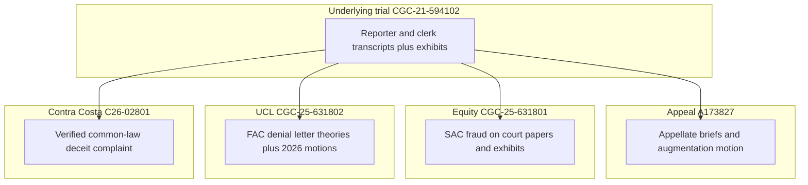

> **Posture (September 22, 2026):** 801 portions of this document are appellate-record material (see [01-APPEAL/EQUITY-PRESERVATION-LANE/](01-APPEAL/EQUITY-PRESERVATION-LANE/README.md)); 802 portions reflect the live trial-court front. **August 26, 2026, Dept. 302:** CCP 391 heard; order DocID `10397483`; continued to **October 6, 2026, 9:00 a.m., Dept. 302** (seq 354). After the empty-file / anti-SLAPP contradiction, that access ask is an escape from merits adjudication. **Next CMC:** October 21, 2026, 10:30 a.m., Dept. 610 (see [03-CASE-CGC-25-631802/INDEX.md](03-CASE-CGC-25-631802/INDEX.md) · [vexatious-opposition-aug26-2026](03-CASE-CGC-25-631802/vexatious-opposition-aug26-2026/README.md) · [HEARINGS-CALENDAR.md](HEARINGS-CALENDAR.md)).
# Legal and factual spine - five proceedings

This document is the **logical backbone** of the public record in this folder. It states **what each forum is**, **who appears there**, **what theories the operative papers describe**, and **which primary-source PDFs anchor those descriptions**. It does not predict outcomes.

**Plaintiff:** Franciscus Dylan Rosario.

**Forums and numbers:**

| Layer | Identifier | Forum |
|-------|------------|--------|
| Underlying civil trial | CGC-21-594102 | San Francisco Superior Court |
| Appellate review | A173827 | California Court of Appeal, First District, Division Three |
| Independent equity action | CGC-25-631801 | San Francisco Superior Court |
| Representational / UCL action | CGC-25-631802 | San Francisco Superior Court |
| Common-law deceit | C26-02801 | Contra Costa Superior Court |

Long-form narratives (each with pleading trees and record citations) live under [narrative/](narrative/00-OVERVIEW.md). Vertical chronologies are under [timelines/](timelines/trial-CGC-21-594102.md). Defendant-specific fact sheets are under [defendants/](defendants/INDEX.md).

---

## 1. Underlying trial - CGC-21-594102

**Nature of proceeding.** A civil jury trial on liability and damages arising from a pedestrian-vehicle incident on February 4, 2021, at Tehama and 5th Street, San Francisco.

**Operative posture at trial end.** A jury returned a defense verdict reported in this repository as **9-3** (minimum civil majority). The April 23, 2025 reporter transcript volume is indexed with other trial days under [05-TRANSCRIPTS/REPORTER-TRANSCRIPTS/](05-TRANSCRIPTS/REPORTER-TRANSCRIPTS/).

**Core primary sources used across all later proceedings.**

- **911 audio and statements attributed to the driver on the call.** The repository hosts listening links and transcript excerpts on [evidence.md](evidence.md) and [evidence.html](evidence.html). Trial authentication is discussed in the Day 8 reporter transcript PDF linked from the trial timeline.
- **Body-worn camera and related law-enforcement video.** Links appear on the evidence pages; trial-day PDFs are under [04-EXHIBITS/](04-EXHIBITS/INDEX.md).
- **Reporter’s transcripts - Trial Days 7, 8, 10, 11.** [Day 7 PDF](05-TRANSCRIPTS/REPORTER-TRANSCRIPTS/Trial-Day-07-April-16-2025.pdf), [Day 8 PDF](05-TRANSCRIPTS/REPORTER-TRANSCRIPTS/Trial-Day-08-April-17-2025.pdf), [Day 10 PDF](05-TRANSCRIPTS/REPORTER-TRANSCRIPTS/Trial-Day-10-April-22-2025.pdf), [Day 11 PDF](05-TRANSCRIPTS/REPORTER-TRANSCRIPTS/Trial-Day-11-April-23-2025.pdf).
- **Hearing transcripts (February 18, 2025 and related).** [All-Hearing-Transcripts PDF](05-TRANSCRIPTS/HEARINGS/All-Hearing-Transcripts-Rosario-AAA.pdf).
- **Clerk’s transcript (full).** [Clerk’s transcript PDF](05-TRANSCRIPTS/CLERKS-TRANSCRIPT/CGC-21-594102-A173827-Clerks-Transcript-Full.pdf).

**Defendants at trial (as listed on the equity index).** Subhi Abdelhalim; CSAA Insurance Exchange; Phillips, Spallas & Angstadt LLP; Priya D. Navaratnasingham; Alberto Reyna; Michael R. Chambers; Carbone, Smith & Koyama - roles summarized in [02-CASE-CGC-25-631801/INDEX.md](02-CASE-CGC-25-631801/INDEX.md). Tyler J. O'Connell (CSAA defense counsel, non-party) is also documented for his filing conduct in 631802.

**Why this layer matters to the spine.** Later filings treat the trial record as the **shared factual substrate**: what was said under oath, what was offered or excluded, and what the jury was permitted to hear. The appeal briefs catalog preserved error from this record. The equity action alleges extrinsic fraud affecting the fairness of this trial. The UCL action uses a **pre-litigation** insurer letter as a separate timestamped representation.

---

## 2. Appeal - A173827

**Nature of proceeding.** Direct review of orders and judgment in CGC-21-594102 under the standards described in the opening brief.

**Indexed filings.** [01-APPEAL/INDEX.md](01-APPEAL/INDEX.md) lists the opening brief, supplemental memoranda, augmentation motion, and combined exhibits PDF.

**Theories as framed in the appeal index (checklist, not adjudication).**

- Instructional error as assigned in the opening brief and the August 20, 2026 reply: on April 23, 2025, the deliberating jury asked for Vehicle Code sections 22107 and 21804; the trial court forbade consideration and refused to instruct, on the premise that the statutes were not evidence. The opening brief states that Defense Exhibit 500, the complaint, already placed those sections before the jury. The briefs assign that prohibition as a Code of Civil Procedure section 614 violation going to the substance of the right of trial by jury. Reader block: [consequence registry, section 3](COMMENTARY/CONSEQUENCE-REGISTRY.md#jury-prohibition).
- Instructional issues described as mandatory CACI / standard-of-care problems.
- Evidentiary rulings described as abuse-of-discretion categories (911, body camera, expert disclosure).
- Juror-misconduct and Evid. Code § 1150 process arguments.
- Structural / cumulative error framing.

**Spine link to trial.** Each appellate point ties to **volume and page** references in the clerk’s and reporter transcripts named in [01-APPEAL/INDEX.md](01-APPEAL/INDEX.md) “Key Record Citations” table.

---

## 3. Equity action - CGC-25-631801

**Nature of proceeding.** An **independent action in equity** to set aside the CGC-21-594102 judgment, pled on theories that include extrinsic fraud and fraud on the court. The case index states the **CMC** date and department.

**Indexed operative PDFs.** [02-CASE-CGC-25-631801/INDEX.md](02-CASE-CGC-25-631801/INDEX.md) links the Second Amended Complaint, fraud-on-the-court memorandum, judicial-summary demand, RFAs, RJN, exhibit sets, and the “Navaratnasingham admission” memorandum PDF.

**Framework as described in plaintiff’s case index (neutral restatement).**

1. Knowledge and access to materials (911, body camera, CAD).
2. Representations to the court about receipt, provenance, or production history.
3. Alleged reliance by the court on those representations in rulings that affected presentation of evidence.

**Spine link to trial.** The equity papers incorporate **trial and hearing transcripts** and **MIL** materials referenced in the legal-analysis annex: [08-LEGAL-ANALYSIS/COURT-RELIANCE-FRAUD-ON-COURT.md](08-LEGAL-ANALYSIS/COURT-RELIANCE-FRAUD-ON-COURT.md), [08-LEGAL-ANALYSIS/FATAL-PROOF-NAVARATNASINGHAM-DOLAN-ADMISSION-EXTRINSIC-FRAUD.md](08-LEGAL-ANALYSIS/FATAL-PROOF-NAVARATNASINGHAM-DOLAN-ADMISSION-EXTRINSIC-FRAUD.md).

---

## 4. UCL / denial-letter action - CGC-25-631802

**Nature of proceeding.** A separate superior court action against **CSAA Insurance Exchange** alleging a **pre-litigation** “concluded investigation” denial letter and related theories under the unfair competition statute and associated doctrines, as summarized in [03-CASE-CGC-25-631802/INDEX.md](03-CASE-CGC-25-631802/INDEX.md).

**Indexed operative PDFs.** First Amended Complaint, denial-letter memorandum, judicial-summary demand, RFAs, ex parte preservation, exhibit appendix.

**April 2026 motion practice (same case number).**

- Defense **Anti-SLAPP** clerk PDFs: [defense-anti-slapp-clerk/](03-CASE-CGC-25-631802/defense-anti-slapp-clerk/README.md).
- **Demurrer** and plaintiff opposition volley: [demurrer-volley-apr2026/](03-CASE-CGC-25-631802/demurrer-volley-apr2026/README.md).
- **801 draft consolidated opposition** splits: [plaintiff-opposition-consolidated-apr2026/](03-CASE-CGC-25-631802/plaintiff-opposition-consolidated-apr2026/README.md).
- **FINAL-COURT** full packets with exhibits (April 19, 2026): [final-court-apr2026/](03-CASE-CGC-25-631802/final-court-apr2026/README.md).

**Analytical annex (not a court filing).** Anti-SLAPP and demurrer rebuttal hubs: [08-LEGAL-ANALYSIS/anti-slapp-rebuttal/INDEX.md](08-LEGAL-ANALYSIS/anti-slapp-rebuttal/INDEX.md), [08-LEGAL-ANALYSIS/demurrer-rebuttal/INDEX.md](08-LEGAL-ANALYSIS/demurrer-rebuttal/INDEX.md).

---

## 5. Shared evidence spine (cross-links only)

The following items appear in multiple proceedings:

| Item | Typical citation location |
|------|---------------------------|
| Pin register E-01 to E-15 | [evidence.md](evidence.md) |
| Abdelhalim 911 | [evidence.md](evidence.md); trial transcripts (E-02, E-11) |
| Passerby 911 | [evidence.md](evidence.md) (E-03) |
| Body camera / YouTube mirrors | [evidence.md](evidence.md), [evidence.html](evidence.html) (E-04) |
| February 25, 2021 denial letter | [MERITS-EXHIBITS/CSAA_Denial_Letter-Feb-25-2021.pdf](MERITS-EXHIBITS/CSAA_Denial_Letter-Feb-25-2021.pdf) (E-05) |
| CSAA investigation report exhibit | [04-EXHIBITS/EXHIBIT-001-CSAA-Investigation-Report.pdf](04-EXHIBITS/EXHIBIT-001-CSAA-Investigation-Report.pdf) (E-06) |
| Compex subpoena (Feb. 1, 2024) | [04-EXHIBITS/2024-02-01-Compex-Subpoena.pdf](04-EXHIBITS/2024-02-01-Compex-Subpoena.pdf) (E-07) |
| Trial day exhibit PDFs | [04-EXHIBITS/](04-EXHIBITS/INDEX.md) |
| C26-02801 verified complaint | [04-CASE-C26-02801/VERIFIED-COMPLAINT-C26-02801.pdf](04-CASE-C26-02801/VERIFIED-COMPLAINT-C26-02801.pdf) (E-15) |
| Bar and judicial complaints | [06-EVIDENCE/INDEX.md](06-EVIDENCE/INDEX.md) |

A structured **cause-of-action to evidence** map is in [evidence-tree/INDEX.md](evidence-tree/INDEX.md).

---

## 6. Vertical diagram - how the five forums interlock

The diagram is **top-to-bottom** (GitHub-friendly). Each box is a proceeding; arrows show **shared record dependencies** described in the pleadings (not res judicata effects).

---

## 7. How to read this repository as a single investigation

1. Read [README.md](README.md) for the narrative homepage and defendant matrix.
2. Skim this **SPINE** for forum boundaries and PDF entry points.
3. Walk the **timelines** for each case number in chronological order.
4. Open the **narrative** chapter for the proceeding you care about; follow pleading-tree links outward.
5. Use **defendants** pages when you need a person- or entity-centric view tied to sources.
6. Use **evidence.md** for the numbered pin register, then **evidence-tree** for the claim-element view.

---

## 8. Disclaimer

All documents are filed or published as described. Statements in transcripts are record quotations when cited with day and line or page as provided in the linked PDFs.

---

## 9. Causes of action and where they live (pleading map)

The following table maps **where a reader should open first** for a given subject. Labels follow the **complaint or brief titles** in the linked PDFs; they are not findings of fact by a court.

| Subject matter (as pled or argued) | Primary PDF entry points | Supporting record |
|-----------------------------------|---------------------------|-------------------|
| Negligence / liability / damages (underlying) | Clerk’s transcript motions in limine and trial rulings; reporter volumes | [05-TRANSCRIPTS/](05-TRANSCRIPTS/INDEX.md), [04-EXHIBITS/](04-EXHIBITS/INDEX.md) |
| Instructional and evidentiary error (appeal) | [01-Appellants-Opening-Brief.pdf](01-APPEAL/01-Appellants-Opening-Brief.pdf), [07-Appeal-Exhibits.pdf](01-APPEAL/07-Appeal-Exhibits.pdf) | Clerk’s and reporter PDFs cited in brief tables |
| Extrinsic fraud / fraud on the court / equitable vacatur (801) | [01-Second-Amended-Complaint.pdf](02-CASE-CGC-25-631801/01-Second-Amended-Complaint.pdf), [03-Memorandum-Fraud-on-Court.pdf](02-CASE-CGC-25-631801/03-Memorandum-Fraud-on-Court.pdf), [11-Motion-Extrinsic-Fraud-Navaratnasingham-Admission.pdf](02-CASE-CGC-25-631801/11-Motion-Extrinsic-Fraud-Navaratnasingham-Admission.pdf) | Hearing and trial transcripts; MIL set described in equity index |
| Pre-litigation denial letter / UCL / related insurer theories (802) | [01-First-Amended-Complaint.pdf](03-CASE-CGC-25-631802/01-First-Amended-Complaint.pdf), [03-Memorandum-Denial-Letter-Fraud.pdf](03-CASE-CGC-25-631802/03-Memorandum-Denial-Letter-Fraud.pdf) | CSAA investigation exhibit; claim-file references inside FAC PDF |
| Anti-SLAPP and demurrer defenses (802, April 2026) | [defense-anti-slapp-clerk PDFs](03-CASE-CGC-25-631802/defense-anti-slapp-clerk/README.md), [demurrer-volley defense PDFs](03-CASE-CGC-25-631802/demurrer-volley-apr2026/README.md) | Plaintiff responses: [plaintiff-opposition-consolidated-apr2026](03-CASE-CGC-25-631802/plaintiff-opposition-consolidated-apr2026/README.md), [FINAL-COURT packets](03-CASE-CGC-25-631802/final-court-apr2026/README.md) |

---

## 10. Accountability documents (non-court primary sources in this folder)

Bar complaints and a judicial complaint are stored as PDFs under [06-EVIDENCE/](06-EVIDENCE/INDEX.md). They are **filings to regulatory bodies**, not court adjudications. They are linked from defendant pages where the subject matches the name on the PDF cover.

---

## 11. Deposition layer (pre-trial sworn discovery)

Deposition PDFs are indexed under [05-TRANSCRIPTS/DEPOSITIONS/](05-TRANSCRIPTS/DEPOSITIONS/). Names and dates appear in the legacy README’s deposition table ([README.LEGACY.md](README.LEGACY.md)). Those transcripts supply **pretrial sworn statements** that later trial and hearing transcripts either align with or diverge from, depending on the witness and topic.

---

## 12. Consolidated memoranda across 801 and 802

The [pleadings/](pleadings/README.md) folder hosts cross-case service masters and consolidated memoranda PDFs that duplicate some single-case filings for convenience. When a citation in a narrative points to both `02-CASE…` and `pleadings/`, treat them as **the same instrument class** unless the filenames show a different revision date.

---

## 13. “Favorable to plaintiff” as a research category

Throughout this site, arguments that a ruling **should** be entered for plaintiff appear inside **plaintiff-filed papers** (memoranda, oppositions, SAC drafts). This spine does not restate those arguments as facts. Instead, each narrative file contains a section titled **Plaintiff’s filed position** with hyperlinks to the specific memorandum PDF. Judges and researchers can compare that section to **defense-filed PDFs** linked in the same pleading tree.

---

## 14. Evidence suppression and admission (record-only phrasing)

Some papers allege that certain materials were **excluded or delayed** after **representations to the court**. Whether that occurred is a **disputed adjudicative fact**. The spine uses only neutral verbs: materials were **offered**, **excluded**, **received**, or **referenced in transcript**. The exact sequence for each item is in [evidence-tree/INDEX.md](evidence-tree/INDEX.md) and in the **trial** and **equity** timelines.

---

## 15. Related-case and preservation filings

Both post-trial superior court actions include **notice of related cases** and **document preservation** ex parte PDFs in their indexes. Those instruments explain **why** later courts see cross-references among CGC-21-594102, CGC-25-631801, and CGC-25-631802. Links: [02-Notice-of-Related-Cases.pdf](02-CASE-CGC-25-631801/02-Notice-of-Related-Cases.pdf), [07-Ex-Parte-Document-Preservation.pdf](02-CASE-CGC-25-631801/07-Ex-Parte-Document-Preservation.pdf), [02-Notice-of-Related-Cases.pdf](03-CASE-CGC-25-631802/02-Notice-of-Related-Cases.pdf), [07-Ex-Parte-Document-Preservation.pdf](03-CASE-CGC-25-631802/07-Ex-Parte-Document-Preservation.pdf).

---

## 16. August / September / October 2026 hearing dates

On **August 26, 2026**, Dept. 302 heard the CCP 391 access motion in **631802** (papers as filed: [vexatious-opposition-aug26-2026/](03-CASE-CGC-25-631802/vexatious-opposition-aug26-2026/README.md); order DocID `10397483`). The motion is continued to **October 6, 2026, 9:00 a.m., Dept. 302** (seq 354). After the empty-file / anti-SLAPP contradiction, that access ask is an escape from merits adjudication. **Next CMC** for both 801 and 802 is **October 21, 2026, 10:30 a.m., Dept. 610** (continued from September 9). June 24, 2026 consolidated hearing is historical. See [HEARINGS-CALENDAR.md](HEARINGS-CALENDAR.md) and [ANALYSIS/AUG-2026-POSTURE.md](ANALYSIS/AUG-2026-POSTURE.md).

---

## 17. Novel and long-form non-filing narrative

The [NOVEL/](NOVEL/README.md) directory contains a literary narrative version (PDF, EPUB, Markdown chapters). That material is **not** a court filing. Forensic readers who want filing-only content should prefer [narrative/](narrative/00-OVERVIEW.md) and the PDF indexes.

---

## 18. Chronological anchors (February 2021 through April 2026)

The following dates are **folder-level bookmarks** used throughout the narratives; each date has a longer footnote trail in the timelines.

**2021-02-04.** Incident date recorded on the evidence page and in multiple pleadings.

**2021-02-25 (21 days post-incident).** Date relationship described in the **631802** index between the collision and CSAA’s denial letter theory.

**2022-2024.** Deposition tranche listed in [README.LEGACY.md](README.LEGACY.md): plaintiff, Victoria Rosario, Officer Fernandez, Nicholas Raffin (PMK for CSAA), and Subhi Abdelhalim.

**2024-02-01.** Compex subpoena PDF dated this day appears in [04-EXHIBITS/2024-02-01-Compex-Subpoena.pdf](04-EXHIBITS/2024-02-01-Compex-Subpoena.pdf); plaintiff papers discuss requests for 911 and body-worn camera materials.

**2025-01-17.** Motions in limine filing date referenced in the **631801** index discussion of MIL No. 17 language about production and provenance.

**2025-02-18.** Hearing transcript volume containing exchanges referenced in equity papers (“news to me” line appears in legacy README summary).

**2025-04-16.** Trial Day 7 reporter transcript; exchange about “Dolan” appears in equity index block quote.

**2025-04-17.** Trial Day 8 reporter transcript; 911 authentication appears in legacy README cite (RT 8, line 1979 in their cite format).

**2025-04-23.** Trial Day 11 reporter transcript; verdict.

**2025-2026.** Post-trial filing of **631801** and **631802** complaints and memoranda per each case’s numbered PDF list.

**2026-04-13 through 2026-04-19.** Demurrer volley PDFs under [demurrer-volley-apr2026/](03-CASE-CGC-25-631802/demurrer-volley-apr2026/README.md); consolidated opposition rebuild under [plaintiff-opposition-consolidated-apr2026/](03-CASE-CGC-25-631802/plaintiff-opposition-consolidated-apr2026/README.md); **FINAL-COURT** exhibit-integrated packets copied April 19 into [final-court-apr2026/](03-CASE-CGC-25-631802/final-court-apr2026/README.md).

---

## 19. Standard of review vocabulary (non-binding primer)

**De novo** review applies to certain categories of claimed instructional error on appeal; **abuse of discretion** applies to many evidentiary rulings; **substantial evidence** governs sufficiency challenges. These phrases appear in [01-APPEAL/INDEX.md](01-APPEAL/INDEX.md). This spine does not apply them to facts; the opening brief does.

**Equitable** relief standards for setting aside a judgment are cited in **631801** materials (for example *Kulchar v. Kulchar* and Code of Civil Procedure § 187 in that index). Readers should read the **SAC** and **fraud memorandum** for the complete element list as plaintiff articulates it.

**Anti-SLAPP** (Code Civ. Proc. § 425.16) involves a two-step framework discussed in plaintiff’s opposition PDFs and in the analytical hub; defense memoranda are in the clerk PDF set. The **gravamen** dispute is a characterization question described in both sides’ papers.

---

## 20. Expert and law-enforcement record strands

The trial record includes **defense expert** testimony categories referenced in the appeal index (biomechanics / causation). Plaintiff’s appellate papers identify **CCP § 2034** disclosure issues. Those strands intersect with **MIL** rulings recorded in the clerk’s transcript PDF. The spine treats expert issues as a **parallel branch** to the audio/video branch because they implicate different pages of the reporter volumes.

Law-enforcement materials include **police reports**, **supplemental reports** (referenced in trial-day PDFs and pleadings), and **CAD** logs. The exhibit index lists investigation PDFs. When a pleading says a report was “excluded,” verify the **clerk’s transcript order** and the **reporter sidebar** in the linked hearing or trial PDF rather than relying on any summary sentence.

---

## 21. Insurance-file strand separate from tort trial

The **631802** action isolates a **pre-filing** letter. That pleading choice means certain litigation-privilege defenses are argued inapplicable because the letter predates the complaint in **CGC-21-594102**. The memorandum PDF in **631802** walks through that sequencing. The spine highlights it because readers sometimes merge the **trial** fraud allegations with the **denial-letter** fraud allegations; they are **related chronologically** but **different on paper** as causes of action.

**C26-02801** is the filed Contra Costa common-law deceit complaint. It isolates the same February 25, 2021 letter as an affirmative representation of completed historical investigative acts, preserved under *Moradi-Shalal* at pages 304-305. Public page: [04-CASE-C26-02801/INDEX.md](04-CASE-C26-02801/INDEX.md). Filed complaint: [VERIFIED-COMPLAINT-C26-02801.pdf](04-CASE-C26-02801/VERIFIED-COMPLAINT-C26-02801.pdf). Homepage banner: [README.md](README.md#banner-argument-c26-02801-and-the-core-wrong).

---

## 22. Parallel reading tracks for external reviewers

**Track A - Judge or staff attorney:** Start at [timelines/trial-CGC-21-594102.md](timelines/trial-CGC-21-594102.md), then the clerk’s transcript PDF for any order referenced in a motion title, then the reporter PDF for the same calendar day. Cross-check with [evidence-tree/INDEX.md](evidence-tree/INDEX.md) for the element-by-element view.

**Track B - Media:** Start at [README.md](README.md) cold open, then [evidence.md](evidence.md) for audio/video, then [narrative/01-UNDERLYING-CGC-21-594102.md](narrative/01-UNDERLYING-CGC-21-594102.md) for the trial pleading tree only after listening links are reviewed.

**Track C - Disciplinary authorities:** Open [defendants/INDEX.md](defendants/INDEX.md), pick the subject, then open the matching PDF in [06-EVIDENCE/](06-EVIDENCE/INDEX.md). Return to trial transcripts only if the complaint quotes testimony.

**Track D - Opposing counsel:** Read [SPINE.md](SPINE.md) sections 5-9 first, then your client’s defendant page, then the **FINAL-COURT** PDFs if your filing matches that build.

---

## 23. Navigation

| Resource | Link |
|----------|------|
| Contra Costa C26-02801 | [04-CASE-C26-02801/INDEX.md](04-CASE-C26-02801/INDEX.md) |
| Narrative hub | [narrative/00-OVERVIEW.md](narrative/00-OVERVIEW.md) |
| Book-style file list | [BOOK-OUTLINE.md](BOOK-OUTLINE.md) |
| Legacy navigation README | [README.LEGACY.md](README.LEGACY.md) |

---

## Document metadata

| Field | Value |
|-------|-------|
| Created | 2026-07-10 |
| Last updated | 2026-07-10 |
| Last author | soltrinox |
| Version | `216d319` (rev 7) |
| Repository | GITHUB-PAGE |

*Auto-generated from git history. Re-run `scripts/audit_strategic_docs.py --apply` to refresh.*
