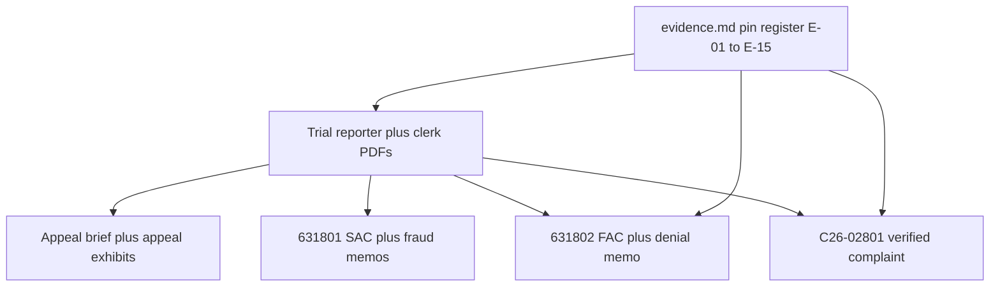

# Evidence tree: causes of action to sources

This page maps **claim families** (as pled or argued in linked PDFs) to **primary sources** in this repository. It states **where to read**, not **who will win**.

Numbered media and transcript pins live on [evidence.md](../evidence.md) (E-01 through E-15). This page is the claim-family index to those pins.

---

## A. Underlying negligence / liability (CGC-21-594102)

| Element (generic negligence pattern) | Primary sources | Pins |
|----------------------------------------|-----------------|------|
| Duty / breach | [Trial days](../05-TRANSCRIPTS/REPORTER-TRANSCRIPTS/), [clerk's transcript](../05-TRANSCRIPTS/CLERKS-TRANSCRIPT/CGC-21-594102-A173827-Clerks-Transcript-Full.pdf) | E-01 collision; E-12 Vehicle Code jury question |
| Contact and contemporaneous statements | [evidence.md](../evidence.md); [Trial Day 8](../05-TRANSCRIPTS/REPORTER-TRANSCRIPTS/Trial-Day-08-April-17-2025.pdf) | E-02 driver 911; E-03 passerby 911; E-04 BWC; E-11 "Yes. That is my voice." |
| Causation | Expert testimony days; jury questions referenced in [01-APPEAL/INDEX.md](../01-APPEAL/INDEX.md) | Reporter PDFs |
| Damages | Medical and economic modules in trial volumes | Reporter PDFs |

---

## B. Appellate error categories (A173827)

| Issue cluster | Primary sources | Pins |
|---------------|-----------------|------|
| Instructional | [Opening brief](../01-APPEAL/01-Appellants-Opening-Brief.pdf); clerk's instruction conference | E-12 |
| Evidentiary (911 / video / experts) | Opening brief; reporter volumes; [appeal exhibits](../01-APPEAL/07-Appeal-Exhibits.pdf); MIL 6/17 | E-08, E-09, E-10, E-11 |
| Juror misconduct process | Opening brief; trial/hearing transcripts | same |

---

## C. Extrinsic fraud / fraud on the court (CGC-25-631801, as pled)

| Alleged element (high-level) | Primary sources | Pins |
|------------------------------|-----------------|------|
| Knowledge / access | [SAC](../02-CASE-CGC-25-631801/01-Second-Amended-Complaint.pdf); [fraud memorandum](../02-CASE-CGC-25-631801/03-Memorandum-Fraud-on-Court.pdf); [investigation exhibit](../04-EXHIBITS/EXHIBIT-001-CSAA-Investigation-Report.pdf) | E-06, E-07 |
| Representations to the court | [Hearing transcripts](../05-TRANSCRIPTS/HEARINGS/All-Hearing-Transcripts-Rosario-AAA.pdf); [Trial Day 7](../05-TRANSCRIPTS/REPORTER-TRANSCRIPTS/Trial-Day-07-April-16-2025.pdf); MIL 6/17 | E-08, E-09, E-10 |
| Reliance / impact on presentation | Equity memoranda; clerk's orders | E-08, E-09 |
| "Provided by Dolan" admission | [Day 7 admission excerpt](../04-EXHIBITS/EXHIBIT-TRIAL-DAY-7-ADMISSION.pdf); [FATAL-PROOF](../08-LEGAL-ANALYSIS/FATAL-PROOF-NAVARATNASINGHAM-DOLAN-ADMISSION-EXTRINSIC-FRAUD.md) | E-10 |

---

## D. Denial-letter / UCL (CGC-25-631802, as pled)

| Topic | Primary sources | Pins |
|-------|-----------------|------|
| Representations in denial letter | [FAC](../03-CASE-CGC-25-631802/01-First-Amended-Complaint.pdf); [denial-letter memorandum](../03-CASE-CGC-25-631802/03-Memorandum-Denial-Letter-Fraud.pdf); [denial letter](../MERITS-EXHIBITS/CSAA_Denial_Letter-Feb-25-2021.pdf) | E-05 |
| Investigation completeness | [EXHIBIT-001](../04-EXHIBITS/EXHIBIT-001-CSAA-Investigation-Report.pdf); [Raffin deposition](../05-TRANSCRIPTS/DEPOSITIONS/04-Nicholas-Raffin-PMK-Deposition-2023-03-10.pdf) | E-02 through E-07 |
| April 2026 defenses | [631802 index](../03-CASE-CGC-25-631802/INDEX.md); [anti-SLAPP extraction](../DEFENSE-FILINGS/CGC-25-631802/2026-04-09__mpa__mpa-anti-slapp-mpas---anti-slapp/extraction.md); [section 436 extraction](../03-CASE-CGC-25-631802/motion-strike-apr2026/PARSED/TEXT/MPA2-CCP436.md) | E-13, E-14 |
| Plaintiff responses already on file | [consolidated README](../03-CASE-CGC-25-631802/plaintiff-opposition-consolidated-apr2026/README.md); [final-court README](../03-CASE-CGC-25-631802/final-court-apr2026/README.md) | 802 index |

---

## E. Common-law deceit (C26-02801, as pled)

The filed Contra Costa complaint treats the February 25, 2021 completed-investigation representation as independent common-law deceit under Civil Code sections 1709 and 1710, subdivision (1). It does not plead a private Insurance Code section 790.03 action. Full formulation: [04-CASE-C26-02801/INDEX.md](../04-CASE-C26-02801/INDEX.md).

| Topic | Primary sources | Pins |
|-------|-----------------|------|
| Representation of completed historical acts | [Denial letter](../MERITS-EXHIBITS/CSAA_Denial_Letter-Feb-25-2021.pdf); [verified complaint](../04-CASE-C26-02801/VERIFIED-COMPLAINT-C26-02801.pdf) | E-05, E-15 |
| Report-identified materials not in the claim file as alleged | Police report; [investigation exhibit](../04-EXHIBITS/EXHIBIT-001-CSAA-Investigation-Report.pdf); 911 / BWC / CAD on [evidence.md](../evidence.md) | E-01 through E-06 |
| Later statements used as knowledge / ratification, not as the wrong | MIL 6/17; Feb. 18 hearing; Trial Days 7-8; April 2026 802 papers | E-08 through E-14 |
| *Moradi-Shalal* preservation clause | [Carve-out hub](../_shared/moradi-shalal-carveout-apr27/README.md) | E-15 |

---

## F. Audio / video / CAD (cross-cutting)

| Item | Link |
|------|------|
| 911 audio, transcripts, BWC, pin register | [evidence.md](../evidence.md) |
| Embedded players | [evidence.html](../evidence.html) |
| Trial exhibit PDFs | [04-EXHIBITS/INDEX.md](../04-EXHIBITS/INDEX.md) |

---

## G. Regulatory complaints (non-court)

| Item | Link |
|------|------|
| Bar and judicial complaint PDFs | [../06-EVIDENCE/INDEX.md](../06-EVIDENCE/INDEX.md) |

---

## Vertical diagram: claim sources

[← Homepage](../README.md) · [← SPINE](../SPINE.md) · [evidence.md](../evidence.md)
